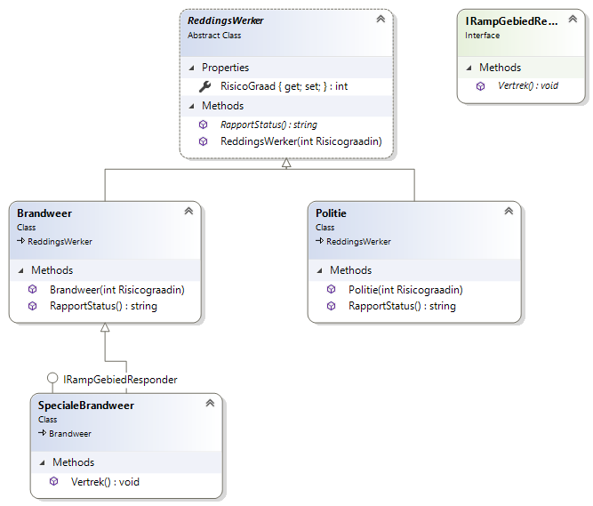

:::{.callout-tip}
Volgende opgave was de vaardigheidsproefopdracht voor het 1e zit examen van dit vak (OOP) in juni 2020
:::

## Opgave 1 (70%)

Een school, "Stedelijk Lyceum 90", heeft je gevraagd een administratief pakket voor hen te ontwikkelen. Maak een applicatie die simuleert hoe leerlingen in een school worden gemaakt op voorwaarde dat er genoeg geld aanwezig is. Vervolgens kunnen leerlingen uit een school gerekruteerd worden om als werkstudent te dienen.


### Maak een klasse school (35%)

* Je school heeft volgende properties:
  * geldHoeveelheid: een int die nooit onder 15 of lager kan gaan en die bijhoudt hoeveel geld je school nog heeft, private set
  * IsBijnaLeeg: een readonly property die true teruggeeft indien de hoeveelheid geld  15 of lager is
  * leerlingen: Een lijst van leerlingen (zie hierna) als gewone property die initieel een capaciteit van 15 plekken heeft.
  * Een autoproperty Naam die steeds op  school90 staat.
* Volgende publieke methoden:
  * Geefgeld: deze methode aanvaardt een double. Het getal dat je meegeeft wordt bijgeteld bij geldHoeveelheid
    * Maakleerling: Deze methode voegt een nieuwe leerling aan de lijst toe. Een leerling kan enkel gemaakt worden indien je school minstens 40 of hoger geld heeft. Vervolgens wordt de hoeveelheid geld met 15 verlaagt. Deze methode geeft een bool terug: true indien het aanmaken gelukt is, false indien niet (omdat er niet genoeg geld was)
    * Geefleerling: deze methode geeft een object van het type leerling terug indien er minstens 2 leerlingen in de lijst aanwezig zijn. De methode kiest altijd de eerste leerling uit de lijst om terug te geven en zal deze vervolgens uit de lijst verwijderen.
* Je school override ToString zodat de geld hoeveelheid, de Naam ,IsBijnaleeg en het aantal leerlingen in de lijst mooi op het scherm toont.	

### Maak een klasse leerling. (25%)

Deze heeft 1 property:

* Een readonly string Naam met private set

Deze heeft een default constructor die bij het aanmaken van de leerling de naam van de leerling zal instellen op StudentX waarbij de X vervangen wordt door de zoveelste leerling die in het programma al werd aangemaakt. De eerste heet dus Student1, dan Student2, etc.

### Main werking (40%)
Toon in je main aan dat je klassen werken door een programma te maken dat:
* Een school aanmaakt
* Een lege lijst leerlingen, werkstudenten genaamd,  aanmaakt
* Een loop start die 15 keer zal lopen, per loop:
  * wordt een random hoeveelheid geld (tussen 15 en 30) aan je school gegeven.
  * Wordt een leerling aangemaakt in je  school
    * Indien een leerling kon aangemaakt worden (omdat er genoeg geld was) bestaat er 60 % kans dat vervolgens een ridder met de Geefleerlingmethode uit je school wordt gehaald en in de werkstudenten lijst wordt gestoken.
  * Wordt de informatie van je  school op het scherm getoond (mbv ToString)
  * Na de loop wordt de lijst van werkstudenten overlopen en worden alle namen de leerlingen in die lijst getoond.

## Opgave 2  (30%)
Maak een kleine applicatie die kan gebruikt worden om alle reddingswerkers tijdens een ramp in kaart te brengen en op te volgen.

### Klassestructuur (40%)
Implementeer volgende klasse diagram (de naam van de Interface= IRampGebiedResponder)


Zorg ervoor dat:
* Een SpecialeBrandweer altijd een risicograad van 15 heeft wanneer deze wordt aangemaakt. De overige klassen is die altijd 6
* RapportStatus toont de risicograad van het object. Bij de SpecialeBrandweer wordt deze aangevuld met de zin “Ik ben beter”

### In je main (60%)
In je main wordt van elke klasse 1 object aangemaakt:
* Plaats deze elementen in een dictionary waarbij je steeds een random getal tussen 100 en 2000 als “key” toewijst. Zoek eerst op of deze key reeds in de dictionary aanwezig is, zo ja, dan genereer je nieuw getal en probeer je opnieuw toe te voegen. Toon deze key op het scherm.
* Vraag eenmalig aan de gebruiker een getal, de key, en toon van dit object de RapportStatus (ga er van uit dat de gebruiker steeds een geldige key invoert)
* Bereken de gemiddelde risicograad van alle objecten in de dictionary
* Bereken de gemiddelde risicograad van alle objecten die geen IRampGebiedResponder zijn 


::::{.callout-caution collapse="true" title="Oplossing"}
## Opgave 1

### Main

```java
static Random r = new Random();
static void Main(string[] args)
{
    School s = new School();
    var WerkStudenten = new List<Leerling>();

    for (int i = 0; i < 15; i++)
    {
        s.GeefGeld(r.Next(15, 30));
        if(s.MaakLeerling())
        {
            if(r.Next(0,100)>=60)
            { 
                Leerling toadd = s.GeefLeerling();
                    if (toadd != null)
                        WerkStudenten.Add(toadd);
            }
        }
        Console.WriteLine(s);
    }

    foreach (var werkstudent in WerkStudenten)
    {
        Console.WriteLine(werkstudent.Naam);
    }
}
```

### School

```java
class School
{
    private int geldHoeveelheid;

    public int GeldHoeveelheid
    {
        get { return geldHoeveelheid; }
        set
        {
            if (value <= 15)
                geldHoeveelheid = 15;
            else geldHoeveelheid = value;
        }
    }

    public bool IsBijnaLeeg
    {
        get
        {
            if (GeldHoeveelheid >= 15)
                return true;
            else return false;
        }

    }

    public List<Leerling> Leerlingen { get; set; } = new List<Leerling>(15);

    public void GeefGeld(double geld)
    {
        GeldHoeveelheid += (int)geld;
    }

    public bool MaakLeerling()
    {
        if (geldHoeveelheid>=40 && Leerlingen.Count<16 ) 
        {
            
            geldHoeveelheid -= 15;
            Leerlingen.Add(new Leerling());
            return true;
        }
        return false;
    }

    public Leerling GeefLeerling()
    {
        if(Leerlingen.Count>=2)
        {
            Leerling toreturn = Leerlingen[0];
            Leerlingen.RemoveAt(0);
            return toreturn;

        }
        return null;
    }

    public override string ToString()
    {
        return $"{GeldHoeveelheid},{IsBijnaLeeg},{Leerlingen.Count}";
        //Mag je iets sexier maken
    }
}
```

## Opgave 2

### Klassen
```java
interface IRampGebiedResponder
{
    void Vertrek();
}

abstract class ReddingsWerker
{
    public ReddingsWerker(int Risicograadin)
    {
        RisicoGraad = Risicograadin;
    }
    public int RisicoGraad { get; set; } = 6;
    public virtual string RapportStatus()
    {
        return $"{RisicoGraad}";
    }
}

class Politie : ReddingsWerker
{
    public Politie(int risicograadin) : base(risicograadin)
    {

    }
}
class Brandweer : ReddingsWerker
{
    public Brandweer(int risicograadin) : base(risicograadin)
    {

    }
}
class SpecialeBrandweer : Brandweer, IRampGebiedResponder
{
    public SpecialeBrandweer() : base(15)
    {

    }
    public void Vertrek()
    {
        throw new NotImplementedException();
    }
    public override string RapportStatus()
    {
        return base.RapportStatus() + "Ik ben beter.";
    }
}
```

### Main
```java
List<ReddingsWerker> begin = new List<ReddingsWerker>()
{
    new Politie(6),new Brandweer(6), new SpecialeBrandweer()
};


var dict = new Dictionary<int, ReddingsWerker>();

int key = 0;
foreach (var element in begin)
{

    do
    {
        key = r.Next(100, 2000);
    } while (dict.ContainsKey(key));
    dict.Add(key, element);
    Console.WriteLine($"{element} heeft key {key}");
}

Console.WriteLine("Geef getal?");
int keytoview = Convert.ToInt32(Console.ReadLine());
Console.WriteLine(dict[keytoview].RapportStatus());
int gemall = 0;
int gemallexcl = 0;
int countnotiramp = 0;
foreach (var item in dict.Values)
{
    gemall += item.RisicoGraad;
    if (!(item is IRampGebiedResponder))
    {
        gemallexcl += item.RisicoGraad;
        countnotiramp++;
    }
}


Console.WriteLine($"Gemiddelde is {gemall / dict.Count}");
Console.WriteLine($"Gemiddelde excl IRampgebiedResponse is {gemallexcl / countnotiramp}");
```
::::
