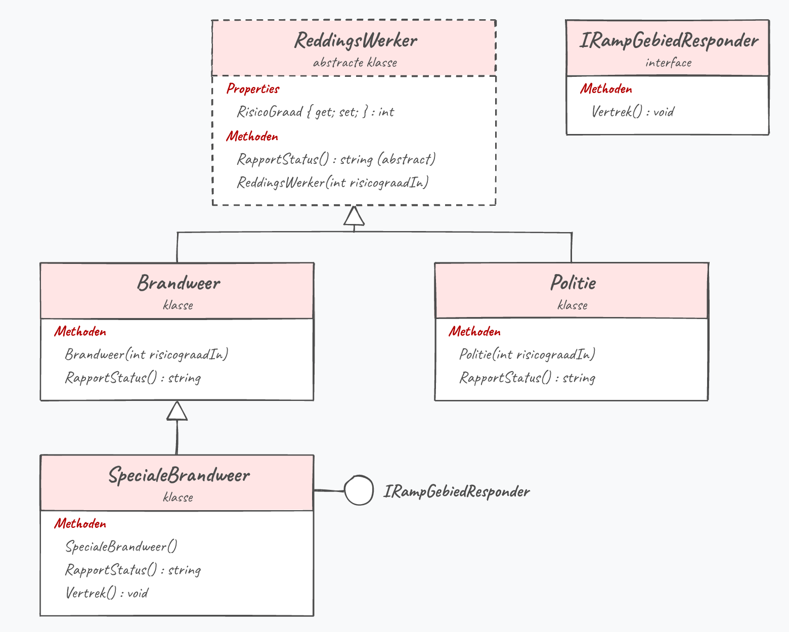

:::{.callout-tip}
Volgende opgave was de vaardigheidsproefopdracht voor het 1e zit examen van dit vak (OOP) in juni 2020
:::

## Opgave 1 (70%)

Een school, "Stedelijk Lyceum 90", heeft je gevraagd een administratief pakket voor hen te ontwikkelen. Maak een applicatie die simuleert hoe leerlingen in een school worden gemaakt op voorwaarde dat er genoeg geld aanwezig is. Vervolgens kunnen leerlingen uit een school gerekruteerd worden om als werkstudent te dienen.


### Maak een klasse School (35%)

* Je school heeft volgende properties:
  * GeldHoeveelheid: een int die nooit onder 15 kan gaan en die bijhoudt hoeveel geld je school nog heeft, private set
  * IsBijnaLeeg: een readonly property die true teruggeeft indien de hoeveelheid geld 15 of lager is
  * Leerlingen: een lijst van leerlingen (zie hierna) als gewone property. Bij de start is deze lijst leeg.
  * Een autoproperty Naam die steeds op school90 staat.
* Volgende publieke methoden:
  * GeefGeld: deze methode aanvaardt een double. Het getal dat je meegeeft wordt bijgeteld bij GeldHoeveelheid
  * MaakLeerling: Deze methode voegt een nieuwe leerling aan de lijst toe. Een leerling kan enkel gemaakt worden indien je school minstens 40 of hoger geld heeft. Vervolgens wordt de hoeveelheid geld met 15 verlaagd. Deze methode geeft een bool terug: true indien het aanmaken gelukt is, false indien niet (omdat er niet genoeg geld was)
  * GeefLeerling: deze methode geeft een object van het type Leerling terug indien er minstens 2 leerlingen in de lijst aanwezig zijn. De methode kiest altijd de eerste leerling uit de lijst om terug te geven en zal deze vervolgens uit de lijst verwijderen.
* Je school override ToString zodat de geldhoeveelheid, de Naam, IsBijnaLeeg en het aantal leerlingen in de lijst mooi op het scherm toont.

### Maak een klasse Leerling (25%)

Deze heeft 1 property:

* Een readonly string Naam met private set

Deze heeft een default constructor die bij het aanmaken van de leerling de naam van de leerling zal instellen op StudentX waarbij de X vervangen wordt door de zoveelste leerling die in het programma al werd aangemaakt. De eerste heet dus Student1, dan Student2, etc.

### Main werking (40%)
Toon in je main aan dat je klassen werken door een programma te maken dat:
* Een school aanmaakt
* Een lege lijst leerlingen, werkstudenten genaamd,  aanmaakt
* Een loop start die 15 keer zal lopen, per loop:
  * wordt een random hoeveelheid geld (tussen 15 en 30) aan je school gegeven.
  * Wordt een leerling aangemaakt in je  school
    * Indien een leerling kon aangemaakt worden (omdat er genoeg geld was) bestaat er 60 % kans dat vervolgens een leerling met de GeefLeerling-methode uit je school wordt gehaald en in de werkstudenten lijst wordt gestoken.
  * Wordt de informatie van je school op het scherm getoond (mbv ToString)
* Na de loop wordt de lijst van werkstudenten overlopen en worden de namen van alle leerlingen in die lijst getoond.

## Opgave 2  (30%)
Maak een kleine applicatie die kan gebruikt worden om alle reddingswerkers tijdens een ramp in kaart te brengen en op te volgen.

### Klassestructuur (40%)
Implementeer volgende klasse diagram (de naam van de Interface= IRampGebiedResponder)
{fig-alt="Klassendiagram: abstracte klasse ReddingsWerker met property RisicoGraad (int, get en set), de abstracte methode RapportStatus() die een string teruggeeft en de constructor ReddingsWerker(int risicograadIn). Interface IRampGebiedResponder met de methode Vertrek(). Brandweer en Politie erven van ReddingsWerker, elk met een constructor met int risicograadIn en RapportStatus(). SpecialeBrandweer erft van Brandweer, heeft de constructor SpecialeBrandweer(), RapportStatus() en Vertrek(), en implementeert IRampGebiedResponder."}

Zorg ervoor dat:
* Een SpecialeBrandweer altijd een risicograad van 15 heeft wanneer deze wordt aangemaakt. Brandweer en Politie krijgen hun risicograad via hun constructor, zoals in het schema: in je main maak je ze aan met een risicograad van 6.
* RapportStatus is abstract in ReddingsWerker (schuin gedrukt in het schema) en geeft een string terug met de risicograad van het object. Bij de SpecialeBrandweer wordt deze aangevuld met de zin “Ik ben beter”.

### In je main (60%)
In je main wordt van elke klasse die geen abstracte klasse is 1 object aangemaakt:
* Plaats deze elementen in een dictionary waarbij je steeds een random getal tussen 100 en 2000 als “key” toewijst. Zoek eerst op, bijvoorbeeld met een foreach over de dictionary, of deze key reeds in de dictionary aanwezig is, zo ja, dan genereer je nieuw getal en probeer je opnieuw toe te voegen. Toon deze key op het scherm.
* Vraag eenmalig aan de gebruiker een getal, de key, en toon van dit object de RapportStatus (ga er van uit dat de gebruiker steeds een geldige key invoert)
* Bereken de gemiddelde risicograad van alle objecten in de dictionary
* Bereken de gemiddelde risicograad van alle objecten die geen IRampGebiedResponder zijn 


::::{.callout-caution collapse="true" title="Oplossing"}
**Opgave 1**

**School.cs**

```java
namespace SchoolAdministratie
{
    internal class School
    {
        private int geldHoeveelheid = 15;

        public int GeldHoeveelheid
        {
            get { return geldHoeveelheid; }
            private set
            {
                if (value <= 15)
                    geldHoeveelheid = 15;
                else
                    geldHoeveelheid = value;
            }
        }

        public bool IsBijnaLeeg
        {
            get
            {
                if (GeldHoeveelheid <= 15)
                    return true;
                else
                    return false;
            }
        }

        public List<Leerling> Leerlingen { get; set; } = new List<Leerling>();

        public string Naam { get; } = "school90";

        public void GeefGeld(double geld)
        {
            GeldHoeveelheid += (int)geld;
        }

        public bool MaakLeerling()
        {
            if (GeldHoeveelheid >= 40)
            {
                GeldHoeveelheid -= 15;
                Leerlingen.Add(new Leerling());
                return true;
            }
            return false;
        }

        public Leerling GeefLeerling()
        {
            if (Leerlingen.Count >= 2)
            {
                Leerling eersteLeerling = Leerlingen[0];
                Leerlingen.RemoveAt(0);
                return eersteLeerling;
            }
            return null;
        }

        public override string ToString()
        {
            return $"{Naam}: geld {GeldHoeveelheid}, bijna leeg: {IsBijnaLeeg}, aantal leerlingen: {Leerlingen.Count}";
        }
    }
}
```

**Leerling.cs**

```java
namespace SchoolAdministratie
{
    internal class Leerling
    {
        private static int aantalAangemaakt = 0;

        public string Naam { get; private set; }

        public Leerling()
        {
            aantalAangemaakt++;
            Naam = $"Student{aantalAangemaakt}";
        }
    }
}
```

**Program.cs**

```java
namespace SchoolAdministratie
{
    internal class Program
    {
        static void Main(string[] args)
        {
            Random random = new Random();
            School school = new School();
            List<Leerling> werkstudenten = new List<Leerling>();

            for (int i = 0; i < 15; i++)
            {
                school.GeefGeld(random.Next(15, 31));
                if (school.MaakLeerling())
                {
                    //60 procent kans: 0 tot en met 59 op 100 mogelijke getallen
                    if (random.Next(0, 100) < 60)
                    {
                        Leerling werkstudent = school.GeefLeerling();
                        if (werkstudent != null)
                            werkstudenten.Add(werkstudent);
                    }
                }
                Console.WriteLine(school);
            }

            foreach (var werkstudent in werkstudenten)
            {
                Console.WriteLine(werkstudent.Naam);
            }
        }
    }
}
```

**Opgave 2**

**IRampGebiedResponder.cs**

```java
namespace Reddingswerkers
{
    interface IRampGebiedResponder
    {
        void Vertrek();
    }
}
```

**ReddingsWerker.cs**

```java
namespace Reddingswerkers
{
    abstract class ReddingsWerker
    {
        public int RisicoGraad { get; set; }

        public ReddingsWerker(int risicograadIn)
        {
            RisicoGraad = risicograadIn;
        }

        public abstract string RapportStatus();
    }
}
```

**Brandweer.cs**

```java
namespace Reddingswerkers
{
    class Brandweer : ReddingsWerker
    {
        public Brandweer(int risicograadIn) : base(risicograadIn)
        {
        }

        public override string RapportStatus()
        {
            return $"Risicograad {RisicoGraad}.";
        }
    }
}
```

**Politie.cs**

```java
namespace Reddingswerkers
{
    class Politie : ReddingsWerker
    {
        public Politie(int risicograadIn) : base(risicograadIn)
        {
        }

        public override string RapportStatus()
        {
            return $"Risicograad {RisicoGraad}.";
        }
    }
}
```

**SpecialeBrandweer.cs**

```java
namespace Reddingswerkers
{
    class SpecialeBrandweer : Brandweer, IRampGebiedResponder
    {
        public SpecialeBrandweer() : base(15)
        {
        }

        public void Vertrek()
        {
            Console.WriteLine("De speciale brandweer vertrekt naar het rampgebied.");
        }

        public override string RapportStatus()
        {
            return base.RapportStatus() + " Ik ben beter";
        }
    }
}
```

**Program.cs**

```java
namespace Reddingswerkers
{
    internal class Program
    {
        static void Main(string[] args)
        {
            Random random = new Random();
            List<ReddingsWerker> werkers = new List<ReddingsWerker>();
            werkers.Add(new Politie(6));
            werkers.Add(new Brandweer(6));
            werkers.Add(new SpecialeBrandweer());

            Dictionary<int, ReddingsWerker> rampGebied = new Dictionary<int, ReddingsWerker>();
            foreach (var werker in werkers)
            {
                int key;
                bool bestaatAl;
                do
                {
                    key = random.Next(100, 2000);
                    bestaatAl = false;
                    foreach (var item in rampGebied)
                    {
                        if (item.Key == key)
                            bestaatAl = true;
                    }
                } while (bestaatAl);
                rampGebied.Add(key, werker);
                Console.WriteLine($"{werker.GetType().Name} heeft key {key}");
            }

            Console.WriteLine("Geef een key:");
            int gekozenKey = Convert.ToInt32(Console.ReadLine());
            Console.WriteLine(rampGebied[gekozenKey].RapportStatus());

            int somAlle = 0;
            int somZonderResponder = 0;
            int aantalZonderResponder = 0;
            foreach (var item in rampGebied)
            {
                somAlle += item.Value.RisicoGraad;
                if (!(item.Value is IRampGebiedResponder))
                {
                    somZonderResponder += item.Value.RisicoGraad;
                    aantalZonderResponder++;
                }
            }

            Console.WriteLine($"Gemiddelde risicograad: {(double)somAlle / rampGebied.Count}");
            Console.WriteLine($"Gemiddelde risicograad zonder IRampGebiedResponder: {(double)somZonderResponder / aantalZonderResponder}");
        }
    }
}
```
::::
