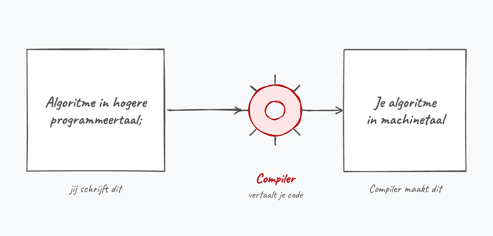
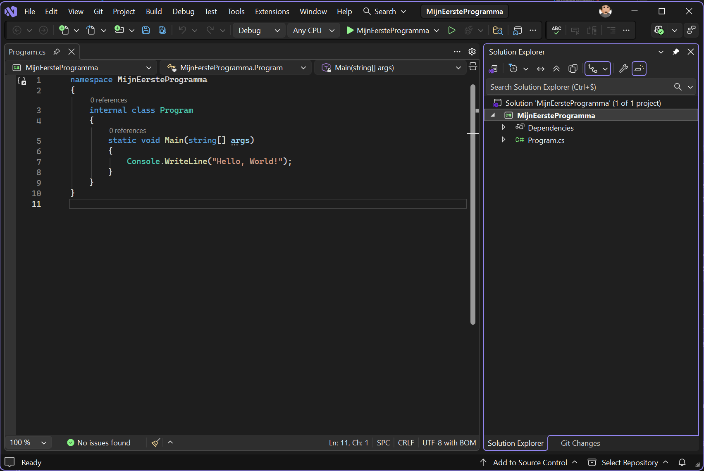
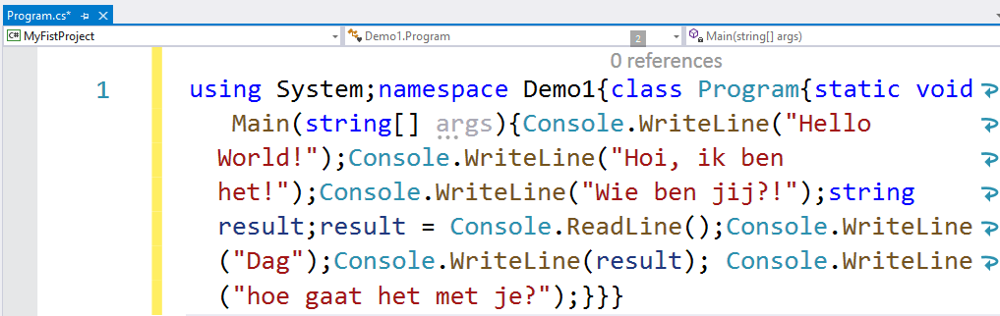
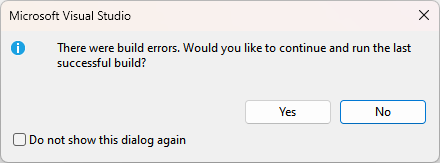
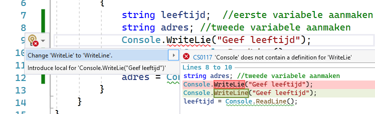

## Wat leer je in dit hoofdstuk?

Na dit hoofdstuk kan je:

* uitleggen wat **programmeren** en een **algoritme** zijn
* de rol van een **programmeertaal**, de **compiler** en **.NET** situeren
* een **console-project** aanmaken in Visual Studio
* in- en uitvoer verwerken met **`WriteLine`**, **`Write`** en **`ReadLine`**
* de meest voorkomende **beginnersfouten** herkennen en oplossen
* **kleur** gebruiken in de console

---

## Eerst denken, dan typen

> First, solve the problem. Then, write the code.

* Leren programmeren is als een berg beklimmen waarvan je nooit de top bereikt
  * en dat is net het mooie: er valt altijd iets nieuws te leren
* De eerste stappen zijn nooit eenvoudig

::: {.callout-tip .fragment}
Blijf volhouden. Blijf oefenen. Vloek gerust af en toe. En vooral: geniet van het ontdekken van nieuwe dingen.
:::

---

## Wat is programmeren?

* Computers zijn in essentie **ongelooflijk domme dingen**, hoe krachtig ze ook zijn
* Ze doen altijd **exact** wat jij zegt, niet wat je bedoelt

> **Programmeren** = leren praten met die domme computers zodat ze doen wat jij wilt.

::: {.callout-note .fragment}
Geef je hen de opdracht om te ontploffen, schrik dan niet dat je even later de 112 mag bellen.
:::

---

## Het algoritme

* Mythe: een programmeur schrijft de hele dag code
* Echt werk = **analyse van het probleem** + een goed **algoritme**

Een algoritme is het **recept** dat je aan de computer geeft: een **reeks instructies** in de juiste **volgorde**.

```text
Haal dop van het ventiel.
Plaats pomp op ventiel.
Begin te pompen.
```

::: {.callout-warning .fragment}
Een andere volgorde geeft vreemde, en soms fatale, fouten. Logisch en analytisch denken is dus de echte kern.
:::

---

## Een programmeertaal

Een taal die de computer begrijpt is meestal:

* **ondubbelzinnig**: elke opdracht heeft exact één betekenis (anders dan "wat een koele kikker")
* **woordenschat**: een vaste lijst woorden die je mag gebruiken
* **grammaticaregels**: een vaste volgorde

::: {.callout-tip .fragment}
Enkel Yoda mag woorden in de verkeerde volgorde gebruiken. "bal rood jongen is gooit veel"?
:::

---

## C# (siesjarp)

* Eén van de vele programmeertalen, deel van **.NET** ("dotnet")
* Een **hogere programmeertaal**: leesbaarder, dichter bij onze eigen taal
* C# lijkt als twee druppels water op **Java**, en stamt af van C en C++

::: {.callout-tip .fragment}
Net als bij talen leren: ken je eenmaal Frans, dan leer je makkelijker Italiaans of Spaans. Zo ook met programmeertalen: na dit boek hebben Python en JavaScript weinig geheimen meer voor je.
:::

---

## Anders Hejlsberg

:::: {.columns}

::: {.column width="35%"}

:::

::: {.column width="65%"}
De Deen die C# boven de doopvont hield bij Microsoft.

* Schreef eerder **Turbo Pascal**
* Was *chief architect* van **Delphi**
* Bedacht later ook **TypeScript**
:::

::::

::: {.callout-tip .fragment}
Als je één poster in je slaapkamer hangt, zou het die van Anders moeten zijn.
:::

---

## De compiler

* Machinetaal rechtstreeks schrijven is loodzwaar: tientallen lijnen voor één letter op het scherm
* We hebben dus een **vertaler** nodig: de **compiler**



De kern: **C#-code omzetten naar een uitvoerbaar bestand in machinetaal**.

---

## .NET, kort

::: {.callout-note}
**.NET** is een **framework**: een grote verzameling bibliotheken plus de **Common Language Runtime (CLR)**.

* Je C#-code wordt eerst omgezet naar **Intermediate Language (IL)**
* Bij het uitvoeren zet de CLR die IL **Just-In-Time (JIT)** om naar machinetaal
* Daardoor kunnen .NET-talen (C#, F#, VB.NET) samenwerken met diezelfde bibliotheken
:::

---

## Naamgeving van .NET en C#

* Sinds 2020: gewoon **.NET gevolgd door een nummer** (.NET 5, 6, ... en intussen hoger)
* Elk jaar in november een nieuwe versie; de **even** nummers zijn **LTS** (langer ondersteund)
* Dit boek werkt steeds met de **meest recente LTS-versie**
* Elke .NET-versie komt met een nieuwe **C#-versie** (features die je *kan*, niet *moet* gebruiken)

::: {.callout-tip .fragment}
Waarom deze geschiedenisles? Online bots je vaak op oudere namen. Anders raak je het noorden kwijt bij het opzoeken.
:::

---

## Visual Studio: de IDE

* We werken met **Visual Studio Community 2026** (gratis)
* VS is een **IDE** (Integrated Development Environment): debugger, code-editor en compiler in één
* **Niet** Visual Studio *Code*: dat is een lichtere, aparte editor

::: {.callout-warning .fragment}
Sinds augustus 2024 bestaat VS Community niet meer voor **Mac**. Mac-gebruikers werken met VS Code of JetBrains Rider, of draaien Windows via een virtuele machine.
:::

---

## Installeren: één workload volstaat

* Download de **Community**-editie via [visualstudio.microsoft.com/vs](https://visualstudio.microsoft.com/vs)
* Kies bij de installatie zeker de workload **".NET desktop development"**

Meer heb je voorlopig niet nodig.

---

## Een nieuw project: Console App

Kies "Create a new project" en let op:

* Projecttype **Console App** met het **groene C#-icoon** (niet Visual Basic)
* Duid zeker **"Do not use top-level statements"** aan
* Laat **"Solution name"** met rust en vink **niet** "place solution and project in the same directory" aan

::: {.callout-important .fragment}
Krijg je code te zien die er totaal anders uitziet? Dan koos je wellicht het verkeerde projecttype, de verkeerde taal, of vergat je de top-level-statements-checkbox.
:::

---

## De IDE-layout

:::: {.columns}

::: {.column width="55%"}
* Elk open bestand krijgt een eigen **tab**
* De **Solution Explorer** toont alle bestanden van je project (niet wegklikken!)
* De **Copilot**-AI rechts mag je meteen wegklikken
:::

::: {.column width="45%"}

:::

::::

::: {.callout-tip .fragment}
Layout om zeep? "Window" - "Reset window layout" zet alles terug.
:::

---

## A.I. even parkeren

* VS heeft krachtige AI ingebouwd: **IntelliCode** en **Copilot**
* Verbluffend goed, maar voor een beginner **af te raden**

> Je leert ook niet hoofdrekenen door vanaf dag 1 met een zakrekenmachine te werken.

::: {.callout-important .fragment}
De programmeur van de toekomst moet **béter** zijn dan Copilot en ChatGPT. Wie enkel op AI leunt, beperkt z'n kansen. Zet de tools dus voorlopig **uit**.
:::

---

## Je eerste programma

```csharp
namespace Demo1
{
    internal class Program
    {
        static void Main(string[] args)
        {
            Console.WriteLine("Hello World!");
        }
    }
}
```

::: {.callout-important}
**Voorlopig negeren.** De keywords `namespace`, `class` en `static void Main` lijken mysterieus. Dat geeft niet: schrijf voorlopig enkel **tussen de accolades van `Main`**. We pluizen ze uit vanaf hoofdstuk 7.
:::

---

## Even in het diepe

:::: {.columns}

::: {.column width="20%"}

:::

::: {.column width="80%"}
Ik gooi je heel even in het diepe deel van het zwembad, maar haal je er op tijd weer uit. Daarna spelen we rustig verder in het babybadje.

Onthoud nu alvast:

* Al je eigen code komt voorlopig **tussen de `Main`-accolades**
* Eindig elke lijn met een **puntkomma** (`;`)
* Code wordt **van boven naar onder** uitgevoerd
:::

::::

---

## WriteLine: tekst op het scherm

* **`Console.WriteLine()`** toont alle tekst tussen de aanhalingstekens

```csharp
Console.WriteLine("Hello World!");
Console.WriteLine("Hoi, ik ben het!");
Console.WriteLine("Wie ben jij?!");
```

De aanhalingstekens én de puntkomma achteraan zijn **cruciaal**.

---

## ReadLine: input van de gebruiker

* **`Console.ReadLine()`** leest wat de gebruiker typt tot die op enter drukt

```csharp
Console.WriteLine("Geef je naam?");
string naam = Console.ReadLine();
```

We maken een geheugenplekje (**variabele**) `naam` van het type `string` en bewaren daarin wat de gebruiker invoert.

::: {.callout-tip .fragment}
Toekenning gebeurt **van rechts naar links**: `naam` (links) krijgt de waarde van het stuk rechts van de `=`.
:::

---

## Aanhalingsteken of niet?

```csharp
Console.WriteLine("Dag " + naam + ", hoe gaat het?");
```

* **Mét** aanhalingstekens (`"Dag "`): letterlijk die tekst
* **Zonder** aanhalingstekens (`naam`): de **inhoud** van de variabele

`Console.WriteLine("naam");` toont dus letterlijk het woord *naam*, niet wat de gebruiker typte.

---

## Write vs WriteLine

* **`WriteLine`** plaatst een *enter* aan het einde van de lijn
* **`Write`** doet dat **niet**: het volgende komt op **dezelfde lijn**

```csharp
Console.Write("Dag");
Console.Write(naam);
Console.Write("hoe gaat het?");
```

Resultaat: `Dagtimhoe gaat het?`

::: {.callout-important .fragment}
Spaties zijn ook tekens. Zet ze **binnen** de aanhalingstekens: `"Dag "`. Spaties buiten de quotes worden genegeerd.
:::

---

## C# negeert witregels

* Spaties, enters en tabs **buiten** aanhalingstekens worden genegeerd
* Je kan een heel programma op één lange lijn typen... maar doe dat niet



---

## Zinnen aan elkaar plakken

De **`+`-operator** plakt tekst aan elkaar:

```csharp
Console.WriteLine("Dag " + naam + ", hoe gaat het?");
```

::: {.callout-tip .fragment}
`+` werkt prima, maar is niet de modernste manier. In het volgende hoofdstuk leer je **string interpolation**: veel leesbaarder.
:::

---

## Sneller typen met snippets

Je gaat **heel vaak** `Console.WriteLine` schrijven. Gelukkig zit er een snippet in VS:

> **`cw`** + tweemaal **`[tab]`**

En *automagisch* verschijnt er een verse lijn `Console.WriteLine();`.

---

## Fouten oplossen

Je code compileert pas als ze **100% foutloos** is. VS helpt:

* Fouten krijgen een **rode squiggly** onderlijning
* De **statusbalk** en de **error list** tonen al je fouten
* Klik op een fout om meteen naar de juiste lijn te springen

::: {.callout-tip .fragment}
Veel fouten ineens? Kijk **net boven** de eerste fout. Vaak ontbreekt daar gewoon een puntkomma.
:::

---

## De gevaarlijke dialog

{width=60%}

::: {.callout-warning}
Krijg je deze melding bij het starten? **Klik nooit op "Yes" en vink de checkbox nooit aan.**

Anders draait VS de laatste **werkende** versie, niet je huidige code met fouten. Je zit dan uren naar een "spook" te kijken.
:::

---

## Het lampje

:::: {.columns}

::: {.column width="55%"}
* Zet je cursor op een foutlijn, dan verschijnt soms een **geel lampje**
* Klik erop voor een mogelijke oplossing
:::

::: {.column width="45%"}

:::

::::

::: {.callout-important .fragment}
Wees **kritisch**: VS is niet alwetend en kan niet altijd raden wat je bedoelt.
:::

---

## Top 5 beginnersfouten

1. **Puntkomma** vergeten
2. **Schrijffouten**, bv. `RaedLine` i.p.v. `ReadLine`
3. **Hoofdlettergevoeligheid**, bv. `Readline` i.p.v. `ReadLine`
4. Per ongeluk een **accolade** verwijderd
5. Code op een **plek waar dat niet mag** (enkel binnen `Main`)

---

## Kleuren in de console

```csharp
Console.BackgroundColor = ConsoleColor.Yellow;
Console.ForegroundColor = ConsoleColor.Black;
Console.WriteLine("Zwart op gele achtergrond");
Console.ResetColor();
```

* **`ForegroundColor`** = letterkleur, **`BackgroundColor`** = achtergrond
* Geldt voor alle tekst **hierna**; bestaande tekst verandert niet mee
* **`ResetColor()`** zet alles terug naar de standaard

::: {.callout-important .fragment}
Hou het leesbaar en denk aan **daltonisme**: rood op groen las voor sommigen onleesbaar.
:::

---

## Conclusie

* **Programmeren** = een dom maar gehoorzaam toestel exact vertellen wat het moet doen
* Een goed **algoritme** (de juiste instructies in de juiste volgorde) komt vóór de code
* De **compiler** vertaalt je C# naar machinetaal; **.NET** levert het framework
* Met **`WriteLine`**, **`Write`** en **`ReadLine`** doe je in- en uitvoer
* Lees je **fouten**, wees kritisch op het lampje, en klik **nooit** op "Yes" bij die dialog

::: {.callout-tip}
Volgende halte: **variabelen en datatypes**. Daar gaan we het woord "variabele" zo vaak gebruiken dat je oren ervan gaan bloeden.
:::

---

## Meer weten

**Kennisclips**

* [Introductie tot C#](https://ap.cloud.panopto.eu/Panopto/Pages/Viewer.aspx?id=f517d032-35b9-4c9f-ba91-ac33007cd2a6)
* [Werken met VS](https://ap.cloud.panopto.eu/Panopto/Pages/Viewer.aspx?id=49110395-048c-4792-810b-af030090a520)
* [Je eerste programma](https://ap.cloud.panopto.eu/Panopto/Pages/Viewer.aspx?id=3b85ae06-384c-4c3b-958d-af0300961b14)
* [WriteLine, Write en ReadLine](https://ap.cloud.panopto.eu/Panopto/Pages/Viewer.aspx?id=645c1bae-c84d-47c4-89d6-abe3009410c3)
* [Fouten oplossen](https://ap.cloud.panopto.eu/Panopto/Pages/Viewer.aspx?id=1dd4ec60-8782-4bc5-8522-ac3200d629cd)
* [Kleuren in console](https://ap.cloud.panopto.eu/Panopto/Pages/Viewer.aspx?id=a0446be7-b8f2-4ce7-ba76-abe30094107e)

[Oefeningen H1](https://apwt.gitbook.io/ziescherp-oefeningen/h1-de-eerste-stappen/a_practica) · [Quizlet flashcards](https://quizlet.com/be/918617842/zie-scherp-scherper-hoofdstuk-01-flash-cards/)
