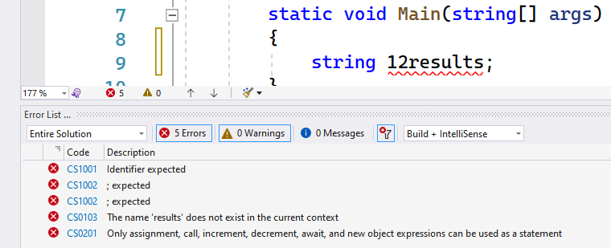
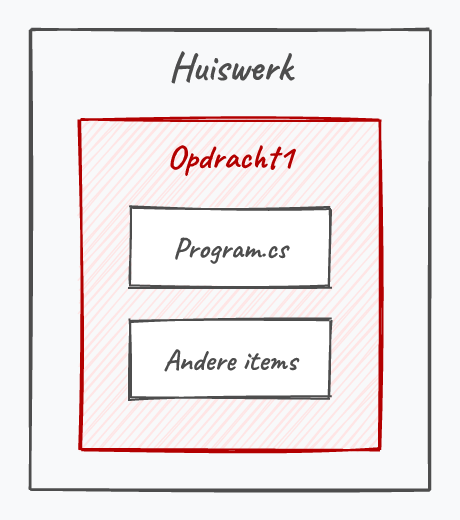

## Wat leer je in dit hoofdstuk?

Na dit hoofdstuk kan je:

* de **C#-syntax** en de rol van **keywords** uitleggen
* geldige **identifiers** herkennen en variabelen volgens de conventies benoemen
* de belangrijkste **datatypes** kiezen (`int`, `double`, `bool`, `char`, `string`, ...)
* variabelen **declareren**, **initialiseren** en **literals** correct schrijven
* **expressies** en **operators** gebruiken, inclusief de valkuil van gehele deling
* **constanten** gebruiken en de structuur van **solutions en projecten** uitleggen

---

## C# is ook maar een taal

Net als elke taal bestaat C# uit:

* **grammatica**: de **C#-syntax**
* **woordenschat**: de gereserveerde **keywords**

Een programma is een opeenvolging van **statements**, en elk statement eindigt op een **puntkomma** (`;`), zoals een zin op een punt.

> Eén statement = één lijn in je recept, het algoritme.

---

## Een paar harde regels

* **Hoofdlettergevoelig**: `Reinhardt` en `reinhardt` zijn niet hetzelfde
* **Puntkomma** sluit elk statement af
* **Witruimte** (spaties, tabs, enters) wordt genegeerd, behalve tussen `" "`
* **Commentaar** mag: `//` voor één lijn, `/* ... */` voor een blok
* Je code start altijd in **`Main`**
* Uitvoering gaat **van boven naar onder**

---

## Keywords: de woordenschat

* C# heeft **80 gereserveerde keywords** met een vaste, eenduidige betekenis

```csharp
int   double   bool   string   if   for   while   class   void   return
```

* Doorheen het boek leren we ze stelselmatig gebruiken

::: {.callout-tip .fragment}
C# is een levende taal. Nieuwe woorden komen erbij als **contextual keywords** (bv. `get`, `set`, `value`, `var`); de lijst van 80 echte keywords verandert niet.
:::

---

## Even iets van het hart

:::: {.columns}

::: {.column width="30%"}

:::

::: {.column width="70%"}
**Step away from the keyboard!**

`goto` is een officieel keyword, maar je ziet het in dit boek **nooit**.

* Elk probleem los je op zonder `goto`
* Voel je de drang? **Don't.** Het is het niet waard.
:::

::::

::: {.callout-warning .fragment}
**NEVER EVER USE GOTO.** Enneuh, ik hou je in 't oog hoor.
:::

---

## Variabelen, kort

Een **variabele** is een geheugenplekje waarin we tijdelijk data bewaren (bv. gebruikersinput).

Bij het aanmaken geef je minstens twee zaken mee:

* een **identifier**: de gebruiksvriendelijke naam voor die geheugenplek
* een **datatype**: wat voor soort data erin mag

Zo hoef je niet te werken met een lang geheugenadres als `0x4234FE13EF1`.

---

## Regels voor identifiers

* **Hoofdlettergevoelig**: `tim` en `Tim` zijn verschillend
* **Geen keywords**: `goto` of `string` mag niet als naam
* **Eerste teken**: een letter of een liggend streepje (`_`)
* **Daarna**: ook cijfers toegelaten
* **Lengte**: zo lang je wil, maar hou het leesbaar

::: {.callout-tip .fragment}
Breek je deze regels, dan raakt VS volledig de kluts kwijt met een hele resem foutboodschappen.
:::

---

## Identifiers: mag het of niet?

:::: {.columns}

::: {.column width="55%"}
| Identifier | Mag? |
|---|---|
| `werknemer` | ja |
| `kerst2018` | ja |
| `pippo de clown` | nee (spaties) |
| `4dPlaats` | nee (start cijfer) |
| `_ILOVE2022` | ja |
| `Tor+Bjorn` | nee (`+`) |
| `class` | nee (keyword) |
:::

::: {.column width="45%"}

:::

::::

---

## Naamgeving: de conventies

* **Duidelijke naam**: liever `gewicht` of `leeftijd` dan `a` of `meuh`
* **camelCasing** bij meerdere woorden: elk volgend woord met een hoofdletter, het eerste woord met een kleine letter

```csharp
int leeftijdTimDams;
int aantalLeerlingenKlas1EA;
```

---

## Commentaar

```csharp
//De start van het programma
int getal = 3;
int result = getal * 5;
Console.WriteLine(result); //resultaat: 15

/*
    Dit is blok-commentaar
    over meerdere lijnen
*/
```

* `//` zet alles tot het einde van de lijn in commentaar
* `/* ... */` zet een volledig blok in commentaar
* Handig om tijdelijk code "uit te schakelen"

---

## Datatypes

C# is een **strongly typed language**: je legt van bij de start vast welk **soort data** een variabele bevat.

In dit boek gebruiken we types voor:

* **gehele getallen**: `sbyte, byte, short, ushort, int, uint, long, ulong`
* **kommagetallen**: `double, float, decimal`
* **tekst**: `char, string`
* **booleans**: `bool`

::: {.callout-tip .fragment}
Anders dan in JavaScript kan data hier niet zomaar van vorm veranderen. Dat is soms strenger, maar bespaart je veel gevloek.
:::

---

## Gehele getallen

| Type | Geheugen | Bereik |
|---|---|---|
| `byte` | 8 bits | 0 tot 255 |
| `short` | 16 bits | -32 768 tot 32 767 |
| `int` | 32 bits | ca. -2,1 tot +2,1 miljard |
| `long` | 64 bits | ca. -9,2 tot +9,2 triljoen |

* `s` = **signed** (1 bit voor het teken), `u` = **unsigned** (altijd positief)
* Het bereik volgt rechtstreeks uit het aantal bits

::: {.callout-tip .fragment}
Bij twijfel kies je voor gehele getallen gewoon **`int`**.
:::

---

## Moet ik dit allemaal kennen?

:::: {.columns}

::: {.column width="22%"}

:::

::: {.column width="78%"}
"Wow, moet ik al die datatypes vanbuiten kennen? Ik was al blij dat ik tekst op het scherm kon tonen."

Nee. Onthoud de belangrijkste, en door **veel te programmeren** ontdek je vanzelf welk type waar past. Laat je niet afschrikken door de ellenlange tabellen: we gebruiken er maar een handvol.
:::

::::

---

## Kommagetallen

| Type | Geheugen | Sterkte |
|---|---|---|
| `float` | 32 bits | kleinst |
| `double` | 64 bits | grootste bereik |
| `decimal` | 128 bits | hoogste precisie (28-29 cijfers) |

* `decimal` vooral voor **financiële** en **wetenschappelijke** code
* **Precisie** = aantal beduidende cijfers (`2.2345` heeft precisie 5)

::: {.callout-tip .fragment}
Bij twijfel kies je voor kommagetallen **`double`**.
:::

---

## Bool, char en string

* **`bool`**: het eenvoudigste type, enkel **`true`** of **`false`** (neemt 1 byte in)
  * onmisbaar bij beslissingen (`if`) vanaf een later hoofdstuk
* **`char`**: één enkel karakter
* **`string`**: een stuk tekst

::: {.callout-warning .fragment}
Weet je dat een variabele maar twee waarden kan hebben? Gebruik dan een **`bool`**, geen `int`. Scheelt geheugen en is duidelijker.
:::

---

## Variabelen declareren

```csharp
int leeftijd;
string leverAdres;
bool isGehuwd;
```

* **Declareren** = type + identifier opgeven
* Optioneel meteen een **beginwaarde** toekennen:

```csharp
int mijnLeeftijd = 37;
```

Toekenning gaat **van rechts naar links**: het deel rechts van `=` gaat naar links.

---

## Literals

Een **literal** is een waarde die je letterlijk neerschrijft. De schrijfwijze bepaalt het type:

```csharp
int getal = 5;
double anderGetal = 5.5;
uint nogAnder = 15u;
float klein = 158.9f;
char letter = 'k';
bool isCool = true;
string zin = "Ja hoor";
```

* Gehele getallen zijn standaard **`int`**, kommagetallen standaard **`double`**
* Suffixen: `u` (uint), `L` (long), `f` (float), `m` (decimal)

---

## Geef altijd een beginwaarde

Een **lokale variabele** (binnen `Main`) moet een waarde hebben **voor** je ze uitleest:

```csharp
int getal;
Console.WriteLine(getal); //FOUT: use of unassigned local variable
```

::: {.callout-tip .fragment}
**Instantievariabelen** (bij een object, zie het hoofdstuk klassen) krijgen *wel* automatisch een standaardwaarde: `0` voor getallen, `false` voor `bool`, `""` voor tekst.
:::

---

## Waarden overschrijven

Een nieuwe waarde wist de oude **onherroepelijk**:

```csharp
int temperatuurGisteren = 20;
temperatuurGisteren = 25; //20 is weg
```

::: {.callout-important .fragment}
Declareer een variabele **maar één keer**. Dit geeft een fout:

```csharp
double kdRating = 2.1;
double kdRating = 3.4; //al gedefinieerd in deze scope
```
:::

---

## Expressies en operators

Een **expressie** is een reeks bewerkingen die uitkomt op één resultaat met een type. `3 + 2` geeft `5` (type `int`).

Volgorde van berekeningen, net als in de wiskunde:

1. **Haakjes**
2. `*`, `/`, `%`
3. `+`, `-`

```csharp
3 + 5 * 2     // 13
(3 + 5) * 2   // 16
```

::: {.callout-tip .fragment}
In `3 + 2` zijn `3` en `2` de **operanden** en `+` de **operator**.
:::

---

## Een echte berekening

Hoeveel zou je wegen op Mars?

```csharp
double gewichtOpAarde = 80.3; //kg
double gAarde = 9.81;
double gMars = 3.711;
double gewichtOpMars = (gewichtOpAarde / gAarde) * gMars;
Console.WriteLine("Je weegt op Mars " + gewichtOpMars + " kg");
```

Literals, variabelen en operators samen, met haakjes om de volgorde af te dwingen.

---

## Modulo: de rest na deling

De **`%`-operator** geeft de gehele **rest** van een deling:

```csharp
int rest = 7 % 2;   // 1  (7 = 3*2 + 1)
int rest2 = 10 % 5; // 0
```

::: {.callout-tip .fragment}
`% 2` is dé manier om te testen of een getal **even** is: is de rest `0`, dan is het even.
:::

---

## Verkorte notaties

```csharp
getal++;    // getal = getal + 1
getal--;    // getal = getal - 1
getal += 3; // getal = getal + 3
getal *= 7; // getal = getal * 7
```

* Compacter om te lezen, niet sneller
* `getal++` zie je overal (zeker in lussen), dus je moet het vlot kunnen **lezen**

---

## Pre- vs post-increment

```csharp
int getal = 1;
int som = getal++;  // som wordt 1, getal wordt 2
int som2 = ++som;   // som2 wordt 2, som wordt 2
```

::: {.callout-important}
* `som++` (achteraan): geef **eerst** de waarde terug, **dan** verhogen
* `++som` (vooraan): **eerst** verhogen, **dan** de nieuwe waarde teruggeven
:::

---

## Opletten geblazen

:::: {.columns}

::: {.column width="22%"}

:::

::: {.column width="78%"}
Zet je helm op. Als je de volgende sectie goed begrijpt, heb je een grote stap gezet.

Variabelen zijn het **hart** van programmeren. Expressies zijn het **bloedvatensysteem** dat ze combineert tot iets nieuws.
:::

::::

---

## Het type van een expressie

> De types die je in een expressie gebruikt, bepalen het type van het **resultaat**.

```csharp
int result = 3 + 4;       // int + int = int, ok
int fout = 3.1 / 45.2;    // FOUT: double past niet in int
```

`int` + `int` geeft een `int`. Een `double` kan je niet zomaar aan een `int` toewijzen.

---

## De val: gehele deling

```csharp
int getal1 = 9;
int getal2 = 2;
int result = getal1 / getal2;
Console.WriteLine(result);
```

::: {.callout-warning .fragment}
Op het scherm verschijnt **`4`**, niet `4.5`.

`int / int` geeft een `int`: C# **kapt** alles na de komma af (*truncatie*), het rondt niet af. Ook `4.9` wordt zo `4`.
:::

---

## Datatypes mengen

Meng je een `int` met een `double`, dan kiest C# het **grootste** type (hier `double`):

```csharp
double result = 3 / 5.6;  // ok
int    fout   = 3 / 5.6;  // FOUT: double past niet in int
```

Wil je `9 / 2` als `4.5`, zet dan minstens één operand op `double`:

```csharp
double getal2 = 2.0; //slim he
double result = 9 / getal2; // 4.5
```

---

## Krijg jij de helft van mijn salaris?

Ik verdien 10 000 euro per maand (*I wish*) en geef je de helft:

```csharp
double helft = 10000.0 * (1 / 2);
```

. . .

**Hoeveel krijg je? 0.0 euro. MUHAHAHA.**

`1 / 2` is een gehele deling en geeft `0`. Pas dit aan:

```csharp
double helft = 10000.0 * (1.0 / 2); // 5000.0
```

---

## Constanten

Met **`const`** maak je een variabele **onveranderlijk**:

```csharp
const double G_AARDE = 9.81;
G_AARDE = 10.48; //ERROR, al bij het compileren
```

* Conventie: een `const` in **ALLCAPS** met liggende streepjes
* Vermijd losse **magic numbers**: geef ze een duidelijke naam

---

## Solutions en projecten

:::: {.columns}

::: {.column width="60%"}
Visual Studio organiseert je code in een hiërarchie:

* een **solution** is een map met **één of meer projecten**
* een **project** bundelt codebestanden tot één uitvoerbaar geheel

Daarom raden we aan om *"Place solution and project in the same directory"* **niet** aan te vinken.
:::

::: {.column width="40%"}

:::

::::

::: {.callout-warning .fragment}
Een `.sln`-bestand bevat **geen code**. Wil je je werk delen, geef dan de **hele folderstructuur** mee.
:::

---

## Conclusie

* C# = **syntax** (grammatica) + **keywords** (woordenschat); statements eindigen op `;`
* Een **variabele** = identifier + datatype; geef ze altijd meteen een **beginwaarde**
* Kies je **datatype** bewust: `int` en `double` als veilige standaard
* **Expressies** volgen de wiskundige volgorde, maar let op **`int / int`**: dat kapt af
* **`const`** maakt waarden onveranderlijk; **solutions** bundelen **projecten**

::: {.callout-tip}
Volgende halte: alles over **tekst**: `char`, `string` en hun trucjes.
:::

---

## Zie verder: andere talen

Dezelfde concepten uit dit hoofdstuk, maar dan in andere talen. Handig om later code in Python of JavaScript te leren lezen.

---

## Zie verder: types in Python

In **Python** geef je nooit een type op. Diezelfde variabele mag later zelfs een ander soort data bevatten:

```python
x = 5        # x is een geheel getal
x = "hallo"  # nu tekst, Python klaagt niet
```

In C# blijft een `int` een `int`: regel twee zou hier een compilatiefout geven.

::: {.fragment}
Handig om te weten: zo'n stukje Python kan je nu al grotendeels lezen, ook al schrijf je het zelf nog niet.
:::

---

## Zie verder: getaltypes elders

Die hele waaier integer-types deelt C# met **C** en **C++**: ook daar kies je tussen `short`, `int`, `long`, ... omdat geheugen telt.

**JavaScript** doet het omgekeerde: één enkel getaltype `number`, altijd een 64-bit kommagetal.

```javascript
let leeftijd = 25;   // intern een kommagetal
let prijs = 19.99;   // exact hetzelfde type
```

Handig, maar het verklaart waarom JS onnauwkeurig wordt bij heel grote gehele getallen.

---

## Zie verder: bestaat `bool` overal?

Niet vanzelfsprekend. De oude **C**-standaard had geen booleantype: men gebruikte een `int`, met `0` als false en al de rest als true.

```c
int klaar = 0;        /* false */
if (klaar) { /* ... */ }   /* draait niet */
```

C# (net als Java en Python) maakt van `true` en `false` echte, aparte waarden, zodat je geen getal per ongeluk als conditie gebruikt.

---

## Zie verder: `const` in Python

**Python** kent geen echt `const`-keyword. Een naam in ALLCAPS is er enkel een *afspraak*, geen regel die de taal afdwingt.

```python
G_AARDE = 9.81   # afspraak: niet wijzigen
G_AARDE = 10.48  # Python staat dit gewoon toe
```

In C# vangt de compiler die tweede regel meteen op: de taal dwingt de belofte af.

---

## Meer weten

**Kennisclips**

* [Essentie van C#](https://ap.cloud.panopto.eu/Panopto/Pages/Viewer.aspx?id=5ada7611-488b-4890-94b7-ac3300c413f7)
* [Datatypes](https://ap.cloud.panopto.eu/Panopto/Pages/Viewer.aspx?id=1b40cd70-3224-486b-846a-ac38009741af)
* [Variabelen](https://ap.cloud.panopto.eu/Panopto/Pages/Viewer.aspx?id=17b14f94-5805-4ce1-a4d6-ac3800a51815)
* [Expressies](https://ap.cloud.panopto.eu/Panopto/Pages/Viewer.aspx?id=67287dee-b3b8-49a6-886c-ac3a00a1eb65)
* [VS Howto: meerdere projecten in 1 solution](https://ap.cloud.panopto.eu/Panopto/Pages/Viewer.aspx?id=52e6f50e-d90e-4210-8cb0-af2300a6bbbf)

[Oefeningen H2](https://apwt.gitbook.io/ziescherp-oefeningen/h2-de-basisconcepten-van-c/a_practica) · [Quizlet flashcards](https://quizlet.com/be/918618272/zie-scherp-scherper-hoofdstuk-02-flash-cards/)
