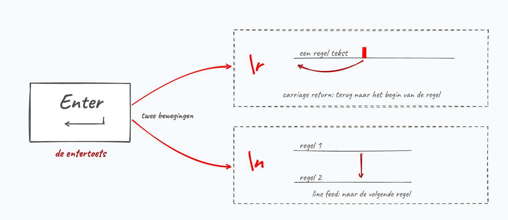
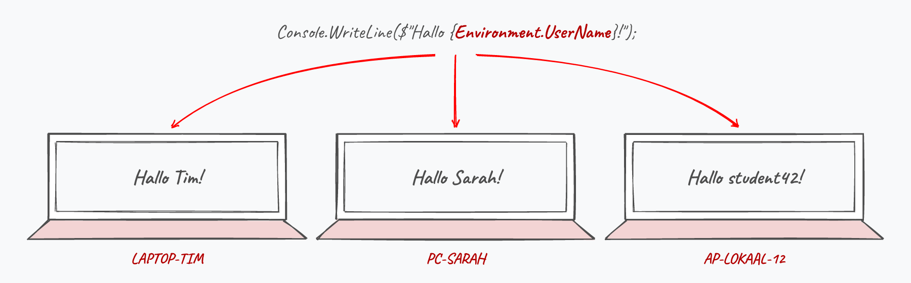
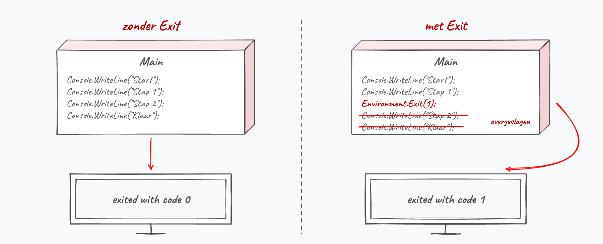
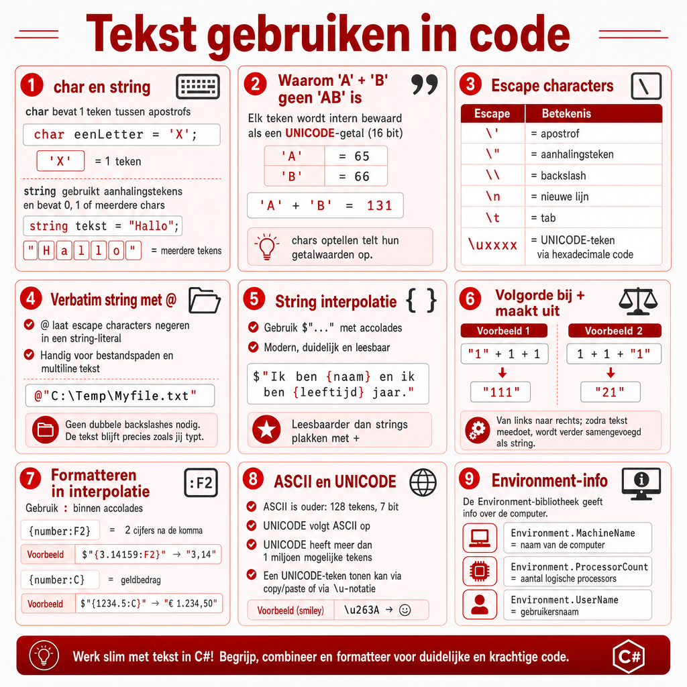

## Wat leer je in dit hoofdstuk?

Na dit hoofdstuk kan je:

* het verschil tussen **`char`** en **`string`** uitleggen
* **ASCII** en **UNICODE** situeren en weten hoe .NET tekst bewaart
* **escape characters** (`\n`, `\t`, `\"`, ...) gebruiken en weten waarom een Enter uit twee tekens bestaat
* tekst letterlijk laten staan met het **verbatim** teken `@` of met een **raw string literal** (`"""`)
* tekst samenvoegen en formatteren met **string interpolation** (`$`)
* speciale **UNICODE-tekens** en emoji op het scherm tonen
* info over de machine ophalen via **`Environment`** en je programma afsluiten met een **exitcode**

---

## Alles is een char

* Elk teken dat je intypt is een **`char`**
* Je toetsenbord toont maar een fractie van alle mogelijke tekens (vergelijk met een Spaans, Tunesisch of Chinees toetsenbord)

Voor we tekst inlezen, moeten we begrijpen **hoe** een computer al die tekens voorstelt.

---

## Van ASCII naar UNICODE

:::: {.columns}

::: {.column width="55%"}
* **ASCII**: de oude standaard, maar 128 tekens (7 bits)
* **UNICODE**: de opvolger, ruimte voor meer dan 1 miljoen tekens
* De eerste 128 UNICODE-tekens zijn identiek aan ASCII (compatibel)
* .NET bewaart een `string` intern als **UTF-16**
:::

::: {.column width="45%"}

:::

::::

::: {.callout-tip .fragment}
De eerste 32 tekens zijn "onzichtbare" stuurtekens uit het Telex-tijdperk (*line feed*, *bell*, ...).
:::

---

## Char

```csharp
char eenLetter = 'X';
Console.WriteLine(eenLetter);
```

* Één enkel karakter, tussen **apostrofs** (`'`)
* **Intern bewaard als een 16-bit getal** (de UNICODE-waarde)

::: {.callout-important .fragment}
`char eenGetal = '7';` bewaart het teken `7`, niet het getal 7. Wil je ermee rekenen, dan moet je eerst converteren (hoofdstuk 4).
:::

---

## String

> Een **`string`** is een reeks van 0, 1 of meer `char`-elementen.

* Tekst staat tussen **dubbele aanhalingstekens** (`"`)
* Een `char` gebruikt een apostrof, een `string` aanhalingstekens

{width=80%}

::: {.callout-tip .fragment}
In hoofdstuk 8 ontdek je dat een `string` eigenlijk een **array** van chars is.
:::

---

## Drie keer "1", drie types

```csharp
char eenKarakter = '1';
string eenString = "1";
int eenGetal = 1;

Console.WriteLine(eenKarakter);
Console.WriteLine(eenString);
Console.WriteLine(eenGetal);
```

Driemaal een `1` onder elkaar, maar telkens een ander **type**. Boeiend programma, hoor.

---

## Escape characters

:::: {.columns}

::: {.column width="22%"}

:::

::: {.column width="78%"}
Niet de boeiendste materie (geen opvolger van Prison Break), maar wie ze beheerst, tovert mooiere tekst op het scherm.

Sommige tekens hebben een **speciale functie** (bv. `"` begrenst een string). Met een **backslash** (`\`) zeg je: behandel het volgende teken letterlijk.
:::

::::

---

## Het probleem, en de redding

```csharp
char weglatingsteken = ''';  // VS raakt volledig in de war
```

. . .

**Escape characters to the rescue:**

```csharp
char weglatingsteken = '\'';
```

{width=70%}

---

## De belangrijkste escape characters

```text
\'      apostrof
\"      aanhalingsteken
\\      backslash
\n      nieuwe lijn (enter / newline)
\t      horizontale tab
\uxxxx  teken met hexadecimale UNICODE-waarde xxxx
```

Niet vanbuiten leren: in de praktijk grijp je vooral naar `\n`, `\t`, `\"` en `\\`. De rest zoek je op.

::: {.callout-note .fragment}
`\a` laat de computer biepen. In Windows Terminal en standaard ook op Linux en Mac hoor je niets: het teken wordt genegeerd. Je code is dus niet stuk.
:::

---

## Escape in strings

```csharp
string woord = "\'s avonds";
```

Code op het scherm tonen wordt al snel *Inception*:

```csharp
Console.WriteLine("Console.WriteLine(\"Cool he\");");
```

Uitvoer:

```text
Console.WriteLine("Cool he");
```

---

## Witregels en tabs

```csharp
string eenString = "Een zin.\t na een tab \nDan een nieuwe regel";
Console.WriteLine(eenString);
```

Uitvoer:

```text
Een zin.         na een tab
Dan een nieuwe regel
```

::: {.callout-tip .fragment}
`\t` springt naar de volgende vaste **tabstop**, handig om data uitgelijnd in een tabel te zetten.
:::

---

## De entertoets: `\n` en `\r`

Duw je op **Enter**, dan gebeuren er historisch twee dingen. De termen komen van de typemachine:

* `\r` (*carriage return*): terug naar het begin van de regel
* `\n` (*line feed*): één regel naar beneden

{width=70%}

---

## `\r\n` of `\n`?

* **Windows** schrijft een nieuwe regel als `\r\n`
* **Linux** en **macOS** gebruiken enkel `\n`

Daarom staat een tekstbestand van Windows elders soms op één lange lijn, of vol `^M`-tekens.

```csharp
Console.Write("Eerste regel" + Environment.NewLine + "Tweede regel");
```

::: {.callout-tip .fragment}
`Environment.NewLine` kiest zelf het juiste teken voor het systeem waarop je code draait. In je console volstaat `\n`; zodra je naar een bestand schrijft of over het netwerk verstuurt, begint het verschil te tellen.
:::

---

## Het verbatim teken @

Het apenstaartje `@` voor een string zegt: **behandel alles letterlijk**, escape characters worden genegeerd.

```csharp
string zonderAt = "C:\\Temp\\Myfile.txt";
string metAt = @"C:\Temp\Myfile.txt";
```

::: {.callout-note .fragment}
Aanhalingstekens moet je nog steeds escapen. Heb je een `"` in je tekst, dan kan `@` niet helpen.
:::

---

## String interpolation met $

Zet een **`$`** voor de string en alles tussen `{ }` wordt als code uitgevoerd:

```csharp
int leeftijd = 13;
string naam = "Finkelstein";
string zin = $"Ik ben {naam} en ik ben {leeftijd} jaar.";
```

Je kende dit al uit hoofdstuk 1: op de plek van `{naam}` komt de inhoud van de variabele.

{width=55%}

---

## Expressies in interpolatie

Tussen de accolades mag **elke expressie**:

```csharp
string a = $"Ik ben {leeftijd + 4} jaar.";          // 17
string b = $"Je naam telt {naam.Length} tekens.";   // methode-aanroep
Console.WriteLine($"3 maal 9 is {3 * 9}");           // 27
```

De expressie wordt eerst berekend, dan in de tekst geplaatst.

---

## Stagiair Steven vergeet iets

:::: {.columns}

::: {.column width="20%"}

:::

::: {.column width="80%"}
Steven kreeg deze regel van de A.I., was tevreden en commit ze meteen:

```csharp
string naam = "Finkelstein";
Console.WriteLine("Hallo {naam}, welkom!");
```
:::

::::

. . .

Op het scherm staat letterlijk `Hallo {naam}, welkom!`, mét de accolades. Het **`$`** vooraan ontbreekt.

{width=70%}

---

## Formatteren

Plaats een dubbelpunt na de expressie om de weergave te sturen:

```csharp
double number = 12.345;
Console.WriteLine($"{number:F2}");   // 12,35  (afgerond, niet afgekapt)
```

* `F2`: kommagetal met 2 cijfers na de komma
* `D5`: geheel getal met minstens 5 cijfers (`123` wordt `00123`)
* `E2`: wetenschappelijke notatie (`12000000` wordt `1,20E+007`)
* `C`: geldbedrag volgens de landinstellingen

---

## Formatteren met een masker

```csharp
double number = 12.3;
Console.WriteLine($"{number:0.00}");    // 12,30
Console.WriteLine($"{number:000.00}");  // 012,30
```

::: {.callout-warning}
**Komma of punt hangt van de computer af.** Op een Belgisch systeem zie je `12,30`, op een Engels `12.30`. Dat maakt je uitvoer **machine-afhankelijk**. Wil je dat vastzetten, dan leer je later `CultureInfo` kennen.
:::

---

## De +-operator op strings

`+` plakt strings aan elkaar (**concatenatie**):

```csharp
string zin = "Ik ben " + naam + " en ik ben " + leeftijd + " jaar.";
```

Zelfde resultaat, maar je let zelf op de spaties en de zin valt in stukken. Voor zulke zinnen: interpolatie.

---

## Wanneer wél +?

**Lange tekst over meerdere lijnen**, met `+` op het lijneinde:

```csharp
Console.WriteLine("Je wordt wakker in een donkere kamer. " +
                  $"Het enige licht komt van een scherm, {naam}. " +
                  "Typ START om te beginnen.");
```

::: {.callout-important .fragment}
Elk stuk met accolades heeft zijn **eigen `$`** nodig. Een `$` op de eerste lijn geldt niet voor de rest.
:::

::: {.fragment}
**Tekst stap voor stap opbouwen** met `tekst += stuk;` (komt terug bij herhalingen, H6).
:::

---

## Opletten met de volgorde bij +

Bij `+` met strings en getallen door elkaar, van links naar rechts:

```csharp
Console.WriteLine("1" + 1 + 1);     // 111
Console.WriteLine(1 + 1 + "1");     // 21
Console.WriteLine("1" + (1 + 1));   // 12
```

De **linkse operand** bepaalt het resultaat bij twijfel: `"1" + 1` wordt `"11"`, en dat stuk is dan de linkse operand voor de volgende stap.

{width=48%}

---

## De char-val: 'A' + 'B'

```csharp
char letter1 = 'A';
char letter2 = 'B';
Console.WriteLine(letter1 + letter2);
```

. . .

**Op het scherm: `131`, niet "AB".**

Een `char` bewaart een getal: `A` = 65, `B` = 66. De `+`-operator bestaat niet voor `char`, dus C# rekent met `int`: 65 + 66 = **131**.

{width=62%}

---

## Speciale UNICODE-tekens tonen

:::: {.columns}

::: {.column width="60%"}
Zet als **allereerste lijn** in `Main`, nog voor je iets naar het scherm stuurt:

```csharp
Console.OutputEncoding = System.Text.Encoding.UTF8;
```

Zet je die lijn later, dan kan tekst die je daarvoor al toonde verkeerd verschijnen.
:::

::: {.column width="40%"}

:::

::::

::: {.callout-tip .fragment}
Ook het euroteken bij `{bedrag:C}` heeft die lijn nodig. Een consolevenster op Windows werkt standaard met 256 tekens (*code page 850*, uit de MS-DOS-tijd) en daar zit de € niet in.
:::

---

## Drie manieren, één teken

Zoek de hexadecimale waarde op in een UNICODE-tabel ([symbl.cc](https://symbl.cc)), voor © is dat `00A9`:

```csharp
Console.WriteLine("©");         // 1. het teken zelf plakken
char copyright = (char)0x00A9;  // 2. de code casten naar char
Console.WriteLine(copyright);
Console.WriteLine("\u00A9");    // 3. de \u-notatie in een string
```

{width=52%}

---

## En emoji?

Een `char` gaat maar tot `0xFFFF`, en `\u` verwacht exact vier cijfers. Emoji zitten daarboven:

```csharp
char blij = (char)0x1F600;        // compileert niet
Console.WriteLine("\U0001F600");  // wel: hoofdletter U, acht cijfers
```

::: {.callout-note .fragment}
.NET bewaart zo'n teken als twee 16-bit stukjes (een *surrogate pair*). Eén emoji telt daardoor als 2 in `string.Length`. Die `.Length` is dus niet altijd het aantal zichtbare tekens.
:::

---

## UNICODE-kunst

Multiline ASCII-art toon je met een verbatim string `@`:

```csharp
string titel = @"
 _______ _____
|__   __|  __ \
   | |  | |  | |
   | |  | |  | |
   |_|  |_|__/ ";
Console.WriteLine(titel);
```

::: {.callout-tip .fragment}
`$` en `@` mogen samen: zowel `$@"..."` als `@$"..."` werkt en doet hetzelfde.
:::

---

## Raw string literals

Nadeel van `@`: ook de spaties waarmee je je code inspringt horen bij de string. Sinds C# 11 kan het netter, met drie aanhalingstekens:

```csharp
string titel = """
     _______ _____
    |__   __|  __ \
       | |  | |  | |
       |_|  |_|__/
    """;
```

* De sluitende `"""` bepaalt welke inspringing weggeknipt wordt
* Backslashes en `\t` blijven letterlijk, net als bij `@`
* Een `$` ervoor mag ook: `$"""..."""`

::: {.callout-note .fragment}
`@"..."` blijft gewoon werken. Je ziet het nog volop in bestaande code en in wat AI-tools genereren.
:::

---

## De Environment-bibliotheek

`Console` is maar één bibliotheek. **`Environment`** vertelt iets over de machine waarop je programma nú draait:

```csharp
string gebruiker = Environment.UserName;
string pcnaam = Environment.MachineName;
int aantalProcessoren = Environment.ProcessorCount;

Console.WriteLine($"Hallo {gebruiker}, welkom op {pcnaam}.");
Console.WriteLine($"Hallo {Environment.UserName}!");   // ook zonder tussenvariabele
```

{width=85%}

::: {.callout-important .fragment}
Hetzelfde programma geeft op elke machine een andere uitvoer. Test zulke code op meer dan één systeem.
:::

---

## Zelf op ontdekking

:::: {.columns}

::: {.column width="22%"}

:::

::: {.column width="78%"}
Typ in Visual Studio `Environment.` en kijk wat IntelliSense voorstelt: `OSVersion`, `CurrentDirectory`, ... Niemand kent élke bibliotheek: het is aan jou om te ontdekken welke nuttig zijn voor jouw probleem.
:::

::::

```csharp
long geheugen = Environment.WorkingSet;
Console.WriteLine($"Dit programma gebruikt {geheugen / 1024 / 1024} MB geheugen");
```

`WorkingSet` is het geheugen dat Windows aan je programma toewees. Dat getal verschilt per pc, en zelfs bij elke run.

---

## Programma afsluiten

```csharp
Environment.Exit(1);
```

Stopt je programma **onmiddellijk**. Alles wat erna staat, wordt niet meer uitgevoerd.

{width=80%}

* Het getal is de **exitcode**: 0 betekent "alles goed", elk ander getal "er ging iets mis"
* Je zag ze al staan in Visual Studio: `exited with code 0`

---

## Zoek de fout

Deze regel wil tonen waar een bestand bewaard werd, maar de uitvoer ziet er raar uit:

```csharp
Console.WriteLine("Bestand bewaard in C:\temp\notities.txt");
```

. . .

`\t` is een tab en `\n` een nieuwe lijn:

```text
Bestand bewaard in C:    emp
otities.txt
```

Zet er een `@` voor: `@"C:\temp\notities.txt"`. Of verdubbel elke backslash: `"C:\\temp\\notities.txt"`.

---

## Conclusie

* Een **`char`** is één teken (een 16-bit getal), een **`string`** is een reeks chars
* **UNICODE** (UTF-16 in .NET) volgt ASCII op en bevat meer dan een miljoen tekens
* **Escape characters** (`\n`, `\t`, `\"`) sturen hoe tekst geïnterpreteerd wordt; `@` en `"""` schakelen ze uit
* **String interpolation** (`$"...{expressie}..."`) is de standaardmanier om variabelen in tekst te plaatsen; `+` vooral om lange tekst over meerdere lijnen te splitsen
* Let op de **char-val** (`'A' + 'B'` = 131) en op **machine-afhankelijke** formattering
* **`Environment`** geeft info over de machine (`UserName`, `MachineName`, `NewLine`) en `Exit(0)` stopt je programma met een exitcode

::: {.callout-tip}
Volgende halte: **werken met data**: converteren, casten en rekenen.
:::

---

## Meer weten

**Kennisclips**

* [Char en strings](https://ap.cloud.panopto.eu/Panopto/Pages/Viewer.aspx?id=dace7ae4-e4aa-4686-a3aa-ac38008c4f5e)
* [Escape characters](https://ap.cloud.panopto.eu/Panopto/Pages/Viewer.aspx?id=e80901c9-0baa-47d3-9c18-ac380085c4d1)
* [String interpolation](https://ap.cloud.panopto.eu/Panopto/Pages/Viewer.aspx?id=a054ae85-1e31-44ba-b3fb-ac38008554a1)
* [Unicode tonen](https://ap.cloud.panopto.eu/Panopto/Pages/Viewer.aspx?id=9b7eb60b-35fd-4f4e-b825-ac3800850087)
* [Environment bibliotheek](https://ap.cloud.panopto.eu/Panopto/Pages/Viewer.aspx?id=72cdbd18-2533-4106-aac5-af0f00809b06)

[Oefeningen H3](https://apwt.gitbook.io/ziescherp-oefeningen/h3-tekst-gebruiken-in-code/a_practica) · [Quizlet flashcards](https://quizlet.com/be/918618502/zie-scherp-scherper-hoofdstuk-03-flash-cards/)

---

## Zie verder: andere talen

Dezelfde concepten uit dit hoofdstuk, maar dan in andere talen. Handig om later code in Python of JavaScript te leren lezen.

---

## Zie verder: string als char-array

In **C** bestaat er geen echt string-type. Tekst is daar letterlijk een array van `char`, afgesloten met een null-karakter `\0`:

```c
char woord[] = "Tim";   // {'T', 'i', 'm', '\0'}
printf("%s\n", woord);
```

In C# is `string` een volwaardig type met handige methodes. Het idee "een string is een reeks chars" zie je in C dus heel letterlijk terug.

---

## Zie verder: het verbatim-idee elders

**Python** kent net hetzelfde, daar heet het een *raw string*. Je plaatst een `r` voor de string in plaats van een `@`:

```python
met_r = r"C:\Temp\Myfile.txt"
```

Backslashes worden gewoon als tekst behandeld, niet als escape character. Handig voor bestandspaden en reguliere expressies.

---

## Zie verder: interpolatie elders

**Python** (f-string) en **JavaScript** (template literal) doen exact hetzelfde, met een ander tekentje vooraan:

```python
zin = f"Ik ben {naam} en ik ben {leeftijd} jaar."
```

```javascript
const zin = `Ik ben ${naam} en ik ben ${leeftijd} jaar.`;
```

---

## Samenvattende poster

Een handige samenvattende poster (Opgelet: gemaakt m.b.v. ChatGPT Image Gen 2).

{width=55%}
