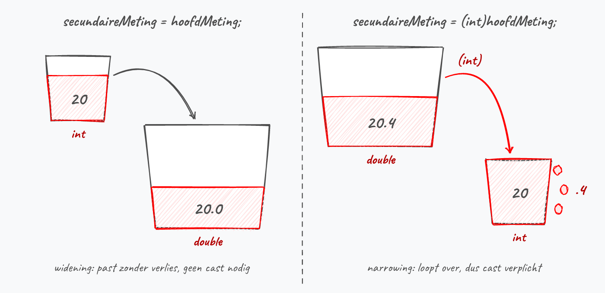
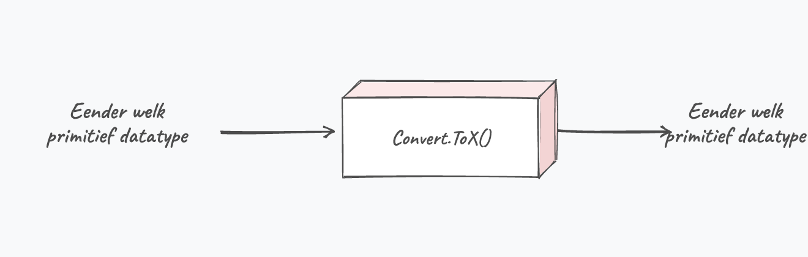
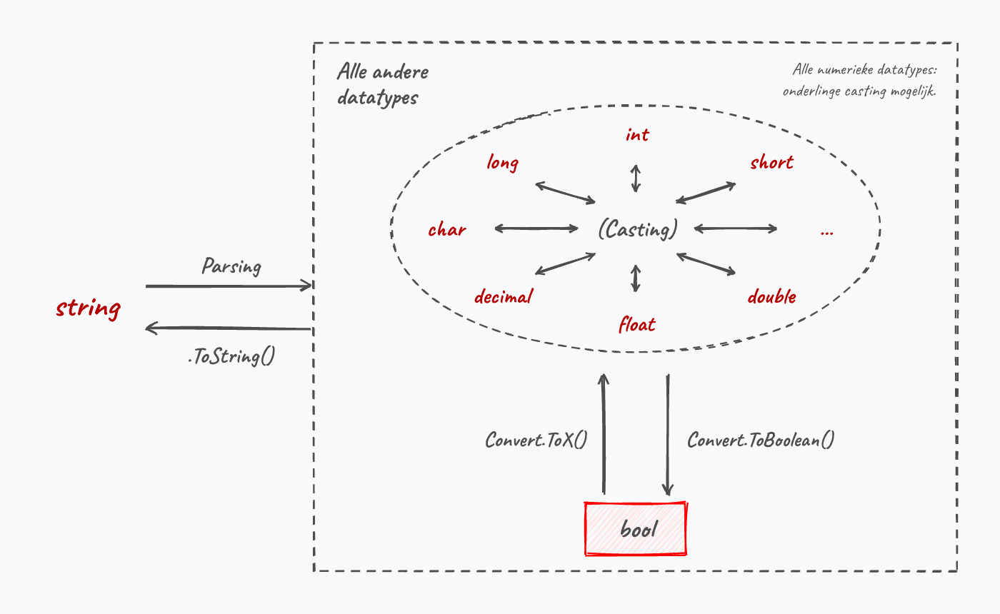
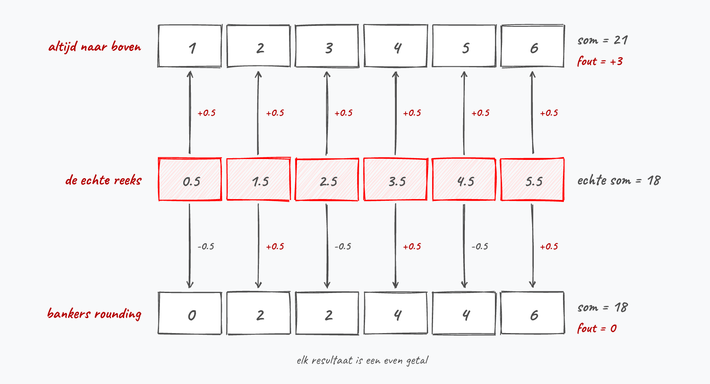
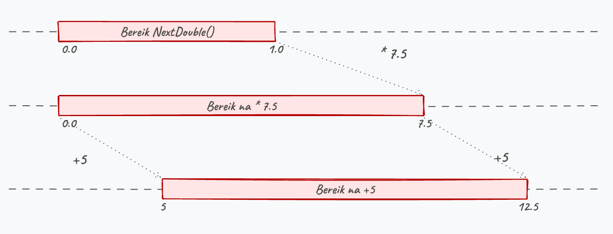
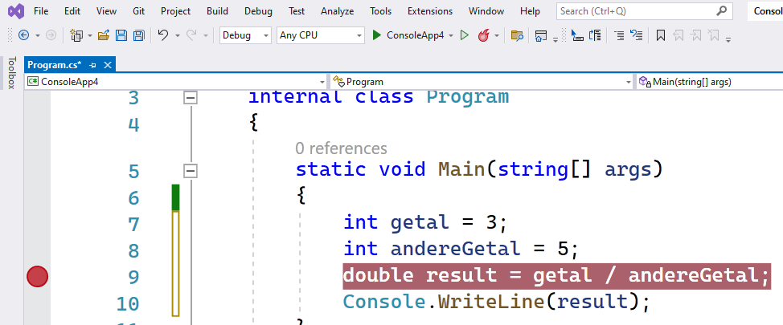
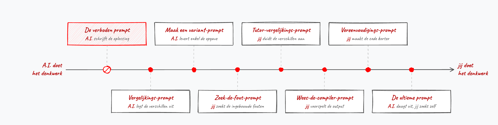
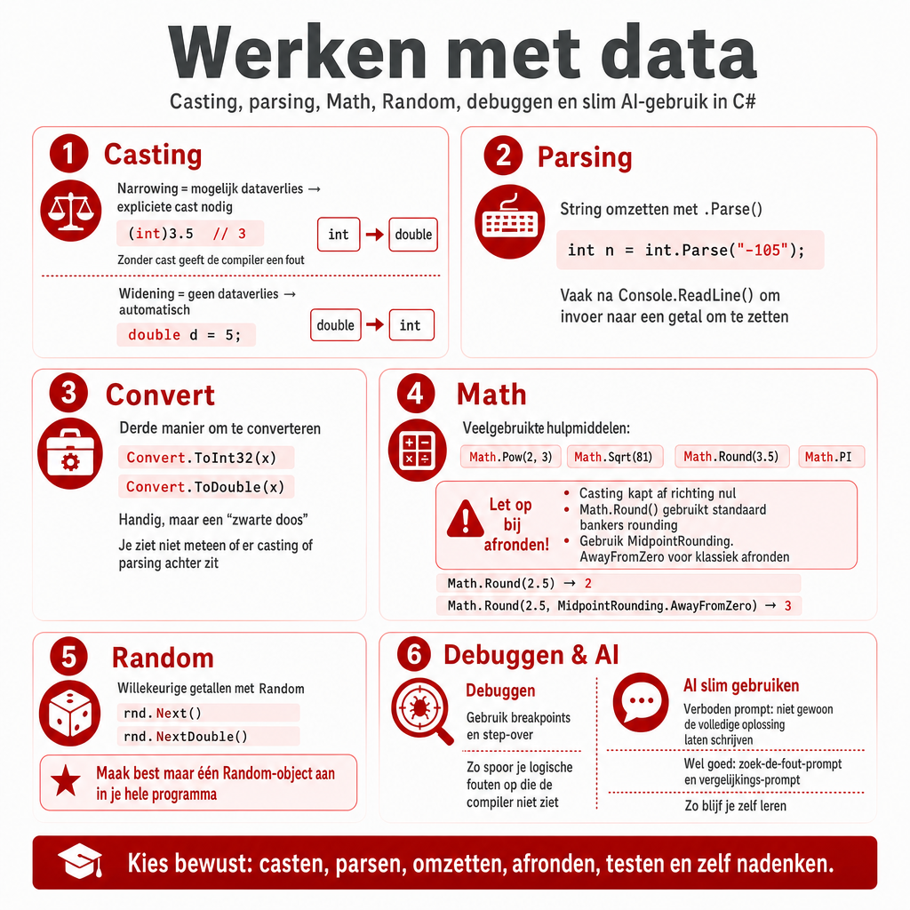

## Wat leer je in dit hoofdstuk?

Na dit hoofdstuk kan je:

* data omzetten via **casting**, **parsing** en de **`Convert`**-bibliotheek
* het verschil tussen **narrowing** en **widening** uitleggen
* gebruikersinvoer correct **inlezen en omzetten** naar een getal
* rekenen met **`System.Math`** en methoden in elkaar schuiven
* bewust **afronden** (let op *bankers rounding*) en weten wanneer je `decimal` nodig hebt
* **willekeurige getallen** genereren met `Random`
* **debuggen** met breakpoints en je code stap voor stap doorlopen

---

## Appelen en peren

Een waarde van het ene type zomaar aan een ander type toekennen mag niet:

```csharp
int leeftijd = 4.3;  // FOUT: een double past niet zomaar in een int
```

Je kan geen appelen in peren veranderen zonder magie. In C# heb je drie manieren:

* **casting**: de klassieke manier (ook in C, C++, Java)
* de **`Convert`**-bibliotheek van .NET
* **parsing**: enkel om een `string` om te zetten

---

## Casting

Plaats het doeltype tussen haakjes voor de waarde:

```csharp
double kommagetal = 13.8;
int afgekapt = (int)kommagetal;  // 13
```

::: {.callout-important .fragment}
Een variabele verandert **nooit** van type. Je zet enkel de **waarde** om en gebruikt die elders. `kommagetal` blijft een `double`.
:::

---

## Narrowing

:::: {.columns}

::: {.column width="55%"}
**Narrowing** = een type omzetten met **verlies aan data** (bv. `double` naar `int`).

* Dit *vereist* een expliciete cast
* Je zegt zo tegen de compiler: "ik weet dat er data verloren gaat, en ik draag de verantwoordelijkheid"
* Casten **rondt niet af**: `(int)20.9` geeft `20`
:::

::: {.column width="45%"}

:::

::::

---

## De klassieke valkuil

:::: {.columns}

::: {.column width="58%"}
`tempGisteren` en `tempVandaag` zijn `int` (20 en 25):

```csharp
double gem = (tempGisteren + tempVandaag) / 2;
```

Dit geeft **`22.0`, niet `22.5`**. De expressie bevat enkel `int`'s, dus de deling is een gehele deling. Casten lost het op:

```csharp
double gem = ((double)tempGisteren + tempVandaag) / 2;
```
:::

::: {.column width="42%"}

:::

::::

::: {.callout-important .fragment}
De plaats van je cast telt: `(double)(a + b) / 2` geeft `22.5`, maar `(double)((a + b) / 2)` geeft `22`. Daar dwingen de haakjes de gehele deling eerst af.
:::

---

## Widening

:::: {.columns}

::: {.column width="55%"}
Een *klein* type in een *groter* type past zonder dataverlies, dus **geen cast nodig**:

```csharp
int hoofdMeting = 20;
double secundaire = hoofdMeting;  // 20.0
```

Casten mag hier wel (`(double)hoofdMeting`), maar het hoeft niet.
:::

::: {.column width="45%"}

:::

::::

---

## Parsing en .ToString()

**Parsing** zet een `string` om naar een ander type:

```csharp
int numVal = int.Parse("-105");
```

De omgekeerde weg, naar tekst, doe je met **`.ToString()`** (dat elk type heeft):

```csharp
int getal = 5;
string tekst = getal.ToString();
```

::: {.callout-tip .fragment}
Niet zeker dat de gebruiker een geldig getal invoert? Dan is `int.TryParse()` je vriend (zie appendix).
:::

---

## ReadLine geeft altijd een string

:::: {.columns}

::: {.column width="55%"}
De gebruiker typt `3` en daarna `4`. Wat toont dit?

```csharp
string a = Console.ReadLine();
string b = Console.ReadLine();
Console.WriteLine(a + b);
```

**`34`.** Geen crash: de `+` plakt twee strings aan elkaar. C# heeft geen idee dat jij met `"3"` en `"4"` wou rekenen.
:::

::: {.column width="45%"}

:::

::::

::: {.callout-warning .fragment}
`int getal = Console.ReadLine();` mag evenmin: de compiler weigert een `string` in een `int` te steken.
:::

---

## Van string naar getal

Uitlezen met `ReadLine`, bewaren in een `string`, en dan **parsen** naar het type dat je nodig hebt:

```csharp
Console.WriteLine("Geef je gewicht:");
double gewicht = double.Parse(Console.ReadLine());
```

{width=80%}

---

## De regel die je honderden keren typt

```csharp
int getal = int.Parse(Console.ReadLine());
```

Enkel de Parse-methode verandert mee met het type dat je nodig hebt:

| Gewenst type | Code |
|---|---|
| `int` | `int.Parse(Console.ReadLine())` |
| `double` | `double.Parse(Console.ReadLine())` |
| `bool` | `bool.Parse(Console.ReadLine())` |
| `char` | `char.Parse(Console.ReadLine())` |
| `string` | `Console.ReadLine()` (geen Parse nodig) |

::: {.callout-note .fragment}
De komende hoofdstukken mag je ervan uitgaan dat de gebruiker **foutloze** invoer geeft.
:::

---

## Stagiair Steven

:::: {.columns}

::: {.column width="20%"}

:::

::: {.column width="80%"}
Steven moet de leeftijd van de gebruiker inlezen. De A.I. gaf hem dit en hij noemt het zelf "robuust":

```csharp
Console.WriteLine("Geef je leeftijd:");
int leeftijd = int.Parse(Console.ReadLine());
Console.WriteLine($"Volgend jaar word je {leeftijd + 1}.");
```

"Werkt perfect, ik heb het getest met `25`", zegt hij trots. Wat als de gebruiker `vijfentwintig` typt, of gewoon op enter duwt?
:::

::::

::: {.callout-note .fragment}
Dan crasht zijn programma. `int.Parse` verwacht tekst die echt een geheel getal voorstelt. Steven testte enkel de invoer die hij zelf in gedachten had, en de A.I. waarschuwde hem nergens. Foute invoer opvangen doe je met `int.TryParse`.
:::

---

## Komma of punt?

* **In je code** schrijf je een kommagetal-literal altijd met een **punt**: `9.81` (onafhankelijk van je taalinstellingen)
* **Als invoer** hangt het van de landinstellingen af: een Belgisch systeem verwacht `9,81`, een Engels `9.81`

::: {.callout-warning .fragment}
Het verkeerde scheidingsteken geeft **geen foutmelding**. Op een Belgische computer wordt `9.81` gelezen als **981**, want de punt geldt daar als scheiding voor duizendtallen. Je programma rekent vrolijk verder met een gewicht van 981 kilogram.
:::

Vreemde resultaten bij kommagetallen zonder dat er iets crasht? Kijk eerst welk teken je hebt getypt.

---

## De Convert-bibliotheek

:::: {.columns}

::: {.column width="58%"}
```csharp
int g = Convert.ToInt32(3.2);
double d = Convert.ToDouble(5);
bool b = Convert.ToBoolean(1);
int l = Convert.ToInt32("19");
```

* Naar `int` is `.ToInt32()`, naar `short` is `.ToInt16()`
* Een **zwarte doos**: je ziet niet of er gecast of geparset wordt
:::

::: {.column width="42%"}

:::

::::

::: {.callout-tip .fragment}
`Convert.ToBoolean` geeft voor **elk** getal `True`, behalve voor `0` (of `0.0`). En een `bool` naar een `int` omzetten lukt **enkel** via `Convert`, niet via casting.
:::

---

## Casting, conversie of parsing?

{width=70%}

Casting en parsing zijn compact en werken ook in andere talen. Beheers ze dus, ook al is `Convert` verleidelijk eenvoudig.

---

## Rekenen met System.Math

```csharp
double macht = Math.Pow(getal, 3);   // grondtal, exponent
double wortel = Math.Sqrt(144);      // 12
double omtrek = Math.PI * 2 * straal;
```

Verder o.a. `Sin`, `Cos`, `Tan`, `Ceiling`, `Floor`, `Abs`, `Max`, `Min` en `Clamp`. Voor `Math` schrijf je nooit `new`.

::: {.callout-warning .fragment}
`Sin`, `Cos` en `Tan` rekenen in **radialen**. `Math.Sin(90)` geeft `0.8939...` en niet `1`. Reken eerst om: `double hoek = graden * Math.PI / 180;`
:::

::: {.callout-tip .fragment}
Typ `Math.` en IntelliSense toont alles. Cursor op een methode + **`F1`** opent de documentatie.
:::

---

## Math geeft kommagetallen terug

```csharp
int resultaat = Math.Pow(2, 10);  // compileert niet!
```

*Cannot implicitly convert type 'double' to 'int'.* Bijna alle rekenmethoden van `Math` geven een `double` terug, ook al stop je er gehele getallen in. Je lost het op zoals daarnet:

```csharp
double resultaat = Math.Pow(2, 10);          // 1024
int resultaatAlsInt = (int)Math.Pow(2, 10);  // 1024
```

::: {.callout-tip .fragment}
Uitzonderingen zijn `Abs`, `Max`, `Min` en `Clamp`: die geven terug wat je erin stopt. `Math.Abs(-42)` is dus een `int`.
:::

---

## Methoden in elkaar schuiven

Het resultaat van een methode mag de parameter van een andere methode zijn. Dat deed je al in `double.Parse(Console.ReadLine())`. De afstand tussen speler en monster, met Pythagoras:

```csharp
double afstand = Math.Sqrt(Math.Pow(dx, 2) + Math.Pow(dy, 2));
```

{width=62%}

---

## Waarden begrenzen

```csharp
levens = Math.Max(levens - schade, 0);        // nooit onder 0
volume = Math.Clamp(volume, 0, 100);          // 130 wordt 100
int verschil = Math.Abs(vandaag - gisteren);  // 5, niet -5
```

* `Max` en `Min`: de grootste of de kleinste van twee getallen
* `Clamp`: begrenzen langs twee kanten tegelijk (waarde, ondergrens, bovengrens)
* `Abs`: het minteken verdwijnt, ideaal voor "hoe groot is het verschil?"

::: {.callout-tip .fragment}
Deze heb je in de praktijk vaker nodig dan alle sinussen samen.
:::

---

## Als rekenen misloopt

```csharp
Console.WriteLine(a / b);          // int door 0: DivideByZeroException
Console.WriteLine(x / y);          // double door 0.0: oneindig
Console.WriteLine(Math.Sqrt(-1));  // NaN, Not a Number
```

`NaN` is besmettelijk: `NaN + 5` blijft `NaN`, `NaN * 1000` ook. Controleren doe je met `double.IsNaN(resultaat)`, dat geeft je een `bool`.

::: {.callout-important .fragment}
Oneindig en `NaN` laten je programma **niet** crashen. De foute berekening werkt stilletjes door, soms tot honderden regels verder waar je plots een onmogelijk resultaat ziet.
:::

---

## Het bereik in code

Elk datatype kent z'n eigen grenzen, en de compiler kent ze ook:

```csharp
Console.WriteLine($"int gaat van {int.MinValue} tot {int.MaxValue}");
```

Bij kommagetallen bestaat zelfs `double.PositiveInfinity` en `double.NegativeInfinity`.

```csharp
int groot = int.MaxValue;
Console.WriteLine(groot + 1);  // -2147483648
```

::: {.callout-warning .fragment}
**Overflow**: de teller loopt over zoals de kilometerteller van een oude auto. Geen crash, geen waarschuwing. Verwacht je grote getallen, kies dan meteen een `long`.
:::

---

## Afkappen is niet afronden

Casting kapt af, ongeacht of er een 1 of een 9 na de komma staat. Bij negatieve getallen zie je het verschil met echt afronden:

```csharp
Console.WriteLine((int)-2.7);        // -2, richting nul
Console.WriteLine(Math.Floor(-2.7)); // -3, richting min oneindig
```

`Math.Truncate` doet exact wat een cast doet, maar geeft je een `double` terug.

{width=80%}

---

## Hoeveel bussen heb je nodig?

47 studenten, 20 per bus:

```csharp
int aantalBussen = (int)Math.Ceiling(aantalStudenten / (double)perBus); // 3
```

Overal waar je iets moet *vullen* (bussen, dozen, pagina's) mag je niets laten liggen, en daar is `Math.Ceiling` voor.

::: {.callout-warning .fragment}
Vergeet je de cast naar `double`, dan deel je twee gehele getallen en krijg je `2` nog voor `Ceiling` iets kan doen. Er staan dan 7 studenten op de parking.
:::

---

## Bankers rounding

:::: {.columns}

::: {.column width="52%"}
```csharp
Math.Round(4.5);  // 4
Math.Round(5.5);  // 6
```

`Math.Round` rondt standaard af naar het **dichtstbijzijnde even getal**.

Rond je de reeks `0.5` tot `5.5` allemaal naar boven af, dan tel je er 3 bij. Met bankers rounding kom je exact op de echte som uit.
:::

::: {.column width="48%"}

:::

::::

::: {.callout-warning .fragment}
Handig voor bankiers, minder handig wanneer jouw quotering van 4.5 op 10 plots een 4 wordt.
:::

---

## Afronden zoals je verwacht

Geef een **`MidpointRounding`** mee:

```csharp
Math.Round(4.5, MidpointRounding.AwayFromZero);         // 5
Math.Round(4.12343, 2, MidpointRounding.AwayFromZero);  // 4,12
```

De volgorde van de parameters ligt vast: eerst het getal, dan het aantal cijfers na de komma, en pas als laatste de `MidpointRounding`.

::: {.callout-important .fragment}
`Convert.ToInt32` doet **ook** aan bankers rounding, en daar kan je het niet afzetten. Rond dan eerst zelf af: `(int)Math.Round(4.5, MidpointRounding.AwayFromZero)`.
:::

---

## De drie manieren naast elkaar

| Waarde | `(int)` | `Math.Round` | met `AwayFromZero` | `Convert.ToInt32` |
|---|---|---|---|---|
| `4.5` | 4 | 4 | **5** | 4 |
| `5.5` | 5 | 6 | 6 | 6 |
| `-2.5` | -2 | -2 | **-3** | -2 |

::: {.callout-important .fragment}
Kies bewust. Wil je **afkappen**, gebruik een cast of `Math.Truncate`. Wil je **afronden**, gebruik `Math.Round` met `MidpointRounding.AwayFromZero`. Doe je niets, dan krijg je bankers rounding.
:::

---

## Afronden of enkel mooi tonen?

```csharp
double gemiddelde = 7.0 / 3.0;

Console.WriteLine(gemiddelde);          // 2,3333333333333335
Console.WriteLine($"{gemiddelde:F2}");  // 2,33
```

Bij `F2` behoudt de variabele al haar cijfers, enkel de tekst op het scherm is ingekort. Bij `Math.Round` gooi je die cijfers echt weg.

::: {.callout-tip .fragment}
Rond pas af **op het laatste moment**, vlak voor je het resultaat toont. Rond je te vroeg af, dan sleep je die fout doorheen je hele berekening mee.
:::

---

## Geld: reken niet met double

```csharp
Console.WriteLine(0.1 + 0.2);     // 0,30000000000000004

double prijs = 4.35;
int centen = (int)(prijs * 100);  // 434 in plaats van 435!
```

`4.35 * 100` levert `434.99999999999994` op en de cast kapt de rest af. Je klant is een cent kwijt, en bij duizend bestellingen merkt de boekhouding dat.

```csharp
decimal prijs = 4.35M;   // decimal bewaart de cijfers decimaal
```

::: {.callout-tip .fragment}
Voor alles wat op een kassaticket zou staan kies je `decimal`. Voor wetenschappelijke berekeningen, coördinaten en snelheden blijft `double` de juiste keuze.
:::

---

## Willekeurige getallen

Maak **eenmalig** een generator en vraag dan getallen op:

```csharp
Random generator = new Random();
int getal1 = generator.Next();
int a = generator.Next(0, 11);    // 0 tot en met 10
int b = generator.Next(55, 100);  // 55 tot en met 99
```

::: {.callout-important .fragment}
**De ondergrens telt mee, de bovengrens niet.** Wil je een getal *tot en met* X, schrijf dan **X + 1** als tweede parameter.
:::

::: {.callout-tip .fragment}
De `new Random()`-syntax pluizen we vanaf hoofdstuk 9 uit. Lig er nu nog niet van wakker.
:::

---

## Kommagetallen met NextDouble

:::: {.columns}

::: {.column width="55%"}
`NextDouble()` geeft een getal tussen `0.0` en `1.0`. Schaal en verschuif naar je bereik:

```csharp
// tussen 5.0 en 12.5
double r = 5.0 + (generator.NextDouble() * 7.5);
```

Bereik = `12.5 - 5.0 = 7.5`, daarna `+5` om te verschuiven.
:::

::: {.column width="45%"}

:::

::::

---

## Steeds dezelfde getallen?

:::: {.columns}

::: {.column width="22%"}

:::

::: {.column width="78%"}
Twee generators die je vlak na elkaar aanmaakt, gebruiken bijna dezelfde **seed** (de tijd) en geven dus **dezelfde** reeks.

```csharp
Random a = new Random();
Random b = new Random(); // slecht idee!
```
:::

::::

::: {.callout-important .fragment}
Maak daarom maar **één** generator aan. Wil je voor het testen telkens dezelfde reeks? Geef dan een vaste seed mee: `new Random(666)`.
:::

---

## Debuggen: logica vs syntax

Code die compileert, is enkel **grammaticaal** correct. De betekenis kan nog altijd fout zijn:

```text
Neem natrium
Neem water
Voeg beide samen
```

Perfecte "code", maar een **logische fout** (en een stevige explosie). Dat is een **bug**.

---

## Breakpoints

:::: {.columns}

::: {.column width="55%"}
* Klik links van een lijn voor een **breakpoint** (rode bol)
* Je programma **pauzeert** daar
* In **Locals**/**Autos** zie je de waarde van elke variabele
* Je kan ook over een variabele **hoveren**
:::

::: {.column width="45%"}

:::

::::

---

## Door je code steppen

:::: {.columns}

::: {.column width="22%"}

:::

::: {.column width="78%"}
* **Continue**: verder tot het volgende breakpoint of het einde
* **Step over** (het gebogen pijltje): één lijn verder, dan weer pauzeren
* **Stop** (rode knop): stoppen om je code aan te passen

**Voorspel telkens eerst** wat er moet gebeuren: welke waarden, welke output? Klopt de werkelijkheid niet met je voorspelling, dan heb je waarschijnlijk een bug beet.
:::

::::

::: {.callout-warning .fragment}
Zomaar door je code steppen en hopen dat de bug magisch verschijnt, werkt niet. Een programmeur die niet kan debuggen is als een vis die niet kan zwemmen.
:::

---

## Programmeren met A.I.

::: {.callout-important}
**De verboden prompt**: *"Schrijf de C#-oplossing voor deze opgave."* Dat is als de Tour de France-winnaar de Mont Ventoux voor je laten opfietsen: je geraakt boven, maar leert niets.
:::

Beter zijn prompts die je **doen denken** en waarmee je in dialoog gaat: laat AI code met ingebouwde fouten maken (*zoek de fout*), je oplossing met de modeloplossing **vergelijken**, of je **ondervragen** over de output van een stukje code.

{width=80%}

---

## Conclusie

* Omzetten kan via **casting**, **parsing** en **`Convert`**: ken het verschil
* **Narrowing** (met dataverlies) vereist een cast, **widening** gaat vanzelf
* `ReadLine` geeft altijd een `string`: parse naar het juiste type
* **`Math`** rekent met kommagetallen en in radialen; oneindig en `NaN` crashen niet
* Kies bewust tussen **afkappen** en **afronden**; voor geld gebruik je `decimal`
* Eén **`Random`**-generator volstaat; **debuggen** doe je door te voorspellen

::: {.callout-tip}
Volgende halte: **beslissingen** nemen met `if`, vergelijkingen en `switch`.
:::

---

## Meer weten

**Kennisclips**

* [Casting, conversie en parsing](https://ap.cloud.panopto.eu/Panopto/Pages/Viewer.aspx?id=5a8cecfa-e8fb-41c8-8ec1-ac3d008960a7)
* [Input verwerken en omzetten](https://ap.cloud.panopto.eu/Panopto/Pages/Viewer.aspx?id=a6e8b098-c0ad-40d6-9a29-ac3d008db7ab)
* [Math-library en berekeningen](https://ap.cloud.panopto.eu/Panopto/Pages/Viewer.aspx?id=3819340c-9222-4814-b1e7-ac3d009788cb)
* [Afronden](https://ap.cloud.panopto.eu/Panopto/Pages/Viewer.aspx?id=c4dfd175-47ec-4b1a-af7a-ac3d009afb99)
* [Random](https://ap.cloud.panopto.eu/Panopto/Pages/Viewer.aspx?id=b3c83c9c-5e84-45b8-949b-ac3d00a41820)
* [Debuggen](https://ap.cloud.panopto.eu/Panopto/Pages/Viewer.aspx?id=37dc025a-d40e-4610-8d00-ac3f00a2923b)

[Oefeningen H4](https://apwt.gitbook.io/ziescherp-oefeningen/h4-werken-met-data/a_practica) · [Quizlet flashcards](https://quizlet.com/be/918621177/zie-scherp-scherper-hoofdstuk-04-flash-cards/)

---

## Zie verder: andere talen

Dezelfde concepten uit dit hoofdstuk, maar dan in andere talen. Handig om later code in Python of JavaScript te leren lezen.

---

## Zie verder: type-coercion

C# is streng. **JavaScript** zet types net automatisch om (*coercion*):

```javascript
console.log("5" + 3);  // "53"  (de 3 wordt een string)
console.log("5" * 3);  // 15    (de "5" wordt een getal)
```

Die eerste regel doet C# ook: `"5" + 3` levert daar eveneens de tekst `"53"` op. Het verschil zit in de tweede regel: `"5" * 3` weigert de C#-compiler.

---

## Zie verder: omzetten in Python

De naam van het type is er meteen de omzetfunctie:

```python
gewicht = float(input("Geef je gewicht: "))
```

Wiskunde zit in een aparte *module* die je eerst moet importeren:

```python
import math

wortel = math.sqrt(144)   # 12.0
```

C# heeft een aparte `Parse` per type, en `Math` hoort standaard bij de taal.

---

## Zie verder: zoek de fout

Deze **Python**-code rondt twee examencijfers af. Eén van de twee studenten gaat klagen. Waarom?

```python
cijfer1 = 4.5
cijfer2 = 5.5

print(round(cijfer1))  # 4
print(round(cijfer2))  # 6
```

. . .

`round()` doet in Python ook aan bankers rounding: ligt een getal op de helft, dan gaat het naar het dichtstbijzijnde **even** getal. Wat Python niet heeft is de `MidpointRounding`-parameter.

---

## Samenvattende poster

Een handige samenvattende poster (Opgelet: gemaakt m.b.v. ChatGPT Image Gen 2).

{width=55%}
