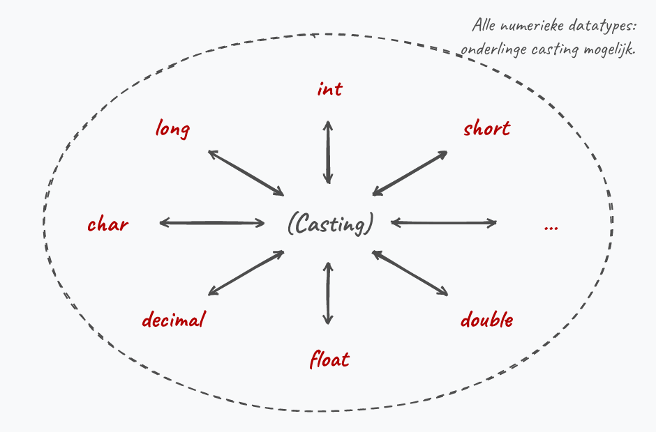

## Wat leer je in dit hoofdstuk?

Na dit hoofdstuk kan je:

* data omzetten via **casting**, **parsing** en de **`Convert`**-bibliotheek
* het verschil tussen **narrowing** en **widening** uitleggen
* gebruikersinvoer correct **inlezen en omzetten** naar een getal
* rekenen met **`System.Math`** en bewust **afronden** (let op *bankers rounding*)
* **willekeurige getallen** genereren met `Random`
* **debuggen** met breakpoints en je code stap voor stap doorlopen

---

## Appelen en peren

Een waarde van het ene type zomaar aan een ander type toekennen mag niet:

```csharp
int leeftijd = 4.3;  // FOUT: een double past niet zomaar in een int
```

Je kan geen appelen in peren veranderen zonder magie. In C# heb je drie manieren:

* **casting**: de klassieke manier (ook in C, C++, Java)
* de **`Convert`**-bibliotheek van .NET
* **parsing**: enkel om een `string` om te zetten

---

## Casting

Plaats het doeltype tussen haakjes voor de waarde:

```csharp
double kommagetal = 13.8;
int afgekapt = (int)kommagetal;  // 13
```

::: {.callout-important .fragment}
Een variabele verandert **nooit** van type. Je zet enkel de **waarde** om en gebruikt die elders. `kommagetal` blijft een `double`.
:::

---

## Narrowing

:::: {.columns}

::: {.column width="60%"}
**Narrowing** = een type omzetten met **verlies aan data** (bv. `double` naar `int`).

* Dit *vereist* een expliciete cast
* Je zegt zo tegen de compiler: "ik weet dat er data verloren gaat, en ik draag de verantwoordelijkheid"
:::

::: {.column width="40%"}

:::

::::

---

## De klassieke valkuil

`tempGisteren` en `tempVandaag` zijn `int` (20 en 25). Wat geeft dit?

```csharp
double gemiddeld = (tempGisteren + tempVandaag) / 2;
```

. . .

**`22.0`, niet `22.5`.** De expressie bevat enkel `int`'s, dus de deling is een gehele deling. Pas daarna gaat het resultaat naar de `double`.

```csharp
double gemiddeld = ((double)tempGisteren + tempVandaag) / 2;  // 22.5
```

---

## Let op de volgorde

De plaats van je cast maakt een verschil:

```csharp
(double)(tempGisteren + tempVandaag) / 2;   // 22.5
(double)((tempGisteren + tempVandaag) / 2); // 22
```

In de tweede lijn dwingen de haakjes de **gehele deling eerst** af. Pas daarna cast je naar `double`, en dan is het kwaad al geschied.

---

## Widening

Een *klein* type in een *groter* type past zonder dataverlies, dus **geen cast nodig**:

```csharp
int hoofdMeting = 20;
double secundaire = hoofdMeting;  // 20.0, automatisch
```

::: {.callout-tip .fragment}
Casten mag hier wel (`(double)hoofdMeting`), maar het hoeft niet. *Better safe than sorry* als je twijfelt.
:::

---

## Parsing en .ToString()

**Parsing** zet een `string` om naar een ander type:

```csharp
int numVal = int.Parse("-105");
```

De omgekeerde weg, naar tekst, doe je met **`.ToString()`** (dat elk type heeft):

```csharp
int getal = 5;
string tekst = getal.ToString();
```

::: {.callout-tip .fragment}
Niet zeker dat de gebruiker een geldig getal invoert? Dan is `int.TryParse()` je vriend (zie appendix).
:::

---

## Invoer van de gebruiker

> `Console.ReadLine()` geeft **altijd** een `string` terug.

Wil je een getal, dan lees je eerst als tekst en **parse** je daarna:

```csharp
Console.WriteLine("Geef je gewicht:");
double gewicht = double.Parse(Console.ReadLine());
```

::: {.callout-note .fragment}
De komende hoofdstukken mag je ervan uitgaan dat de gebruiker **foutloze** invoer geeft.
:::

---

## Komma of punt?

* **In je code** schrijf je een kommagetal-literal altijd met een **punt**: `9.81` (onafhankelijk van je taalinstellingen)
* **Als invoer** hangt het van de landinstellingen af: een Belgisch systeem verwacht `9,81`, een Engels `9.81`

---

## De Convert-bibliotheek

:::: {.columns}

::: {.column width="58%"}
```csharp
int g = Convert.ToInt32(3.2);
double d = Convert.ToDouble(5);
bool b = Convert.ToBoolean(1);
int l = Convert.ToInt32("19");
```

* Naar `int` is `.ToInt32()`, naar `short` is `.ToInt16()`
:::

::: {.column width="42%"}

:::

::::

::: {.callout-warning .fragment}
Een **zwarte doos**: je ziet niet of er gecast of geparset wordt. Gebruik `Convert.To` pas als je het verschil goed snapt.
:::

---

## Convert en bool

::: {.callout-tip}
**`Convert.ToBoolean`** geeft voor **elk** getal `True`, behalve voor `0` (of `0.0`): dan `False`.
:::

Een `bool` omzetten naar een `int` (of omgekeerd) lukt **enkel** via `Convert`, niet via casting.

---

## Casting, conversie of parsing?

{width=70%}

Casting en parsing zijn compact en werken ook in andere talen. Beheers ze dus, ook al is `Convert` verleidelijk eenvoudig.

---

## Rekenen met System.Math

De `Math`-bibliotheek bevat handige wiskunde:

```csharp
double macht = Math.Pow(getal, 3);   // grondtal, exponent
double wortel = Math.Sqrt(144);      // 12
double omtrek = Math.PI * 2 * straal;
```

Verder o.a. `Sin`, `Cos`, `Tan`, `Ceiling`, `Floor`, `Abs`.

::: {.callout-tip .fragment}
Typ `Math.` en IntelliSense toont alles. Cursor op een methode + **`F1`** opent de documentatie.
:::

---

## Het bereik in code

Elk datatype kent z'n eigen grenzen:

```csharp
Console.WriteLine($"int gaat van {int.MinValue} tot {int.MaxValue}");
Console.WriteLine($"{double.MaxValue}");
```

Bij kommagetallen bestaat zelfs `double.PositiveInfinity` en `double.NegativeInfinity`.

---

## Over afronden

We hebben al drie manieren gezien om af te ronden: **casting**, **`Math.Round`** en **`Convert.ToX`**. Ze gedragen zich niet hetzelfde.

* **Casting** kapt af richting nul (*truncatie*)

::: {.callout-warning .fragment}
Let op met negatieve getallen: `(int)-2.7` geeft **-2** (richting nul), maar `Math.Floor(-2.7)` geeft **-3** (richting min oneindig).
:::

---

## Bankers rounding

```csharp
Console.WriteLine($"{Math.Round(4.5)} en {Math.Round(5.5)}");
```

. . .

**Resultaat: 4 en 6?!**

`Math.Round` (en `Convert.ToInt32`) ronden standaard af naar het **dichtstbijzijnde even getal**. Dat heet *bankers rounding*: handig voor bankiers, verwarrend voor ons.

---

## Afronden zoals je verwacht

Geef een **`MidpointRounding`** mee:

```csharp
Math.Round(4.5, MidpointRounding.AwayFromZero); // 5
Math.Round(5.5, MidpointRounding.AwayFromZero); // 6
```

* `ToEven` (standaard): bankers rounding
* `AwayFromZero`: het meest voorspelbare resultaat (onze voorkeur)

---

## Willekeurige getallen

Maak **eenmalig** een generator en vraag dan getallen op:

```csharp
Random generator = new Random();
int getal1 = generator.Next();
int getal2 = generator.Next();
```

::: {.callout-tip .fragment}
De `new Random()`-syntax pluizen we vanaf hoofdstuk 9 uit. Lig er nu nog niet van wakker.
:::

---

## Een bereik kiezen

```csharp
int a = generator.Next(0, 11);   // 0 tot en met 10
int b = generator.Next(55, 100); // 55 tot en met 99
```

::: {.callout-important}
**De ondergrens telt mee, de bovengrens niet.** Wil je een getal *tot en met* X, schrijf dan **X + 1** als tweede parameter.
:::

---

## Kommagetallen met NextDouble

:::: {.columns}

::: {.column width="55%"}
`NextDouble()` geeft een getal tussen `0.0` en `1.0`. Schaal en verschuif naar je bereik:

```csharp
// tussen 5.0 en 12.5
double r = 5.0 + (generator.NextDouble() * 7.5);
```

Bereik = `12.5 - 5.0 = 7.5`, daarna `+5` om te verschuiven.
:::

::: {.column width="45%"}

:::

::::

---

## Steeds dezelfde getallen?

:::: {.columns}

::: {.column width="22%"}

:::

::: {.column width="78%"}
Twee generators die je vlak na elkaar aanmaakt, gebruiken bijna dezelfde **seed** (de tijd) en geven dus **dezelfde** reeks.

```csharp
Random a = new Random();
Random b = new Random(); // slecht idee!
```
:::

::::

::: {.callout-important .fragment}
Maak daarom maar **één** generator aan. Wil je voor het testen telkens dezelfde reeks? Geef dan een vaste seed mee: `new Random(666)`.
:::

---

## Debuggen: logica vs syntax

Code die compileert, is enkel **grammaticaal** correct. De betekenis kan nog altijd fout zijn:

```text
Neem natrium
Neem water
Voeg beide samen
```

Perfecte "code", maar een **logische fout** (en een stevige explosie). Dat is een **bug**.

---

## Breakpoints

:::: {.columns}

::: {.column width="55%"}
* Klik links van een lijn voor een **breakpoint** (rode bol)
* Je programma **pauzeert** daar
* In **Locals**/**Autos** zie je de waarde van elke variabele
* Je kan ook over een variabele **hoveren**
:::

::: {.column width="45%"}

:::

::::

---

## Door je code steppen

Eens gepauzeerd, gebruik je de debugknoppen:

* **Continue**: verder tot het volgende breakpoint of het einde
* **Step over** (het gebogen pijltje): één lijn verder, dan weer pauzeren
* **Stop** (rode knop): stoppen om je code aan te passen

---

## Debuggen is een essentiële skill

:::: {.columns}

::: {.column width="22%"}

:::

::: {.column width="78%"}
Een programmeur die niet kan debuggen is als een vis die niet kan zwemmen.

**Voorspel telkens eerst** wat er moet gebeuren: welke waarden, welke output? Klopt de werkelijkheid niet met je voorspelling, dan heb je waarschijnlijk een bug beet.
:::

::::

::: {.callout-warning .fragment}
Zomaar door je code steppen en hopen dat de bug magisch verschijnt, werkt niet. Wees kritisch.
:::

---

## Programmeren met A.I.

Tijd om dat krachtige beest in een omheind veldje te zetten, maar mét regels:

::: {.callout-important}
**De verboden prompt**: *"Schrijf de C#-oplossing voor deze opgave."* Dat is als de Tour de France-winnaar de Mont Ventoux voor je laten opfietsen: je geraakt boven, maar leert niets.
:::

Beter zijn prompts die je **doen denken**:

* **Zoek-de-fout**: laat AI code met ingebouwde fouten maken en zoek ze zelf
* **Vergelijk**: laat AI jouw oplossing met de modeloplossing vergelijken

::: {.callout-tip .fragment}
AI wordt pas krachtig in **dialoog**. Anders is het een searchengine *on steroids*.
:::

---

## Conclusie

* Omzetten kan via **casting**, **parsing** en **`Convert`**: ken het verschil
* **Narrowing** (met dataverlies) vereist een cast, **widening** gaat vanzelf
* `ReadLine` geeft altijd een `string`: parse naar het juiste type
* **`Math`** helpt bij rekenen; let bij afronden op **bankers rounding**
* Eén **`Random`**-generator volstaat; **debuggen** doe je door te voorspellen

::: {.callout-tip}
Volgende halte: **beslissingen** nemen met `if`, vergelijkingen en `switch`.
:::

---

## Meer weten

**Kennisclips**

* [Casting, conversie en parsing](https://ap.cloud.panopto.eu/Panopto/Pages/Viewer.aspx?id=5a8cecfa-e8fb-41c8-8ec1-ac3d008960a7)
* [Input verwerken en omzetten](https://ap.cloud.panopto.eu/Panopto/Pages/Viewer.aspx?id=a6e8b098-c0ad-40d6-9a29-ac3d008db7ab)
* [Math-library en berekeningen](https://ap.cloud.panopto.eu/Panopto/Pages/Viewer.aspx?id=3819340c-9222-4814-b1e7-ac3d009788cb)
* [Afronden](https://ap.cloud.panopto.eu/Panopto/Pages/Viewer.aspx?id=c4dfd175-47ec-4b1a-af7a-ac3d009afb99)
* [Random](https://ap.cloud.panopto.eu/Panopto/Pages/Viewer.aspx?id=b3c83c9c-5e84-45b8-949b-ac3d00a41820)
* [Debuggen](https://ap.cloud.panopto.eu/Panopto/Pages/Viewer.aspx?id=37dc025a-d40e-4610-8d00-ac3f00a2923b)

[Oefeningen H4](https://apwt.gitbook.io/ziescherp-oefeningen/h4-werken-met-data/a_practica) · [Quizlet flashcards](https://quizlet.com/be/918621177/zie-scherp-scherper-hoofdstuk-04-flash-cards/)
