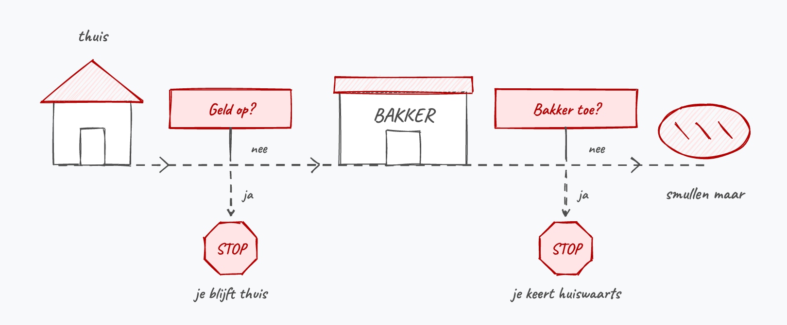
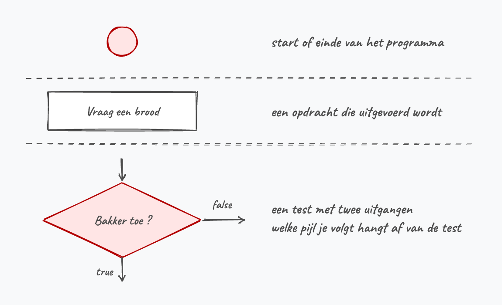
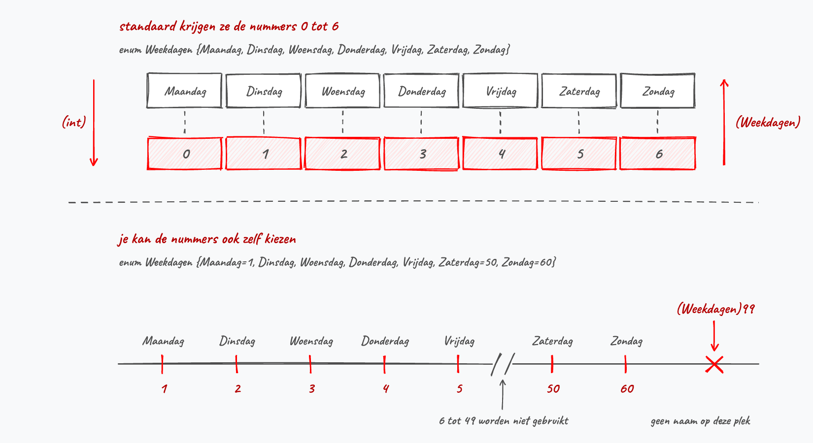
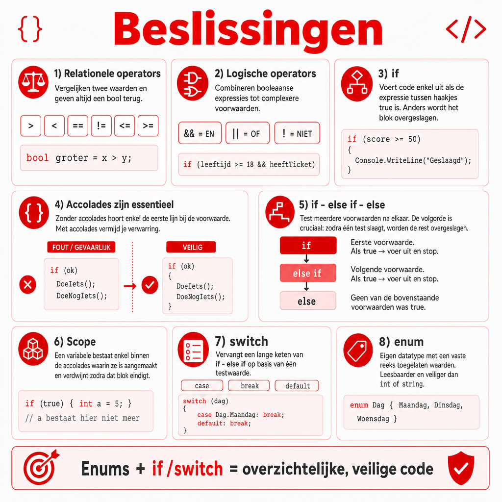

## Wat leer je in dit hoofdstuk?

Na dit hoofdstuk kan je:

* **booleaanse expressies** schrijven met **relationele** en **logische** operators
* de **volgorde van bewerkingen** en het **kortsluiten** van C# correct inschatten
* beslissingen nemen met **`if`**, **`if/else`**, **`if/else if`** en de **ternaire operator**
* de **scope** van een variabele bepalen
* een **`switch`** gebruiken in plaats van een lange `if`-keten
* een eigen **`enum`** maken en inzetten voor leesbare, veilige code

---

## Van lineair naar beslissingen

Tot nu toe was elk programma een rechtlijnige lijst opdrachten. Faalt er één stap (de bakker is toe), dan loopt de rest in het honderd. Een beter algoritme **beslist** onderweg:

```text
Neem geld uit spaarpot
Geld op? Stop dan hier, anders: ga verder
Wandel naar de bakker om de hoek
Bakker toe? Stop dan hier, anders: ga verder
Vraag om een brood
```

{width=72%}

---

## Sequentie, selectie, iteratie

:::: {.columns}

::: {.column width="55%"}
Alles wat je tot nu toe schreef was **sequentie**: de ene opdracht na de andere.

Vanaf nu komt **selectie** erbij: op basis van een test voert je programma een stuk code uit of slaat het over. Later volgt nog **iteratie**, hetzelfde stuk code herhalen.

Elk algoritme dat je ooit zal schrijven is een combinatie van die drie. Dat is geen boute bewering, maar een stelling van Böhm en Jacopini uit 1966.
:::

::: {.column width="45%"}

:::

::::

---

## Relationele operators

> Een **booleaanse expressie** is C#-code die een **`bool`** als resultaat geeft.

| Operator | Betekenis |
|---|---|
| `>` `<` | groter / kleiner dan |
| `>=` `<=` | groter / kleiner dan of gelijk aan |
| `==` | gelijk aan |
| `!=` | niet gelijk aan |

* Twee operanden, resultaat is een **`bool`**, dus mag je het bewaren: `bool isKleiner = 65 > 67;`
* De types moeten **vergelijkbaar** zijn: een `string` met een `int` gaat niet, een `int` met een `double` wel

---

## Vergelijken: let op met tekst en komma's

Op een `string` werken enkel `==` en `!=`, en die zijn **hoofdlettergevoelig**:

```csharp
bool test = "Tim" == "tim";     // false, de hoofdletter T verschilt
bool fout = "appel" < "peer";   // compileert niet
```

Een `double` bewaart kommagetallen binair, en dat gaat niet altijd exact:

```csharp
bool gelijk = (0.1 + 0.2) == 0.3;              // false!
double verschil = Math.Abs((0.1 + 0.2) - 0.3);
bool bijna = verschil < 0.0001;                // zo test je wel
```

::: {.callout-warning .fragment}
De wiskundige notatie `1 < x < 10` geeft een compilerfout: `1 < x` levert een `bool` op, en die kan C# niet meer met `10` vergelijken. Schrijf `x > 1 && x < 10`.
:::

---

## Logische operators

Voor samengestelde voorwaarden ("hongerig **EN** genoeg geld"):

* **`&&`** (EN): `true` als **beide** operanden `true` zijn
* **`||`** (OF): `true` als **minstens één** operand `true` is
* **`!`** (NIET): keert de waarde om, en verwacht maar één operand

| `a` | `b` | EN | OF |
|---|---|---|---|
| `false` | `false` | `false` | `false` |
| `false` | `true` | `false` | `true` |
| `true` | `false` | `false` | `true` |
| `true` | `true` | `true` | `true` |

Logische operators verwachten **`bool`**-operanden en geven zelf ook een `bool` terug.

::: {.callout-tip .fragment}
De **wetten van De Morgan**: een `!` vóór een samengestelde expressie mag je naar binnen brengen, maar dan wisselt de EN met de OF. `!(A && B)` is hetzelfde als `!A || !B`, en `!(A || B)` is hetzelfde als `!A && !B`.
:::

---

## Kortsluiten

C# werkt een logische expressie van links naar rechts af en stopt van zodra het antwoord vastligt:

```csharp
bool test = (5 > 10) && (Console.ReadLine() == "ja");
```

`5 > 10` is al `false`, dus kan een `&&` nooit meer `true` worden. De `Console.ReadLine()` wordt niet uitgevoerd en je programma vraagt dus geen invoer.

{width=68%}

::: {.callout-tip .fragment}
Bij `||` stopt de computer zodra de linkse operand `true` is. Zet bij `&&` dus de test die het vaakst faalt vooraan, bij `||` de test die het vaakst waar is.
:::

---

## Volgorde van bewerkingen

:::: {.columns}

::: {.column width="42%"}
1. `!` (logische NIET)
2. `*`  `/`  `%`
3. `+`  `-`
4. `<`  `<=`  `>`  `>=`
5. `==`  `!=`
6. `&&`
7. `||`
:::

::: {.column width="58%"}
Dat `&&` vóór `||` komt, is de val waar je het vaakst intrapt:

```csharp
bool magBinnen = isLid || isStudent && heeftKaart;
```

C# leest dat als `isLid || (isStudent && heeftKaart)`. Een lid mag hier dus binnen zonder kaart. Moet iedereen een kaart hebben, zet dan zelf haakjes: `(isLid || isStudent) && heeftKaart`.
:::

::::

::: {.callout-tip .fragment}
Dezelfde val zit bij `!`: `!isKlaar == isBezig` betekent `(!isKlaar) == isBezig`. Twijfel je? Haakjes.
:::

---

## Test jezelf

```csharp
4 < 5 && 4 < 3
"a" == "A" || 4 >= 3
1 < 5 < 10
!(4 <= 3)
"appel" < "peer"
```

::: {.fragment}
* `false` (`true && false`)
* `true` (`false || true`, let op: hoofdlettergevoelig)
* **compilerfout**: `1 < 5` geeft een `bool`, en die kan niet met `10` vergeleken worden
* `true` (`!false`)
* **compilerfout**: op strings werken enkel `==` en `!=`
:::

---

## If

:::: {.columns}

::: {.column width="62%"}
```csharp
int nummer = 3;
if (nummer < 5)
{
    Console.WriteLine("Klein");
}
Console.WriteLine("Einde");
```

Het `if`-blok draait enkel als de booleaanse expressie **`true`** is. De lijn erna draait **altijd**.
:::

::: {.column width="38%"}

:::

::::

---

## Werk altijd met accolades

:::: {.columns}

::: {.column width="60%"}
Zonder accolades hoort **enkel de eerste lijn** bij de `if`:

```csharp
if (tijd < 20)
    Console.WriteLine("Doe zo voort.");
    Console.WriteLine("Je bent er bijna!"); // ALTIJD
```

Met accolades hoort het hele blok bij de test:

```csharp
if (tijd < 20)
{
    Console.WriteLine("Doe zo voort.");
    Console.WriteLine("Je bent er bijna!");
}
```
:::

::: {.column width="40%"}

:::

::::

::: {.callout-tip .fragment}
Inspringen heeft in C# **geen** invloed op de programmaflow (anders dan in Python). De accolades bepalen het blok.
:::

---

## Toekennen in plaats van vergelijken

:::: {.columns}

::: {.column width="22%"}

:::

::: {.column width="78%"}
Voorman hier, even wakker schudden. `=` kent toe, `==` vergelijkt. Bij getallen houdt de compiler je tegen (`if (leeftijd = 18)` compileert niet), bij een `bool` is er **geen vangnet**:

```csharp
bool gevonden = false;
if (gevonden = true)   // compileert, en is altijd waar
{
    Console.WriteLine("Gevonden!");
}
```

Schrijf hier gewoon `if (gevonden)`. Een `bool` is zelf al een booleaanse expressie. Testen op `false`? Dan `!gevonden`.
:::

::::

{width=55%}

---

## De puntkomma-val

:::: {.columns}

::: {.column width="58%"}
```csharp
if (naam == "neo");
{
    Console.WriteLine("Red pill?");
    Console.WriteLine("Or blue pill?");
}
```

De `;` sluit de `if` meteen af met een leeg blok. Het blok eronder hoort dus niet meer bij de test en draait **altijd**, ongeacht de naam.
:::

::: {.column width="42%"}

:::

::::

---

## If/else

```csharp
if (waterpeil > MAX)
{
    Console.WriteLine("Waterpeil staat te hoog!");
}
else
{
    Console.WriteLine("Waterpeil is in orde.");
}
```

::: {.callout-warning .fragment}
Een `else` krijgt **geen** eigen booleaanse expressie. `else (a <= b)` is fout: de `else` draait gewoon wanneer de `if` niet waar was.
:::

---

## De ternaire operator

Eén variabele die de ene of de andere waarde moet krijgen? Dan is een volledige `if - else` veel typwerk:

```csharp
int leeftijd = 20;
string boodschap = leeftijd >= 18 ? "Welkom" : "Te jong";
```

Vóór het vraagteken staat de booleaanse expressie, erna de twee mogelijke uitkomsten. Het is de enige operator in C# met drie operanden, vandaar de naam.

{width=70%}

::: {.callout-warning .fragment}
Ze levert enkel een **waarde** op en voert geen codeblok uit. Meerdere lijnen code nodig bij `true` of `false`? Dan een gewone `if - else`.
:::

---

## If - else if

```csharp
if (x > 100)
    Console.WriteLine("Groter dan 100");
else if (x > 10)
    Console.WriteLine("Groter dan 10");
else
    Console.WriteLine("Kleiner dan of gelijk aan 10");
```

Elke `false` zakt door naar de volgende test. De eerste `true` voert zijn blok uit en verlaat de keten meteen: alle tests eronder worden niet meer gedaan.

De afsluitende `else` is optioneel en draait enkel als geen enkele test waar was.

---

## De volgorde is cruciaal

Draai je de twee tests om, dan wordt `x > 100` nooit meer bereikt. Bij 110 slaat `x > 10` al toe:

```csharp
if (x > 10) { /* ... */ }
else if (x > 100) { /* onbereikbaar */ }
```

{width=78%}

::: {.callout-tip .fragment}
Laat de logica van je algoritme het toe? Zet dan de meest voorkomende test bovenaan: hoe minder tests de computer moet doen, hoe sneller je code draait.
:::

---

## Stagiair Steven

:::: {.columns}

::: {.column width="20%"}

:::

::: {.column width="80%"}
Steven schrijft een kortingsprogramma: wie voor meer dan 100 euro koopt krijgt 10% korting, wie voor meer dan 50 euro koopt 5%. De A.I. leverde dit en hij vindt het er logisch uitzien:

```csharp
int bedrag = 120;
int korting = 0;
if (bedrag > 100) { korting = 10; }
if (bedrag > 50)  { korting = 5; }
Console.WriteLine(korting);
```

"Bij 120 euro is dat toch meer dan 100, dus 10% korting", verwacht hij. Waarom verschijnt er toch `5`?
:::

::::

::: {.callout-note .fragment}
Het zijn twee **losse** `if`'s, geen `if`/`else if`-keten. Bij 120 euro zijn beide tests waar, dus overschrijft de tweede `korting` alsnog naar 5. Met een `else if` was die tweede test overgeslagen. Steven zag een getal verschijnen en keek niet na of het wel het júiste getal was.
:::

---

## Nesting

Beslissingen in beslissingen:

```csharp
if (huidigeTemperatuur < MAX_TEMP)
{
    Console.WriteLine("Temperatuur normaal");
}
else
{
    Console.WriteLine("Temperatuur te hoog!");
    if (dokterVanWacht == "")
        Console.WriteLine("Oei! Geen dokter van wacht!");
    else
        Console.WriteLine($"{dokterVanWacht} gecontacteerd");
}
```

De binnenste `if - else` zit volledig in het `else`-blok en wordt enkel bereikt als de temperatuur te hoog is.

---

## if blijft lastig

:::: {.columns}

::: {.column width="22%"}

:::

::: {.column width="78%"}
Laat al die uitleg je niet wijsmaken dat `if`-structuren eenvoudig zijn. Het is als met pijl en boog leren jagen: vlekkeloos op een stilstaande schijf, tot er een mammoet op je afkomt. *Da's andere kak hé?*

Teken zeker in het begin een **flowchart**. *Bezint eer ge begint.*
:::

::::

---

## Scope van variabelen

De **omliggende accolades** bepalen waar een variabele leeft:

```csharp
if (iLoveCSharp)
{
    int getal = int.Parse(Console.ReadLine());
} // einde scope van getal

Console.WriteLine(getal); // FOUT: getal bestaat hier niet meer
```

{width=76%}

---

## Scope oplossen

Declareer de variabele **vóór** het blok waar je ze later nodig hebt, en geef ze meteen een waarde:

```csharp
int getal = 0;
if (iLoveCSharp)
{
    getal = int.Parse(Console.ReadLine());
}
Console.WriteLine(getal); // ok
```

::: {.callout-important .fragment}
Die `= 0` is geen detail. Laat je ze weg, dan compileert je code nog steeds niet: *Use of unassigned local variable 'getal'*. C# ziet dat `getal` enkel een waarde krijgt **als** de `if` uitgevoerd wordt, en dat staat niet vast.
:::

::: {.callout-tip .fragment}
Zolang je in de scope van een variabele zit, kan je geen tweede variabele met **dezelfde naam** aanmaken, ook niet in een geneste blok.
:::

---

## Switch

Een lange `if/else if`-keten korter schrijven:

```csharp
switch (option)
{
    case 1:
        Console.WriteLine("Afbreken gekozen");
        break;
    case 2:
        Console.WriteLine("Opslaan gekozen");
        break;
    default:
        Console.WriteLine("Onbekende keuze");
        break;
}
```

Vier nieuwe keywords: **`switch`**, **`case`**, **`break`**, **`default`**.

---

## Switch: de spelregels

* De **case-waarden** zijn **constanten** (literals), geen variabelen
* Ze moeten van **hetzelfde type** zijn als de testwaarde: een `int`, een `char`, een `string`, een `bool` of een `enum`-waarde
* Vergelijken gaat **van boven naar onder**; geen match? Dan **`default`**
* `default` is **niet verplicht**: past er geen enkele case, dan doet de `switch` gewoon niets

::: {.callout-tip .fragment}
Accolades per case hoeven niet, maar elke case met code eindigt op **`break`**.
:::

---

## Fallthrough en de break-regel

:::: {.columns}

::: {.column width="52%"}
```csharp
case 2:
case 3:
    Console.WriteLine("Laden of opslaan");
    break;
```

Twee cases die dezelfde code delen. Dit werkt enkel omdat `case 2:` zelf **geen** code bevat.
:::

::: {.column width="48%"}

:::

::::

::: {.callout-warning .fragment}
Kom je van C, Java of JavaScript: in C# **mag** een case met code niet doorvallen. Vergeet je `break`, dan compileert je code niet: *Control cannot fall through from one case label to another*.
:::

---

## Switch op tekst

Ook een `string` kan je testen. Tekst vergelijken is **hoofdlettergevoelig**, dus voorzie je per keuze twee labels:

```csharp
string keuze = Console.ReadLine();

switch (keuze)
{
    case "a":
    case "A":
        Console.WriteLine("Afbreken gekozen");
        break;
    default:
        Console.WriteLine("Onbekende keuze");
        break;
}
```

::: {.callout-tip .fragment}
Liever met één enkel teken werken? Gebruik een `char`. De case-waarden staan dan tussen apostrofs: `case 'a':`.
:::

---

## Waarom een enum?

:::: {.columns}

::: {.column width="22%"}

:::

::: {.column width="78%"}
Helm op. Een dag van de week bijhouden zonder enum is foutgevoelig:

* met een **`int`** (1 tot 7): wat bij waarde 9 of -4? En was `2` nu dinsdag?
* met een **`string`** (`"maandag"`): één typefout (`"Maandag"`) en je test faalt

Een `bool` heeft dat probleem niet: die kan maar twee waarden bevatten, `true` en `false`. Een `enum` laat je precies dat doen, maar dan met je eigen lijstje namen:
:::

::::

```csharp
enum Weekdagen { Maandag, Dinsdag, Woensdag, Donderdag, Vrijdag, Zaterdag, Zondag };
```

::: {.callout-note .fragment}
Definieer het type binnen `class Program`, maar **niet** binnen `Main`.
:::

---

## Het type, de waarde en de variabele

| In je code | Wat is het? | Hetzelfde met `int` |
|---|---|---|
| `Weekdagen` | het **type** dat jij zelf maakte | `int` |
| `Weekdagen.Donderdag` | een **waarde** van dat type | `18` |
| `dagKeuze` | de **variabele** die zo'n waarde bewaart | `leeftijd` |

```csharp
int       leeftijd = 18;
Weekdagen dagKeuze = Weekdagen.Donderdag;
```

Een waarde schrijf je **altijd** als typenaam, punt, waarde. `Donderdag` op zichzelf bestaat niet, net zoals je `ConsoleColor.Red` moet schrijven en niet `Red`.

---

## Enum gebruiken

```csharp
Weekdagen dagKeuze = Weekdagen.Donderdag;

if (dagKeuze == Weekdagen.Woensdag) { /* ... */ }

switch (dagKeuze)
{
    case Weekdagen.Maandag:
        Console.WriteLine("It's monday!");
        break;
}

Console.WriteLine($"Vandaag is het {dagKeuze}");  // Vandaag is het Donderdag
```

Er staat nergens een string `"Donderdag"` in je code: C# haalt die naam uit de enum-definitie die je zelf schreef.

::: {.callout-tip .fragment}
Typ `switch`, druk twee keer op tab en vul je enum-variabele in als testwaarde. Visual Studio genereert dan meteen alle cases.
:::

---

## Enum is intern een int

```csharp
Weekdagen dagKeuze = Weekdagen.Donderdag;
Console.WriteLine((int)dagKeuze);   // 3, er wordt vanaf 0 geteld

int keuze = 3;
Weekdagen dag = (Weekdagen)keuze;   // Donderdag
```

Je kan die nummering zelf sturen. Krijgt een waarde geen expliciet getal, dan neemt ze die van de vorige plus één:

```csharp
enum Weekdagen { Maandag = 1, Dinsdag, Woensdag, Zaterdag = 50, Zondag = 60 }
```

{width=50%}

---

## Van gebruikersinvoer naar enum

Een menu stel je voor met een enum, en de keuze van de gebruiker cast je erin:

```csharp
enum Menu { Demo = 1, Start, Einde }
//...
int userkeuze = int.Parse(Console.ReadLine());
Menu keuze = (Menu)userkeuze;
```

Sinds .NET 5 kan het ook rechtstreeks vanuit tekst:

```csharp
Menu keuze = Enum.Parse<Menu>(Console.ReadLine());
```

::: {.callout-warning .fragment}
Een cast controleert niets. Typt de gebruiker `7`, dan bevat `keuze` gewoon 7, een waarde zonder naam. Vang dat op met een `default`-case. `Enum.Parse` crasht dan weer op onzin zoals `pizza`, net als `int.Parse`. Daarvoor bestaat `Enum.TryParse`.
:::

---

## Veelgemaakte fouten met enum

:::: {.columns}

::: {.column width="22%"}

:::

::: {.column width="78%"}
De voorman nog eens. Deze drie zie ik elk jaar passeren, en ze komen allemaal uit dezelfde verwarring tussen het type, de waarde en de variabele:

```csharp
Weekdagen dagKeuze = Maandag;  // does not exist in the current context
if (dagKeuze == "Maandag")     // een enum is geen string
Weekdagen dag = 3;             // are you missing a cast?
```
:::

::::

::: {.callout-important .fragment}
En de klassieker vóór dat alles: je `enum` binnen `Main` zetten. Je krijgt dan een reeks vreemde fouten (*} expected*, *Invalid token '('*) die niets met enums te maken lijken te hebben. Schuif de lijn boven `static void Main` en ze verdwijnen in één klap.
:::

---

## Enum in de praktijk

:::: {.columns}

::: {.column width="45%"}
Gebruik `enum` telkens je vooraf weet welke waarden mogelijk zijn. Klassiek bij *finite state machines*:

```csharp
enum Gamestate
{ Intro, Startmenu, Ingame,
  Gameover, Optionsscreen }
```

Daarna een nette `switch` op `playerGameState`. Of denk aan schaken: `Schaakstuk.Paard`.
:::

::: {.column width="55%"}

:::

::::

---

## Conclusie

* **Booleaanse expressies** combineren relationele en logische operators tot een `bool`
* C# **kortsluit** en volgt een vaste volgorde van bewerkingen: `&&` komt vóór `||`
* **`if`**, **`if/else`**, **`if/else if`** en de **ternaire operator**: let op accolades, puntkomma's en de **volgorde**
* De **scope** van een variabele wordt door de omliggende accolades bepaald
* Een **`switch`** verkort een lange `if`-keten; elke case met code eindigt op **`break`**
* Een **`enum`** maakt code leesbaarder en veiliger: een eigen type met vaste waarden

::: {.callout-tip}
Volgende halte: **herhalingen** met `while`, `do-while` en `for`.
:::

---

## Meer weten

**Kennisclips**

* [Logische operators en expressies](https://ap.cloud.panopto.eu/Panopto/Pages/Viewer.aspx?id=0cc5ce02-e957-4de0-980b-ac4600952358)
* [If](https://ap.cloud.panopto.eu/Panopto/Pages/Viewer.aspx?id=e1565009-be4b-4fed-a1fa-ac46009522dc)
* [Scope van variabelen](https://ap.cloud.panopto.eu/Panopto/Pages/Viewer.aspx?id=16593f9b-a0fa-4b9b-a869-ac4600958190)
* [Switch](https://ap.cloud.panopto.eu/Panopto/Pages/Viewer.aspx?id=ce2ae654-bd58-45ed-915f-ac460095237f)
* [Enum](https://ap.cloud.panopto.eu/Panopto/Pages/Viewer.aspx?id=41f45fba-c731-4f0a-9e87-ac4600952274)
* [Demo: Enums gebruiken](https://ap.cloud.panopto.eu/Panopto/Pages/Viewer.aspx?id=9273e56b-1bfa-4393-a14a-aaed00bd4eaf)

[Oefeningen H5](https://apwt.gitbook.io/ziescherp-oefeningen/h5-beslissingen/a_practica) · [Quizlet flashcards](https://quizlet.com/be/918620856/zie-scherp-scherper-hoofdstuk-05-flash-cards/)

---

## Zie verder: andere talen

Dezelfde concepten uit dit hoofdstuk, maar dan in andere talen. Handig om later code in Python of JavaScript te leren lezen.

---

## Zie verder: logische operators in Python

**Python** gebruikt woorden in plaats van symbolen:

```python
if leeftijd > 18 and heeft_kaart:
    print("Welkom")

resultaat = not (0 == 2)
```

Waar C# `&&`, `||` en `!` schrijft, leest Python bijna als een gewone zin (`and`, `or`, `not`). De werking is identiek, inclusief het stoppen zodra het resultaat vaststaat.

---

## Zie verder: if/else in Python

**Python** kent geen accolades. De **inspringing** bepaalt het blok, en het tussenstuk heet `elif`:

```python
if leeftijd >= 18:
    print("meerderjarig")
elif leeftijd > 12:
    print("tiener")
else:
    print("kind")
```

In C# heeft inspringen geen invloed op de programmaflow, enkel de accolades tellen. In Python is de inspringing verplicht: vergeet je daar een spatie, dan verandert de betekenis van je code.

---

## Zie verder: switch in JavaScript

In **JavaScript** valt de uitvoer wél door naar de volgende case als je `break` vergeet:

```javascript
switch (option) {
    case 1:
        console.log("Afbreken gekozen");
        // GEEN break: valt door naar case 2!
    case 2:
        console.log("Opslaan gekozen");
        break;
}
```

Bij `option` gelijk aan `1` verschijnen hier **beide** lijnen. Een beruchte bron van bugs. C# weigert net daarom code zonder `break` bij een case met inhoud.

---

## Zie verder: enum in TypeScript

**JavaScript** kent geen `enum`, daar behelpen programmeurs zich met een object vol constanten. **TypeScript** (JavaScript met types) heeft er wel een, die sterk op die van C# lijkt:

```typescript
enum Weekdag { Maandag, Dinsdag, Woensdag, Donderdag, Vrijdag }

let keuze: Weekdag = Weekdag.Woensdag;
```

Net als in C# worden de waarden vanaf `0` genummerd en blijft een variabele beperkt tot deze waarden.

---

## Samenvattende poster

Een handige samenvattende poster (Opgelet: gemaakt m.b.v. ChatGPT Image Gen 2).

{width=55%}
