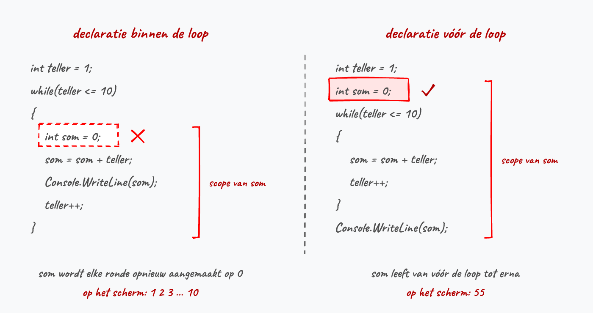
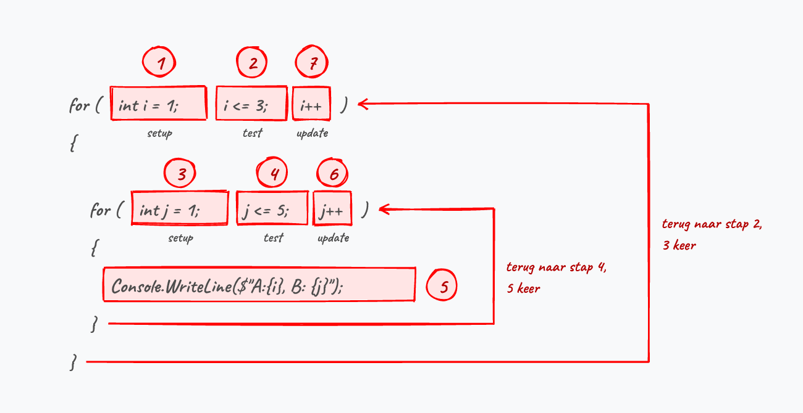
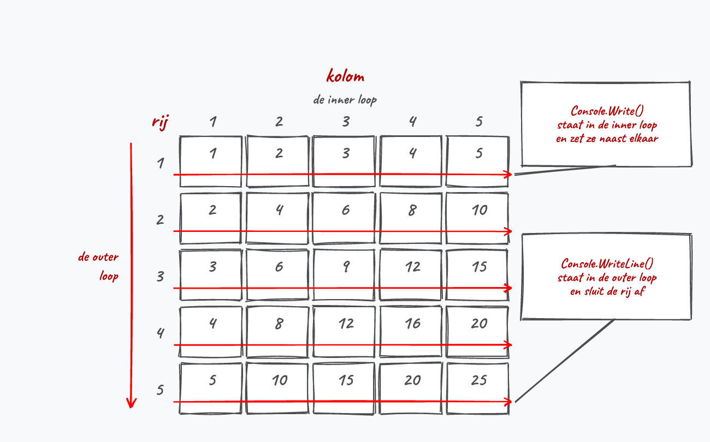
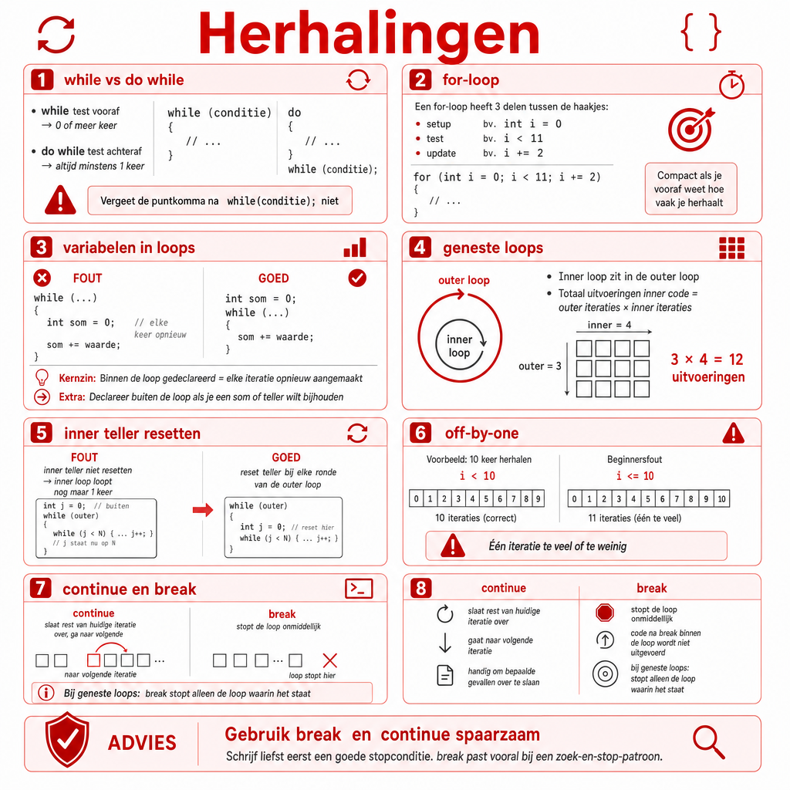

## Wat leer je in dit hoofdstuk?

Na dit hoofdstuk kan je:

* uitleggen wat een **loop** en een **iteratie** zijn
* de drie soorten loops onderscheiden: **definite**, **indefinite** en **oneindig**
* loops schrijven met **`while`**, **`do while`** en **`for`**
* een loop **tracen** en het juiste aantal iteraties tellen (**off-by-one**)
* een **oneindige loop** herkennen en de **scope** in loops correct hanteren
* **geneste loops** schrijven, in rijen en kolommen denken en het aantal iteraties berekenen
* bewust omgaan met **`break`** en **`continue`**

---

## Van branching naar herhalen

:::: {.columns}

::: {.column width="48%"}
Met `if` konden we **vertakken**, maar niet **teruggaan** in ons algoritme.

```text
Neem geld uit spaarpot
Wandel naar de dichtstbijzijnde bakker
Zolang de bakker toe is:
    Wandel naar de volgende bakker
Vraag om een brood
Betaal en keer huiswaarts
```
:::

::: {.column width="52%"}

:::

::::

Hoe vaak die *zolang*-stap draait weet je niet vooraf. Toch schrijf je ze maar één keer op.

---

## Zonder loop typ je alles uit

```csharp
Console.WriteLine("Ik zal niet spieken");
Console.WriteLine("Ik zal niet spieken");
Console.WriteLine("Ik zal niet spieken");
//...en zo nog 97 keer
```

Wil je die zin achteraf aanpassen, dan mag je honderd lijnen bijwerken en vergeet je er gegarandeerd eentje. Elke ronde door een loop heet een **iteratie**.

::: {.callout-tip .fragment}
Loops zitten in zowat elk programma dat je dagelijks gebruikt: je game tekent 60 keer per seconde een beeld, je mailprogramma overloopt alle nieuwe berichten, de zelfscankassa blijft scannen tot jij op *afsluiten* duwt.
:::

---

## Elke loop heeft drie zaken

1. Een **startsituatie**: een teller op 0, een variabele die nog leeg is
2. Een **conditie** die getest wordt om te weten of er nog een iteratie volgt
3. Iets in het codeblok dat die conditie kan **doen veranderen**: de teller verhogen, nieuwe invoer vragen

::: {.callout-important .fragment}
Vergeet je punt 3, dan blijft de conditie eeuwig waar en loopt je programma vast.
:::

---

## Soorten loops

:::: {.columns}

::: {.column width="50%"}
* **Definite** (counted): aantal herhalingen vooraf gekend (getallen 0 tot 100)
* **Indefinite** (sentinel): input of een interne test bepaalt wanneer het stopt
* **Oneindig**: stopt nooit (soms gewenst, zoals de game loop, vaak een bug)
:::

::: {.column width="50%"}

:::

::::

Het bakkersalgoritme is een indefinite loop: het aantal gesloten bakkers ken je pas terwijl je aan het wandelen bent.

---

## Loops in C\#

* **`while`**: draait 0 of meer keer
* **`do while`**: draait minstens 1 keer
* **`for`**: compacter wanneer je weet hoe vaak je moet herhalen
* **`foreach`**: pas in hoofdstuk 12, wanneer we met objecten werken

| Looptype | Definite | Indefinite | Oneindig |
|---|:---:|:---:|:---:|
| while / do while | x | x | x |
| for | x | | |

::: {.callout-tip .fragment}
Met `while` kan je meer, en toch val je vaak terug op een `for`: die is compacter, en heel wat problemen zijn nu eenmaal definite loops.
:::

---

## While

:::: {.columns}

::: {.column width="55%"}
```csharp
int teller = 0;
while (teller < 100)
{
    teller++;
    Console.WriteLine(teller);
}
```

Zolang de conditie **`true`** is, draait het blok. Is ze meteen `false`, dan draait het blok nooit.
:::

::: {.column width="45%"}

:::

::::

::: {.callout-important .fragment}
De conditie zegt wanneer je **doorgaat**, niet wanneer je stopt. Onthoud dat, want straks bij de invoercontrole loopt het net daar mis.
:::

---

## Tracen: waarom staat 100 er nog bij?

De loop hiervoor toont 1 tot en met 100. Schrijf de rondes uit:

| `teller` bij de test | `teller < 100` | In de loop | Op het scherm |
|:---:|:---:|:---:|:---:|
| 0 | `true` | wordt 1 | 1 |
| ... | ... | ... | ... |
| 99 | `true` | wordt 100 | 100 |
| 100 | `false` | loop stopt | niets |

::: {.callout-tip .fragment}
Zo'n tabel uitschrijven heet een loop **tracen**. Loop je vast op een loop, teken dan met pen en papier de eerste twee en de laatste twee rondes uit. Dat gaat sneller dan gokken.
:::

---

## Niet enkel tellen: de sentinel

Een `while` mag evengoed een *indefinite loop* zijn. Geen teller te bespeuren:

```csharp
int getal = 0;
while (getal != 666)
{
    Console.WriteLine("Geef een getal in (666 stopt):");
    getal = int.Parse(Console.ReadLine());
}
```

Zo'n stopwaarde heet een **sentinel**. De conditie mag ook complexer, met de logische operators uit hoofdstuk 5:

```csharp
while (getal != 666 && pogingen < 10)
```

::: {.callout-important .fragment}
`getal` krijgt een waarde **vóór** de loop. De test staat bovenaan en draait nog voor de gebruiker iets kon intikken. Die 0 dient enkel om de eerste test te laten slagen.
:::

---

## Oneindige loops

Bewust oneindig:

```csharp
while (true) { /* To infinity and beyond! */ }
```

Per ongeluk oneindig:

```csharp
int teller = 0;
while (teller < 10)
{
    Console.WriteLine(teller);
    teller--; // oeps, dit had teller++ moeten zijn
}
```

::: {.callout-tip .fragment}
Zorg dat de variabele uit je conditie **effectief verandert**, en in de juiste richting. Vastgelopen? Stop met de **rode knop** in Visual Studio, of pauzeer met **Pause/Break**.
:::

---

## Scope in loops

:::: {.columns}

::: {.column width="52%"}
```csharp
int teller = 1;
while (teller <= 10)
{
    int som = 0;     // FOUT: telkens terug op 0
    som = som + teller;
    teller++;
}
Console.WriteLine(som); // bestaat hier niet eens
```

Je verwacht 1, 3, 6, 10 en krijgt 1, 2, 3, 4. En buiten de accolades bestaat `som` gewoon niet: *The name 'som' does not exist in the current context*.
:::

::: {.column width="48%"}

:::

::::

::: {.callout-important .fragment}
Wil je een som **bijhouden** over de iteraties heen? Declareer `som` dan **vóór** de loop. En wat bevat `teller` na afloop? Niet 10, maar 11.
:::

---

## Do while

:::: {.columns}

::: {.column width="50%"}
```csharp
int i = 10;
do
{
    i--;
    Console.WriteLine(i);
} while (i > 0);
```

Een `do while` draait **minstens één keer**: de conditie wordt pas **na** elke iteratie getest. Op de flowchart is de ruit van plaats gewisseld.
:::

::: {.column width="50%"}

:::

::::

::: {.callout-warning .fragment}
Let op de **puntkomma** na `while (conditie);`. Vergeten is een klassieke fout (bij een gewone `while` staat ze er niet).
:::

---

## Tel even mee

Welke getallen toont dit aftelprogramma precies?

```csharp
int i = 10;
do
{
    i--;
    Console.WriteLine(i);
} while (i > 0);
```

. . .

**9 tot en met 0.** Dus niet 10 tot en met 1, en ook niet 10 tot en met 0.

::: {.callout-note .fragment}
Dezelfde val als bij de eerste `while`: we passen `i` aan **vóór** we hem tonen. Wil je 10 tot en met 1 zien, zet dan `Console.WriteLine(i);` vóór `i--;`.
:::

---

## Foute input opvangen

Blijven vragen tot de gebruiker a, b of c intikt. Denk in twee stappen.

**Stap 1: wanneer is de invoer goed?**

```csharp
input == "a" || input == "b" || input == "c"
```

**Stap 2: draai het om.** De conditie zegt wanneer je *doorgaat*, dus zet er een `!` voor:

```csharp
string input;
do
{
    Console.WriteLine("Geef uw keuze: a, b of c");
    input = Console.ReadLine();
} while (!(input == "a" || input == "b" || input == "c"));
```

---

## Even tussendoor: De Morgan

Dezelfde logica, anders geschreven:

```csharp
!(input == "a" || input == "b" || input == "c")
input != "a" && input != "b" && input != "c"
```

::: {.callout-tip}
De **Wetten van De Morgan**:

* `!(A && B)` is hetzelfde als `!A || !B`
* `!(A || B)` is hetzelfde als `!A && !B`
:::

Welke van beide vormen je schrijft is persoonlijke smaak.

---

## Waarom hier een `do while`?

Met een gewone `while` staat de test vooraan, en dan heeft `input` nog geen zinnige waarde. Twee omwegen, geen van beide fraai:

```csharp
Console.WriteLine("Geef uw keuze: a, b of c");   // de vraag twee keer in je code
string input = Console.ReadLine();
while (input != "a" && input != "b" && input != "c") { /* ... */ }
```

```csharp
string input = "";   // kunstmatige beginwaarde, enkel voor die eerste test
while (input != "a" && input != "b" && input != "c") { /* ... */ }
```

::: {.callout-important .fragment}
Declareer `input` **vóór** de loop: de test achteraan ligt **buiten** de accolades, dus in een andere scope.
:::

---

## Van while naar for

Deze constructie komt zo vaak voor dat er een kortere schrijfwijze voor bestaat:

```csharp
int i = 0;                 // startsituatie
while (i < 11)             // conditie
{
    Console.WriteLine(i);
    i = i + 2;             // dit doet de conditie veranderen
}
```

{width=70%}

---

## For: de drie delen

:::: {.columns}

::: {.column width="55%"}
```csharp
for (setup; finish test; update)
```

* **setup** (*initializer*): zet de teller op zijn beginwaarde (`int i = 0`)
* **finish test** (*condition*): de booleaanse test (`i < 11`)
* **update** (*iterator*): wat na elke iteratie gebeurt (`i += 2`)

```csharp
for (int i = 0; i < 11; i += 2)
{
    Console.WriteLine(i);
}
```
:::

::: {.column width="45%"}

:::

::::

::: {.callout-tip .fragment}
Typ `for` + tweemaal **[tab]** in Visual Studio voor een kant-en-klare for-loop.
:::

---

## De volgorde van de drie delen

1. De **setup** loopt exact één keer, bij de start van de loop
2. De **finish test** loopt vóór élke iteratie, dus ook vóór de allereerste
3. De **update** loopt telkens ná het codeblok, niet ervoor

Omdat de test vooraan staat draait een `for` net als een `while` 0 of meer keer:

```csharp
for (int i = 5; i < 3; i++)
{
    Console.WriteLine("Deze lijn zie je nooit.");
}
```

::: {.callout-tip .fragment}
De teller heet meestal `i`, van *index*. Heb je er meerdere nodig, dan volgen `j` en `k`. Overloop je effectief rijen, noem hem dan gerust `rij`.
:::

---

## Stagiair Steven

:::: {.columns}

::: {.column width="20%"}

:::

::: {.column width="80%"}
Steven moet de getallen 1 tot en met 10 tonen. De A.I. gaf hem deze loop en hij plakt ze er meteen in:

```csharp
for (int i = 1; i < 10; i++)
{
    Console.WriteLine(i);
}
```

"Van 1 tot 10, dat staat er toch?", zegt hij. Tel even mee: welke getallen verschijnen er echt?
:::

::::

::: {.callout-note .fragment}
`1` tot en met `9`. De finish test `i < 10` blijft waar zolang `i` kleiner is dan 10, dus bij `i` gelijk aan 10 stopt de loop nog net voor die laatste waarde. Wil Steven de 10 erbij, dan moet er `i <= 10` staan (of `i < 11`). Zo'n vergissing van precies één te veel of te weinig heet een **off-by-one**-fout. Steven liet de A.I. de grens kiezen en telde zelf niet na.
:::

---

## Hoeveel keer loopt deze loop?

| Header | `i` neemt de waarden aan | Aantal iteraties |
| --- | :---: | :---: |
| `for (int i = 0; i < 10; i++)` | 0 tot en met 9 | 10 |
| `for (int i = 1; i < 10; i++)` | 1 tot en met 9 | 9 |
| `for (int i = 1; i <= 10; i++)` | 1 tot en met 10 | 10 |
| `for (int i = 0; i <= 10; i++)` | 0 tot en met 10 | 11 |
| `for (int i = 10; i > 0; i--)` | 10 tot en met 1 | 10 |

Start je bij 0 en test je met `<`, dan staat het aantal iteraties letterlijk in de test. Start je bij 1, dan heb je `<=` nodig om even vaak te lopen.

::: {.callout-tip .fragment}
De laatste rij telt af: de teller start op zijn hoogste waarde en de test draait mee om naar `>`. Met `i < 10` zou daar niets gebeuren.
:::

---

## Scope van de teller

Schrijf je `int i = 0` in de setup, dan hoort `i` bij de loop en verdwijnt hij erna:

```csharp
for (int i = 0; i < 10; i++)
{
    Console.WriteLine(i);
}
Console.WriteLine(i); // fout: 'i' does not exist in the current context
```

Heb je die eindwaarde nadien wél nodig, maak de variabele dan vóór de loop aan en laat de `int` weg:

```csharp
int i;
for (i = 0; i < 10; i++) { /* ... */ }
Console.WriteLine(i); // toont 10
```

::: {.callout-tip .fragment}
Kom je in die situatie terecht, vraag je dan eerst af of een `while` niet de duidelijkere keuze is.
:::

---

## Valkuil: een puntkomma achter de header

```csharp
for (int i = 0; i < 10; i++);
{
    Console.WriteLine(i);
}
```

De loop krijgt een **leeg codeblok**: hij draait tien keer en doet tien keer niets. Het blok eronder hoort niet meer bij de loop.

| Constructie | Puntkomma achteraan? |
| --- | --- |
| `if (conditie)` | nee, fout |
| `while (conditie)` | nee, fout |
| `} while (conditie)` | **ja, verplicht** |
| `for (setup; test; update)` | nee, fout |

---

## Valkuil: de teller twee keer aanpassen

```csharp
for (int i = 0; i < 10; i++)
{
    Console.WriteLine(i);
    i++; // oeps, i gaat nu twee keer per ronde omhoog
}
```

Dit toont 0, 2, 4, 6 en 8. Wil je stappen van 2, schrijf dan `i += 2` in de header en laat de teller in het codeblok met rust.

::: {.callout-warning .fragment}
Een `for` is bedoeld voor een **definite** loop. Wring je er een sentinel-loop in, dan blijft de update leeg (`for (int getal = 0; getal != 666; )`) en houd je enkel de omslachtige syntax over. Zulke code hoort in een `while`.
:::

---

## continue en break

```csharp
for (int i = 1; i <= 10; i++)
{
    if (i == 5) continue;   // sla 5 over
    Console.WriteLine(i);
}
```

* **`continue`**: stop de huidige iteratie, ga naar de volgende
* **`break`**: stap meteen volledig uit de loop

. . .

Wat hier eigenlijk staat is "toon niets wanneer `i` gelijk is aan 5", en dat schrijf je even goed zo:

```csharp
if (i != 5) { Console.WriteLine(i); }
```

---

## De goto-politie, deel 2

:::: {.columns}

::: {.column width="30%"}

:::

::: {.column width="70%"}
**Olla!? Wat denken we dat we aan het doen zijn?**

`break` en `continue` zijn de subtiele vrienden van `goto`. Probeer eerst je loop netjes te stoppen via een goede **stopconditie**. Met een `continue` in een `while` spring je bovendien zo over de verhoging van je teller heen, waarna je programma blijft hangen.
:::

::::

::: {.callout-tip .fragment}
Wanneer is `break` wél oké? Bij *zoek-en-stop*: zodra je gevonden hebt wat je zocht, is verder zoeken zinloos. Gebruik het enkel als het je code echt duidelijker maakt.
:::

---

## Geneste loops

:::: {.columns}

::: {.column width="52%"}
```csharp
while (tellerA < 3)        // outer
{
    tellerA++;
    tellerB = 0;
    while (tellerB < 5)    // inner
    {
        tellerB++;
        Console.WriteLine($"A:{tellerA}, B:{tellerB}");
    }
}
```

Denk in **rijen en kolommen**: de outer loop overloopt de rijen, de inner de kolommen binnen zo'n rij.
:::

::: {.column width="48%"}

:::

::::

::: {.callout-important .fragment}
`tellerB = 0` moet elke ronde **gereset** worden, anders blijft hij op 5 staan en draait de inner loop maar één keer.
:::

---

## Nesting met een for

```csharp
for (int i = 1; i <= 3; i++)         // outer loop
{
    for (int j = 1; j <= 5; j++)     // inner loop
    {
        Console.WriteLine($"A:{i}, B: {j}");
    }
}
```

Dezelfde uitvoer, minder in de weg. Belangrijker: **de reset zit gratis in de setup**. Start de outer loop een nieuwe ronde, dan komt de volledige inner loop opnieuw aan de beurt, `int j = 1` incluis.

::: {.callout-tip .fragment}
Daarom worden geneste loops in de praktijk bijna altijd met een `for` geschreven: de vergeten reset kan je hier niet maken.
:::

---

## De volgorde van uitvoering

:::: {.columns}

::: {.column width="45%"}
1. Setup outer: `i` wordt 1 (één keer)
2. Test outer: `i <= 3`
3. Setup inner: `j` wordt 1 (elke ronde opnieuw)
4. Test inner: `j <= 5`
5. Codeblok van de inner loop
6. Update inner: `j++`, terug naar 4
7. Faalt de inner-test, dan pas `i++`, terug naar 2
:::

::: {.column width="55%"}

:::

::::

Stappen 4, 5 en 6 draaien vijf keer voor er ook maar één keer aan stap 7 wordt toegekomen.

---

## Rijen en kolommen op het scherm

:::: {.columns}

::: {.column width="52%"}
```csharp
for (int rij = 1; rij <= 5; rij++)
{
    for (int kolom = 1; kolom <= 5; kolom++)
    {
        Console.Write(rij * kolom + "\t");
    }
    Console.WriteLine();
}
```

`Console.Write` springt niet naar de volgende lijn, `\t` is een tab.
:::

::: {.column width="48%"}

:::

::::

::: {.callout-important .fragment}
Die laatste `Console.WriteLine();` staat binnen de outer loop, buiten de inner. Zet je ze in de inner loop, dan krijg je 25 lijnen met één getal. Zet je ze buiten de outer loop, dan komt alles op één lange lijn.
:::

---

## Geneste loops tellen

```csharp
for (int i = 0; i < 10; i++)
{
    for (int j = 0; j < 5; j++)
    {
        Console.WriteLine("Hallo");
    }
}
```

. . .

Outer 10 keer, inner telkens 5 keer: **10 x 5 = 50** keer "Hallo".

::: {.callout-warning .fragment}
Elke extra laag **vermenigvuldigt** het werk. Twee loops van elk 1000 rondes leveren een miljoen uitvoeringen op, en met een derde erbij zit je aan een miljard.
:::

---

## En deze drie?

```csharp
for (int i = 0; i < 3; i++)
    for (int j = 0; j < 10; j += 2)     // let op: j += 2
        for (int k = 0; k <= 6; k++)    // let op: k <= 6
            Console.WriteLine("Hallo");
```

. . .

* Buitenste: **3x**
* Middelste: **5x** (0, 2, 4, 6, 8)
* Binnenste: **7x** (0 t/m 6)

Samen: **3 x 5 x 7 = 105** keer.

---

## Als de inner loop van de outer afhangt

:::: {.columns}

::: {.column width="62%"}
```csharp
for (int rij = 1; rij <= 5; rij++)
{
    for (int kolom = 1; kolom <= rij; kolom++)
    {
        Console.Write("*");
    }
    Console.WriteLine();
}
```
:::

::: {.column width="38%"}
```text
*
**
***
****
*****
```
:::

::::

::: {.callout-warning .fragment}
De test van de inner loop gebruikt hier `rij`. De inner loop draait dus 1, 2, 3, 4 en 5 keer: samen 15 sterretjes, en niet 5 x 5 = 25. Zodra de teller van de outer loop in de header van de inner opduikt, mag je niet meer zomaar vermenigvuldigen.
:::

---

## Valstrik: for met while erin

Hoe vaak verschijnt "Hallo"?

```csharp
int teller = 0;
for (int j = 0; j < 4; j++)
{
    while (teller < 10)
    {
        Console.WriteLine("Hallo");
        teller++;
    }
}
```

. . .

**Slechts 10 keer, niet 40!** Na de eerste ronde staat `teller` al op 10 en draait de `while` nooit meer.

::: {.callout-important .fragment}
Een `for` reset zijn teller gratis bij de setup; een `while` niet. Zet `teller = 0;` **in** de for-body om wel 40 keer te draaien.
:::

---

## break in geneste loops

`break` haalt je enkel uit de **huidige** loop. Uit beide springen doe je met een **booleaanse vlag** in de condities:

```csharp
bool gevonden = false;
for (int i = 1; i <= 10 && !gevonden; i++)
{
    for (int j = 1; j <= 10 && !gevonden; j++)
    {
        if (i * j == 12)
        {
            Console.WriteLine($"Gevonden: {i} x {j}");
            gevonden = true;
        }
    }
}
```

Zodra `gevonden` op `true` staat falen beide tests. De reden om te stoppen staat in de conditie zelf, waar een lezer ze verwacht.

---

## Welke loop kies je?

{width=60%}

Blijf wel kritisch over de opgave: de vereisten bepalen uiteindelijk je keuze.

---

## De bekendste loop: de game loop

Elke game draait op een grote loop die blijft lopen tot het spel gedaan is:

```csharp
bool gameOver = false;
while (!gameOver)
{
    // 1. Input verwerken
    // 2. Update (de spelwereld aanpassen)
    // 3. Render (op het scherm tekenen)
    System.Threading.Thread.Sleep(50); // 4. Even wachten
}
```

Input, update, render, wachten, en opnieuw. Tientallen keren per seconde.

---

## Een balletje dat stuitert

```csharp
int x = 3, y = 3;     // positie
int xv = 1, yv = 1;   // snelheid (velocity)
while (true)
{
    x += xv;
    y += yv;
    if (x <= 0 || x >= Console.WindowWidth - 1)  xv = -xv;  // bots tegen de zijkant
    if (y <= 0 || y >= Console.WindowHeight - 1) yv = -yv;  // bots tegen boven/onder

    Console.Clear();
    Console.SetCursorPosition(x, y);
    Console.Write("O");
    System.Threading.Thread.Sleep(50);
}
```

::: {.callout-tip .fragment}
Met enkel een lus, `Console.SetCursorPosition` en `Thread.Sleep` maak je al animatie. Console saai? Valt dus reuze mee.
:::

---

## Uitdaging: treinreis-simulator

:::: {.columns}

::: {.column width="55%"}
Een trein rijdt langs **stations** (elk 5 km uit elkaar). Aan elk station stappen passagiers in en uit (de gebruiker geeft het in). Hou bij:

* het **totaal aantal passagiers**
* de **totale afstand** in km
:::

::: {.column width="45%"}
Combineer alles uit dit hoofdstuk:

* een **`while`** of **`for`** over de stations
* een **`for`** voor laadbeurten van goederen
* **`Random`** voor onverwachte gebeurtenissen (sneeuw, bandieten, ...)
:::

::::

::: {.callout-tip .fragment}
Begin met een flowchart en bouw het stap voor stap uit: eerst de stations, dan de uitbreidingen.
:::

---

## Conclusie

* Een **loop** herhaalt code; elke ronde is een **iteratie**
* **`while`** (0 of meer keer) en **`do while`** (minstens 1 keer; let op de `;`)
* **`for`** is compact wanneer je een teller bijhoudt: *setup, finish test, update*
* Let op **oneindige loops**, op **off-by-one** en op de **scope** van variabelen
* Tel geneste loops door de iteraties te **vermenigvuldigen**, behalve wanneer de inner loop de teller van de outer gebruikt
* Spaarzaam met `break`: schrijf liever een deftige stopconditie

::: {.callout-tip}
Volgende halte: **methoden**, om je code op te delen in herbruikbare blokken.
:::

---

## Meer weten

**Kennisclips**

* [Loops intro](https://ap.cloud.panopto.eu/Panopto/Pages/Viewer.aspx?id=3276517e-fc5b-4f0c-9ef2-ac4b006fc937)
* [While en Do-while loops](https://ap.cloud.panopto.eu/Panopto/Pages/Viewer.aspx?id=0b11650a-9e8f-4447-99da-ac4b00924061)
* [De for loop](https://ap.cloud.panopto.eu/Panopto/Pages/Viewer.aspx?id=f9e5d2eb-e053-4904-b121-ac4d007f4f55)
* [Loop nesting](https://ap.cloud.panopto.eu/Panopto/Pages/Viewer.aspx?id=c4a0d717-890e-4e74-bd79-ac4f008fdce4)
* [Micro-tips om loop-opgaven op te lossen](https://ap.cloud.panopto.eu/Panopto/Pages/Viewer.aspx?id=f1563c19-3b86-4603-a86d-ac4f00924132)

[Oefeningen H6](https://apwt.gitbook.io/ziescherp-oefeningen/h6-herhalingen-herhalingen-herhalingen/a_practicasamen) · [Quizlet flashcards](https://quizlet.com/be/918622385/zie-scherp-scherper-hoofdstuk-06-flash-cards/)

---

## Zie verder: andere talen

Dezelfde concepten uit dit hoofdstuk, maar dan in andere talen. Handig om later code in Python of JavaScript te leren lezen.

---

## Zie verder: do-while bestaat niet overal

De `do while` ken je terug in **C**, C++, Java en JavaScript. Python heeft hem niet. Iets dat minstens één keer draait, bootst men er na met `while True` + `break`:

```python
while True:
    keuze = input("Geef uw keuze: a, b of c ")
    if keuze in ("a", "b", "c"):
        break
```

In Python ben je dus vaak verplicht om `break` te gebruiken waar C# een nette stopconditie achteraan de `do while` toelaat.

---

## Zie verder: de for-loop elders

De drie-delige for komt uit **C** en is bijna letterlijk overgenomen door C++, Java en JavaScript:

```java
for (int i = 0; i < 11; i += 2) {
    System.out.println(i);
}
```

In C-code duikt ook `for(;;)` op: alle drie de delen mogen leeg blijven, wat een oneindige loop oplevert. Dat mag in C# evengoed, al schrijft zowat iedereen daar `while(true)`.

---

## Zie verder: tellen in Python

**Python** kent geen teller-met-conditie: je loopt er altijd *over* iets. Tellen doe je met `range`:

```python
for i in range(0, 11, 2):   # van 0 tot (niet incl.) 11, stap 2
    print(i)
```

Losse setup, conditie en update zijn er dus niet, die zitten verstopt in `range`. Dat werkt enkel als je vooraf weet over welke reeks je loopt.

---

## Samenvattende poster

Een handige samenvattende poster (Opgelet: gemaakt m.b.v. ChatGPT Image Gen 2).

{width=55%}
