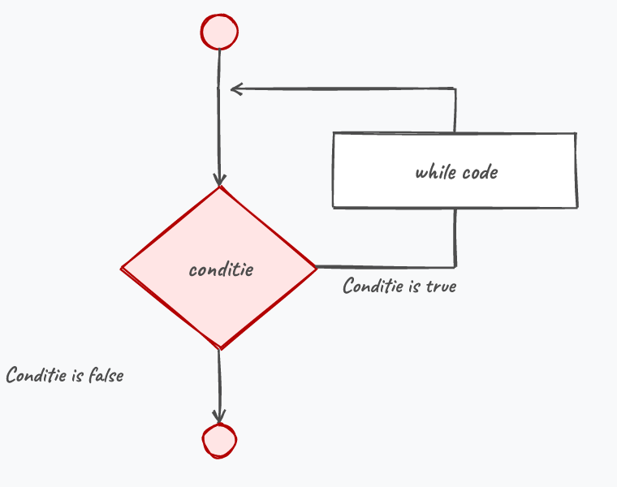
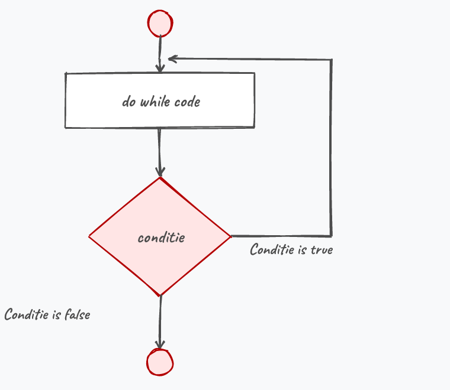
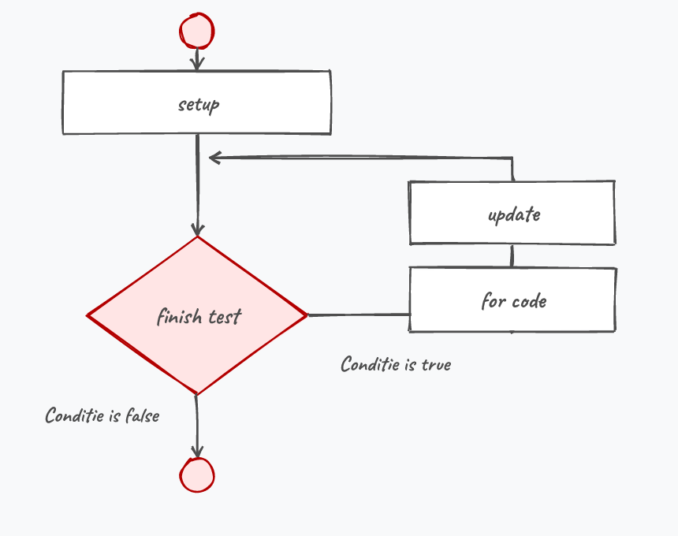
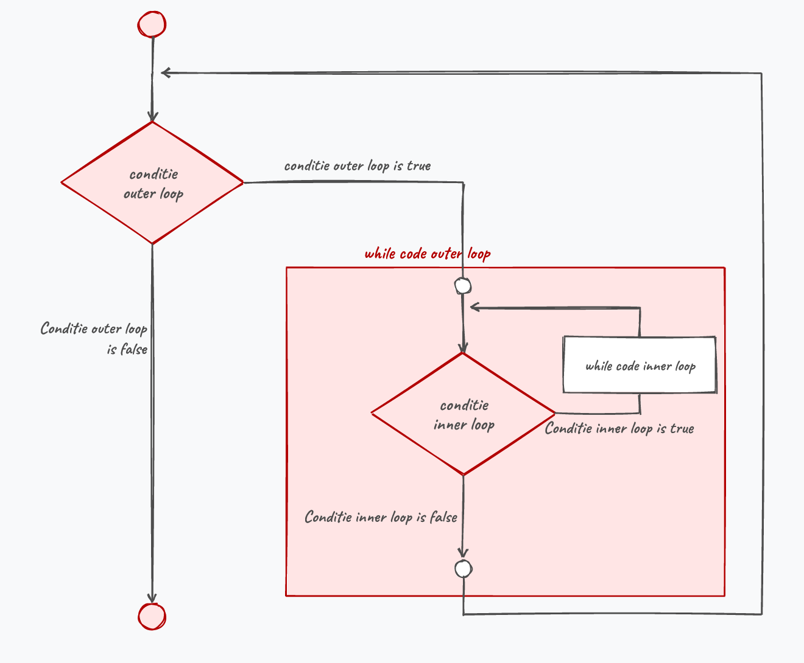

## Wat leer je in dit hoofdstuk?

Na dit hoofdstuk kan je:

* uitleggen wat een **loop** en een **iteratie** zijn
* de drie soorten loops onderscheiden: **definite**, **indefinite** en **oneindig**
* loops schrijven met **`while`**, **`do while`** en **`for`**
* een **oneindige loop** herkennen en de **scope** in loops correct hanteren
* **geneste loops** schrijven en het aantal iteraties berekenen
* bewust omgaan met **`break`** en **`continue`**

---

## Van branching naar herhalen

Met `if` konden we **vertakken**, maar niet **teruggaan** in ons algoritme.

> Soms moet een stuk code meerdere keren draaien tot aan een conditie voldaan is: *"Vraag input tot de gebruiker 666 ingeeft."*

Elke ronde door een loop heet een **iteratie**.

::: {.callout-tip .fragment}
Herhalende code in een loop is **korter**, **minder foutgevoelig** en beter onderhoudbaar.
:::

---

## Soorten loops

* **Definite** (counted): aantal herhalingen vooraf gekend (getallen 0 tot 100)
* **Indefinite** (sentinel): input of een test bepaalt wanneer het stopt
* **Oneindig**: stopt nooit (soms gewenst, zoals de game loop, vaak een bug)

| Looptype | Definite | Indefinite | Oneindig |
|---|:---:|:---:|:---:|
| while / do while | x | x | x |
| for | x | | |

---

## While

:::: {.columns}

::: {.column width="55%"}
```csharp
int tellertje = 0;
while (tellertje < 100)
{
    tellertje++;
    Console.WriteLine(tellertje);
}
```

Zolang de conditie **`true`** is, draait het blok. Is ze meteen `false`, dan draait het blok nooit.
:::

::: {.column width="45%"}

:::

::::

::: {.callout-tip .fragment}
Zie je dezelfde lijnen meermaals onder elkaar (copy-paste)? Grote kans dat een loop beter is.
:::

---

## Oneindige loops

Bewust oneindig:

```csharp
while (true) { /* To infinity and beyond! */ }
```

Per ongeluk oneindig:

```csharp
int teller = 0;
while (teller < 10)
{
    Console.WriteLine(teller);
    teller--; // oeps, dit had teller++ moeten zijn
}
```

::: {.callout-tip .fragment}
Zorg dat de variabele uit je conditie **effectief verandert** in de loop. Vastgelopen? Stop met de **rode knop** in VS.
:::

---

## Scope in loops

Een variabele die je **in** de loop declareert, wordt elke iteratie **opnieuw** aangemaakt:

```csharp
int teller = 1;
while (teller <= 10)
{
    int som = 0;     // FOUT: telkens terug op 0
    som = som + teller;
    teller++;
}
Console.WriteLine(som); // bestaat hier niet eens
```

::: {.callout-important .fragment}
Wil je een som **bijhouden** over de iteraties heen? Declareer `som` dan **vóór** de loop.
:::

---

## Do while

:::: {.columns}

::: {.column width="55%"}
```csharp
int i = 10;
do
{
    i--;
    Console.WriteLine(i);
} while (i > 0);
```

Een `do while` draait **minstens één keer**: de conditie wordt pas **na** elke iteratie getest.
:::

::: {.column width="45%"}

:::

::::

::: {.callout-warning .fragment}
Let op de **puntkomma** na `while (conditie);`. Vergeten is een klassieke fout (bij een gewone `while` staat ze er niet).
:::

---

## Foute input opvangen

`do while` is ideaal om te blijven vragen tot de input klopt:

```csharp
string input;
do
{
    Console.WriteLine("Geef uw keuze: a, b of c");
    input = Console.ReadLine();
} while (input != "a" && input != "b" && input != "c");
```

::: {.callout-important .fragment}
Declareer `input` **vóór** de loop: de test achteraan ligt **buiten** de accolades, dus in een andere scope.
:::

---

## Even tussendoor: De Morgan

Dezelfde logica, anders geschreven:

```csharp
input != "a" && input != "b" && input != "c"
!(input == "a" || input == "b" || input == "c")
```

::: {.callout-tip}
De **Wetten van De Morgan**:

* `!(A && B)` is hetzelfde als `!A || !B`
* `!(A || B)` is hetzelfde als `!A && !B`
:::

---

## For

:::: {.columns}

::: {.column width="55%"}
Een compacte loop wanneer je een teller bijhoudt:

```csharp
for (int i = 0; i < 11; i += 2)
{
    Console.WriteLine(i);
}
```

Toont 0, 2, 4, 6, 8, 10.
:::

::: {.column width="45%"}

:::

::::

---

## For: de drie delen

```csharp
for (setup; finish test; update)
```

* **setup** (*initializer*): zet de wachter-variabele op de beginwaarde (`int i = 0`)
* **finish test** (*condition*): de booleaanse test (`i < 11`)
* **update** (*iterator*): wat na elke iteratie gebeurt (`i += 2`)

::: {.callout-tip .fragment}
Typ `for` + tweemaal **[tab]** in VS voor een kant-en-klare for-loop.
:::

---

## continue en break

```csharp
for (int i = 1; i <= 10; i++)
{
    if (i == 5) continue;   // sla 5 over
    Console.WriteLine(i);
}
```

* **`continue`**: stop de huidige iteratie, ga naar de volgende
* **`break`**: stap meteen volledig uit de loop

---

## De goto-politie, deel 2

:::: {.columns}

::: {.column width="30%"}

:::

::: {.column width="70%"}
**Olla!? Wat denken we dat we aan het doen zijn?**

`break` en `continue` zijn de subtiele vrienden van `goto`. Probeer eerst je loop netjes te stoppen via een goede **stopconditie**.
:::

::::

::: {.callout-tip .fragment}
Wanneer is `break` wél oké? Bij *zoek-en-stop*: zodra je gevonden hebt wat je zocht, is verder zoeken zinloos. Gebruik het enkel als het je code echt duidelijker maakt.
:::

---

## Geneste loops

:::: {.columns}

::: {.column width="52%"}
```csharp
while (tellerA < 3)        // outer
{
    tellerA++;
    tellerB = 0;
    while (tellerB < 5)    // inner
    {
        tellerB++;
        Console.WriteLine($"A:{tellerA}, B:{tellerB}");
    }
}
```
:::

::: {.column width="48%"}

:::

::::

::: {.callout-important .fragment}
`tellerB = 0` moet elke ronde **gereset** worden, anders blijft hij op 5 staan en draait de inner loop maar één keer.
:::

---

## Geneste loops tellen

```csharp
for (int i = 0; i < 10; i++)
{
    for (int j = 0; j < 5; j++)
    {
        Console.WriteLine("Hallo");
    }
}
```

. . .

Outer 10 keer, inner telkens 5 keer: **10 x 5 = 50** keer "Hallo".

::: {.callout-important .fragment}
`break` haalt je enkel uit de **huidige** loop. Uit alle geneste loops springen vraagt een andere aanpak (bv. een booleaanse vlag).
:::

---

## Conclusie

* Een **loop** herhaalt code; elke ronde is een **iteratie**
* **`while`** (0 of meer keer) en **`do while`** (minstens 1 keer; let op de `;`)
* **`for`** is compact wanneer je een teller bijhoudt: *setup, finish test, update*
* Let op **oneindige loops** en op de **scope** van variabelen in een loop
* Tel geneste loops door de iteraties te **vermenigvuldigen**; spaarzaam met `break`

::: {.callout-tip}
Volgende halte: **methoden**, om je code op te delen in herbruikbare blokken.
:::

---

## Meer weten

**Kennisclips**

* [Loops intro](https://ap.cloud.panopto.eu/Panopto/Pages/Viewer.aspx?id=3276517e-fc5b-4f0c-9ef2-ac4b006fc937)
* [While en Do-while loops](https://ap.cloud.panopto.eu/Panopto/Pages/Viewer.aspx?id=0b11650a-9e8f-4447-99da-ac4b00924061)
* [De for loop](https://ap.cloud.panopto.eu/Panopto/Pages/Viewer.aspx?id=f9e5d2eb-e053-4904-b121-ac4d007f4f55)
* [Loop nesting](https://ap.cloud.panopto.eu/Panopto/Pages/Viewer.aspx?id=c4a0d717-890e-4e74-bd79-ac4f008fdce4)
* [Micro-tips om loop-opgaven op te lossen](https://ap.cloud.panopto.eu/Panopto/Pages/Viewer.aspx?id=f1563c19-3b86-4603-a86d-ac4f00924132)

[Oefeningen H6](https://apwt.gitbook.io/ziescherp-oefeningen/h6-herhalingen-herhalingen-herhalingen/a_practicasamen) · [Quizlet flashcards](https://quizlet.com/be/918622385/zie-scherp-scherper-hoofdstuk-06-flash-cards/)
