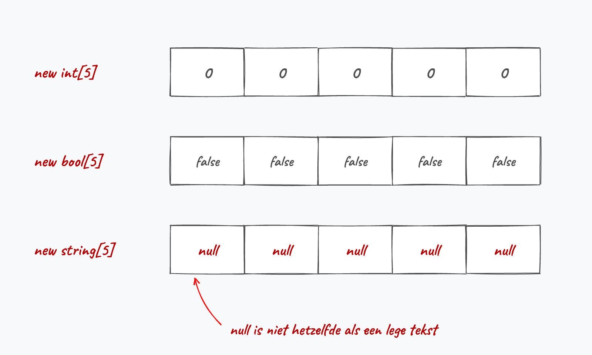
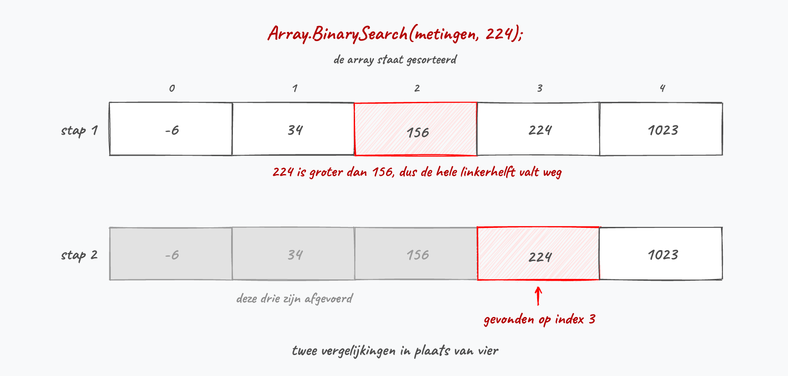
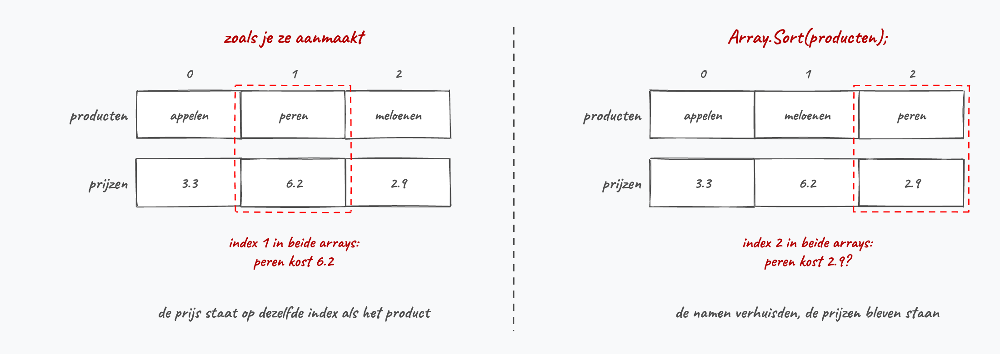
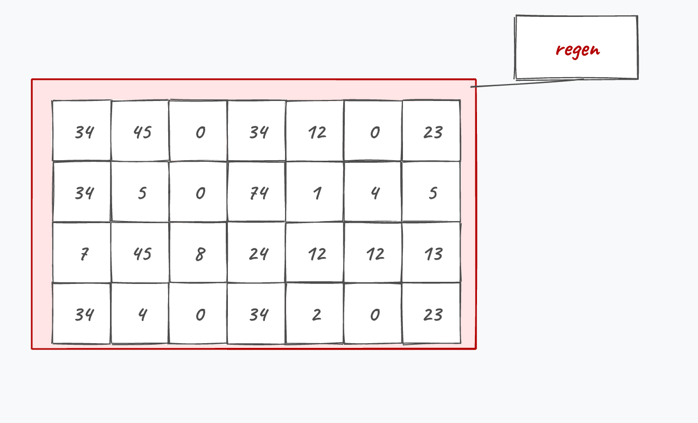
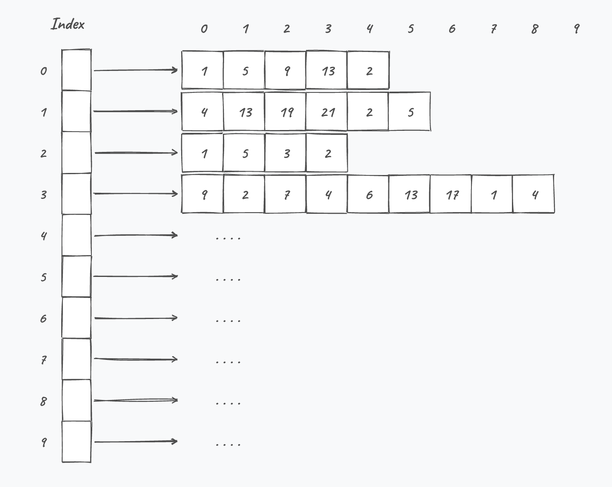

## Wat leer je in dit hoofdstuk?

Na dit hoofdstuk kan je:

* uitleggen waarom **arrays** veel data van hetzelfde type bundelen
* arrays **declareren**, **vullen** en met een loop **overlopen**
* begrijpen dat arrays **by reference** werken (en hoe je ze correct kopieert)
* de **`System.Array`**-methoden gebruiken (`Sort`, `Copy`, `IndexOf`, ...)
* de klassieke **loop-patronen** zelf schrijven: optellen, tellen, de grootste zoeken
* arrays als **parameter** en **returntype** in methoden gebruiken, ook met `params`
* **meerdimensionale** en **jagged** arrays herkennen

---

## Het nut van arrays

Zeven losse variabelen voor zeven dagen regen?

```csharp
int dag1 = 34; int dag2 = 45; int dag3 = 0; // ... dag7
```

. . .

Eén **array** bundelt dezelfde soort data in één variabele:

```csharp
int[] regen = { 34, 45, 0, 34, 12, 0, 23 };
```

{width=60%}

---

## De kracht: een index in een loop

De index tussen `[ ]` mag een **variabele** zijn, dus genereer je ze in een loop:

```csharp
int[] regen = { 34, 45, 0, 34, 12, 0, 23, 7, 20, 34, 7, 42 };
double som = 0;
for (int i = 0; i < regen.Length; i++)
{
    som += regen[i];
}
double gemiddelde = som / regen.Length;
```

::: {.callout-tip .fragment}
Vanaf 3 of meer variabelen van dezelfde soort is een array bijna altijd het antwoord.
:::

---

## Even achteromkijken

:::: {.columns}

::: {.column width="22%"}

:::

::: {.column width="78%"}
Sorry dat we weer in het diepe duiken. Maar kijk eens achterom: schrik je hé? Je hebt al een aardige weg afgelegd sinds ik je voor het eerst in het zwembad gooide.

Alles wordt kinderspel als je er maar lang genoeg mee bezig bent.
:::

::::

---

## Een array declareren: 3 manieren

```csharp
// 1) enkel declareren (nog geen array in het geheugen)
int[] verkoopCijfers;

// 2) meteen initialiseren met waarden
string[] kleuren = { "red", "green", "blue" };

// 3) een lege array van een vaste lengte
string[] namen = new string[5];
```

::: {.callout-important .fragment}
Eens de lengte vastligt, kan een array **niet meer groeien of krimpen**. (Lists in hoofdstuk 12 lossen dat op.)
:::

::: {.callout-tip .fragment}
Sinds C# 12 mag je in de plaats van de accolades ook vierkante haken schrijven: `string[] kleuren = ["red", "green", "blue"];`. Die vorm mag ook ná de declaratielijn, de accolades niet.
:::

---

## Wat staat er in een verse array?

:::: {.columns}

::: {.column width="55%"}
`new int[3]` maakt drie vakjes die meteen de **defaultwaarde** van hun type bevatten:

* `int`, `double`: `0`
* `bool`: `false`
* `char`: `\0`
* `string`: `null`
:::

::: {.column width="45%"}

:::

::::

::: {.callout-warning .fragment}
`new string[5]` geeft je **geen vijf lege teksten**, maar vijf keer `null`. `myColors[0] == ""` is dus `false`, en `myColors[0].Length` crasht. Vul een string-array eerst zelf in.
:::

---

## Een array of een `List`?

* Ligt het aantal elementen **op voorhand vast** (12 maanden, 64 vakjes op een schaakbord), dan neem je een **array**
* Kan er tijdens de uitvoer iets **bij komen of wegvallen** (een winkelmandje, spelers die zich aanmelden), dan heb je een **`List`** nodig (hoofdstuk 12)

::: {.callout-warning .fragment}
Een array heeft `Length`, een `List` heeft `Count`. Een array heeft geen `Count`, en de foutmelding die je dan krijgt zegt niet bepaald duidelijk wat er scheelt.
:::

::: {.callout-tip .fragment}
`Array.Resize(ref cijfers, 5)` lijkt een uitweg, maar maakt achter de schermen een **nieuwe** array en kopieert alles over. Bij grote arrays neem je beter meteen een `List`.
:::

---

## Index en accessor

:::: {.columns}

::: {.column width="60%"}
* Benader een element met `array[index]`
* De index **start bij 0**
* Een array met **lengte 5** heeft indices **0 tot en met 4**
:::

::: {.column width="40%"}

:::

::::

```csharp
Console.WriteLine(myColors[1]); // tweede element
myColors[0] = "indigo";         // eerste element overschrijven
```

---

## Eentje is geentje

Een Vlaamse ezelsbrug voor 0-gebaseerde indexering:

* Een array met **lengte 6** heeft 6 elementen (6 pintjes op de toog)
* Het eerste element zit op index **0**: *eentje is geentje*
* Het **laatste** zit dus op index **5**, niet 6

::: {.callout-warning .fragment}
`array[array.Length]` valt er altijd net naast: dat is precies de `IndexOutOfRangeException`.
:::

---

## Overlopen met Length

`array.Length` geeft het aantal elementen. Ideaal als grens van een loop:

```csharp
for (int i = 0; i < myColors.Length; i++)
{
    Console.WriteLine(myColors[i]);
}
```

::: {.callout-warning .fragment}
`Console.WriteLine(myColors)` toont **niet** de inhoud. Overloop de array element per element.
:::

---

## Out of range

:::: {.columns}

::: {.column width="22%"}

:::

::: {.column width="78%"}
```csharp
int[] getallen = { 1, 2, 3 };
Console.WriteLine(getallen[5]); // crash bij uitvoer
```

Een **`IndexOutOfRangeException`**. We bouwen aan een gebouw met 3 verdiepingen; vraag ik mijn metser om op de zesde te metsen, dan valt hij eraf.
:::

::::

::: {.callout-important .fragment}
De compiler vangt dit **niet**: je ontdekt het pas bij de uitvoer. Hackers misbruiken net dit soort fouten in *buffer overflow attacks*.
:::

---

## Geheugen: value vs reference

:::: {.columns}

::: {.column width="52%"}
* **Value types** (`int`, `double`, ...) bevatten de **waarde** zelf
* **Reference types** bewaren een **adres** naar de data elders in het geheugen

```csharp
int[] getallen = { 5, 42, 2 };
int age = 5;
```
:::

::: {.column width="48%"}

:::

::::

::: {.callout-important .fragment}
**Arrays werken by reference.** Een array-variabele bevat dus niet de array zelf, maar een **verwijzing** ernaar.
:::

---

## De kopieer-val

:::: {.columns}

::: {.column width="55%"}
```csharp
string[] ploegen = { "Beerschot", "Antwerp" };
string[] nieuwe = { "Anderlecht", "Brugge" };
nieuwe = ploegen; // geen kopie!
```

Beide variabelen wijzen nu naar **dezelfde** array. `nieuwe[1] = "..."` past dus ook `ploegen` aan.
:::

::: {.column width="45%"}

:::

::::

---

## Een array echt kopiëren

:::: {.columns}

::: {.column width="55%"}
`=` maakt een alias. Kopieer dus **element per element**, in een array die even groot is:

```csharp
string[] kopie = new string[ploegen.Length];
for (int i = 0; i < ploegen.Length; i++)
{
    kopie[i] = ploegen[i];
}
```
:::

::: {.column width="45%"}

:::

::::

::: {.callout-tip .fragment}
Of gebruik `Array.Copy(bron, doel, aantal)` uit de `System.Array`-bibliotheek.
:::

---

## System.Array

Je roept deze methoden op **`Array`** op en geeft jouw array als argument mee:

```csharp
Array.Sort(myColors);     // alfabetisch / van klein naar groot
Array.Reverse(myColors);  // volgorde omkeren
// myColors.Sort();       // bestaat niet
```

Ze geven **niets** terug: ze krijgen de referentie naar jouw array en herschikken die **ter plekke**. Na die ene regel is `myColors` zelf veranderd.

::: {.callout-tip .fragment}
Van groot naar klein sorteren doe je met een `Sort()` gevolgd door een `Reverse()`.
:::

---

## Clear en Copy

:::: {.columns}

::: {.column width="55%"}
Allebei werken ze met een **startindex** en een **aantal** elementen:

```csharp
int[] scores = { 12, 8, 20, 15, 3 };
Array.Clear(scores, 0, 2);
// scores: 0 0 20 15 3

string[] doel = new string[myColors.Length];
Array.Copy(myColors, doel, myColors.Length);
```
:::

::: {.column width="45%"}

:::

::::

::: {.callout-note .fragment}
`Clear` verandert enkel de inhoud, niet de lengte. Bij `Copy` moet de doel-array al bestaan, en krijg je wél twee aparte arrays in het geheugen.
:::

---

## Zoeken met IndexOf

`Array.IndexOf` laat je array met rust en geeft een **getal** terug:

```csharp
int indexGreen = Array.IndexOf(myColors, "green"); // 3
int indexZwart = Array.IndexOf(myColors, "black"); // -1
```

Die **`-1`** is de afspraak voor "niet gevonden": een index kan nooit negatief zijn. Intern overloopt de methode je array element per element, precies zoals je het zelf zou schrijven.

::: {.callout-important .fragment}
Test op `-1` vóór je het resultaat als index gebruikt, anders vlieg je met `myColors[-1]` tegen een `IndexOutOfRangeException` aan.
:::

---

## Sneller zoeken: BinarySearch

:::: {.columns}

::: {.column width="55%"}
Staat je array **gesorteerd**, dan hoef je niet alles te overlopen:

```csharp
Array.Sort(metingen); // anders werkt het niet
int index = Array.BinarySearch(metingen, keuze);
if (index >= 0)
    Console.WriteLine($"gevonden op {index}");
```

`BinarySearch` kijkt in het midden en weet na die ene vergelijking al in welke helft het element moet liggen.
:::

::: {.column width="45%"}

:::

::::

::: {.callout-important .fragment}
Op een **ongesorteerde** array krijg je geen foutmelding, wel af en toe een fout antwoord. Gebruik dan `IndexOf` of een eigen loop.
:::

---

## Zelf een loop schrijven: optellen en tellen

Zodra je iets wil optellen of tellen helpt geen enkele kant-en-klare methode je nog. Je resultaat-variabele maak je aan **vóór** de loop:

```csharp
int som = 0;
for (int i = 0; i < punten.Length; i++)
{
    som += punten[i];
}
double gemiddelde = (double)som / punten.Length;
```

::: {.callout-warning .fragment}
De cast naar `double` is nodig: `som` en `Length` zijn allebei `int`, dus zonder cast doe je een gehele deling. Wil je tellen in plaats van optellen, dan staat er enkel een `if` in de loop.
:::

---

## De grootste zoeken

Hiervoor bestaat geen kant-en-klare methode. Je houdt de beste kandidaat **tot nu toe** bij, en meteen ook zijn index:

```csharp
int hoogste = punten[0];
int indexHoogste = 0;
for (int i = 1; i < punten.Length; i++)
{
    if (punten[i] > hoogste)
    {
        hoogste = punten[i];
        indexHoogste = i;
    }
}
```

::: {.callout-important .fragment}
Start met **`punten[0]`**, niet met `0`. Met `int hoogste = 0;` krijg je een fout antwoord zodra alle waarden negatief zijn. Daarom start de loop ook bij index **1**.
:::

---

## Zoeken en stoppen

Staat rugnummer 12 in de top 5? Je loop heeft twee redenen om te stoppen: het einde van de array, of een geslaagde zoektocht.

```csharp
int index = 0;
bool gevonden = false;
while (index < top5.Length && !gevonden)
{
    if (top5[index] == teZoeken)
        gevonden = true;
    else
        index++;
}
```

::: {.callout-warning .fragment}
`index++` staat in de **`else`**. Verhoog je de teller altijd, dan wijst `index` achteraf één positie te ver. Met een `for`-loop en een `break` mag ook: je bewaart de index dan in een variabele die op `-1` start.
:::

---

## Twee synchrone arrays

Naam en prijs staan op **dezelfde index** in twee aparte arrays:

```csharp
string[] producten = { "appelen", "peren", "meloenen" };
double[] prijzen = { 3.3, 6.2, 2.9 };

int i = Array.IndexOf(producten, keuzeGebruiker);
if (i != -1) Console.WriteLine($"Prijs: {prijzen[i]}");
```

{width=70%}

::: {.callout-warning .fragment}
`Array.Sort(producten)` breekt de link: de namen verhuizen, de prijzen blijven staan. In hoofdstuk 9 bewaart één object de naam én de prijs samen.
:::

---

## Een string is (bijna) een array

Lezen mag, met vierkante haken en `Length`, precies zoals bij een array:

```csharp
string zin = "Ik ben Tim";
Console.WriteLine(zin[7]);      // T, en dat is een char
Console.WriteLine(zin.Length);  // 10
```

. . .

Schrijven mag **niet**: `zin[8] = 'i';` compileert niet. Een string ligt vast zodra hij bestaat. Wil je toch karakter per karakter werken, dan ga je langs een echte `char[]`:

```csharp
char[] karakters = zin.ToCharArray();
karakters[8] = 'i';
string terug = new string(karakters);
```

---

## Nuttige string-methoden

```csharp
string boek = "Ik ben Mercy";
boek.IndexOf("ben");                 // 3
boek.Substring(3, 3);                // "ben"
boek.Remove(3, 4);                   // "Ik Mercy"
boek.ToUpper();                      // "IK BEN MERCY"
boek.Replace("Mercy", "Reinhardt");  // "Ik ben Reinhardt"
"  hey  ".Trim();                    // "hey"
```

::: {.callout-important .fragment}
Ze geven allemaal een **nieuwe** string terug en laten het origineel ongemoeid. `boek.Trim();` op zichzelf doet dus niets: je gooit het resultaat weg. Schrijf `boek = boek.Trim();`. Merk het verschil met `Array.Sort`, die jouw array wél ter plekke aanpast.
:::

---

## Split en Join

```csharp
string data = "12,13,20";
string[] delen = data.Split(',');        // {"12","13","20"}

string samen = string.Join(";", delen);  // "12;13;20"
```

`Split` levert een **array** op, `Join` voegt er terug één string van. Hoeveel elementen `Split` oplevert weet je op voorhand niet, dus gebruik ook hier `delen.Length` in je loop.

::: {.callout-tip .fragment}
`Console.WriteLine(string.Join(", ", myColors));` is meteen de kortste manier om een hele array op één lijn te tonen.
:::

---

## Arrays en methoden

:::: {.columns}

::: {.column width="22%"}

:::

::: {.column width="78%"}
Arrays gaan **by reference** naar een methode. Pas je de array aan in de methode, dan verandert de **originele** array mee:

```csharp
static void PasAan(int[] arr) { arr[0] = 0; }

int[] nrs = { 1, 2, 3 };
PasAan(nrs);
Console.WriteLine(nrs[0]); // 0, niet 1
```
:::

::::

::: {.callout-tip .fragment}
Wil je dat een methode je origineel niet aanraakt, geef dan een kopie mee die je zelf element per element hebt gevuld.
:::

---

## Array-grootte en returntype

In de signatuur geef je **geen** grootte mee; gebruik `.Length` in de methode:

```csharp
static int[] MaakArray(int lengte, int beginwaarde)
{
    int[] result = new int[lengte];
    for (int i = 0; i < lengte; i++)
        result[i] = beginwaarde;
    return result;
}

int[] nieuw = MaakArray(4, 666);
```

::: {.callout-warning .fragment}
`static void LeesData(int[6] arr)` is **fout**: een grootte in de parameterlijst mag niet.
:::

---

## params: zoveel argumenten als je wil

Nu snap je de `params object[] arg` in de signatuur van `Console.WriteLine`. Zet je `params` voor een array-parameter, dan steekt C# de losse waarden zelf in een array:

```csharp
static int Som(params int[] getallen)
{
    int totaal = 0;
    for (int i = 0; i < getallen.Length; i++)
        totaal += getallen[i];
    return totaal;
}
```

```csharp
Som(1, 2, 3);   // 6
Som();          // 0
Som(cijfers);   // een bestaande array mag ook
```

::: {.callout-warning .fragment}
Er mag maar **één** `params`-parameter zijn, en die staat **achteraan**: `static void Log(string titel, params string[] regels)`.
:::

---

## Stagiair Steven

:::: {.columns}

::: {.column width="22%"}

:::

::: {.column width="78%"}
Steven wil de scores herstellen naar een verse, lege array. De A.I. gaf hem dit:

```csharp
static void Reset(int[] scores)
{
    scores = new int[scores.Length];
}

int[] scores = { 10, 25, 3 };
Reset(scores);
Console.WriteLine(scores[0]);
```

"`Reset` zet er een nieuwe, lege array in de plaats, dus dit toont `0`", zegt hij.
:::

::::

::: {.callout-note .fragment}
Er verschijnt gewoon `10`. Wat je meegeeft is een **kopie van de wegwijzer**: die kopie mag je in de methode naar iets anders laten wijzen, de variabele in `Main` blijft naar de originele array kijken. Een *element* aanpassen (`scores[0] = 99`) werkt wél door, de hele array *vervangen* niet.
:::

---

## Opstartparameters: args

Nu snap je `string[] args` in `Main`: het zijn de **opstartparameters**.

```csharp
for (int i = 0; i < args.Length; i++)
    Console.WriteLine(args[i]);

if (args.Length >= 3 && args[2] == "cool")
    Console.WriteLine("Ik ga akkoord!");
```

::: {.callout-important .fragment}
Test **eerst** `args.Length >= 3`, dan pas `args[2]`. De `&&` stopt links bij `false` en zo vermijd je een crash.
:::

---

## Meerdimensionale arrays

:::: {.columns}

::: {.column width="55%"}
Met een komma in de haken maak je een **rechthoekig rooster**:

```csharp
int[,] regen = new int[4, 7]; // 4 rijen, 7 kolommen

regen[0, 3] = 12;             // week 1, dag 4
Console.WriteLine(regen[0, 3]);
```

Eerst de **rij**, dan de **kolom**. Beide starten bij 0.
:::

::: {.column width="45%"}

:::

::::

::: {.callout-tip .fragment}
`.Length` geeft het **totaal** (hier 28); `GetLength(0)` en `GetLength(1)` de afzonderlijke dimensies, `.Rank` het aantal dimensies.
:::

---

## Alle vakjes overlopen

Twee geneste loops: de buitenste over de **rijen**, de binnenste over de **kolommen** van die rij.

```csharp
for (int week = 0; week < regen.GetLength(0); week++)
{
    for (int dag = 0; dag < regen.GetLength(1); dag++)
        Console.Write($"{regen[week, dag]} ");

    Console.WriteLine(); // nieuwe lijn na iedere week
}
```

Ook een rooster gaat **by reference** naar een methode; in de parameter herhaal je de komma: `static void ToonRooster(int[,] rooster)`.

::: {.callout-warning .fragment}
Gebruik `GetLength(...)` en geen harde getallen. En verwissel de indices niet: `regen[dag, week]` compileert perfect, maar crasht bij de uitvoer.
:::

---

## Rooster of klasse?

Een 2D-array werkt zolang **ieder vakje hetzelfde betekent**: een spelbord, een doolhof, pixels, regen per dag.

```csharp
string[,] boeken =
{
    { "Macbeth", "Shakespeare", "ID12341" },
    { "Zie scherp", "Tim Dams", "ID007" }
};
```

Hier betekent elke kolom iets anders: alles moet `string` zijn, en `boeken[1, 1]` zegt nergens dat kolom 1 de auteur is.

::: {.callout-tip .fragment}
Vanaf hoofdstuk 9 wordt dit een klasse `Boek`, in hoofdstuk 12 bewaard in een gewone 1D-array. De tweede dimensie verdwijnt.
:::

---

## Jagged arrays

:::: {.columns}

::: {.column width="55%"}
Een **array van arrays** met **verschillende** lengtes. Let op de dubbele `[][]`:

```csharp
double[][] tickets =
{
    new double[] { 3.0, 40, 24 },
    new double[] { 123, 31.3 },
    new double[] { 2.1 }
};
tickets[0][1];      // 40
tickets.Length;     // 3 sub-arrays
tickets[1].Length;  // 2
```
:::

::: {.column width="45%"}

:::

::::

::: {.callout-note .fragment}
Je moet ze vooral kunnen **herkennen**. Zelf schrijf je liever een rechthoekige `[,]`-array, of een collectie uit hoofdstuk 12: iedere rij apart aanmaken en apart op zijn lengte controleren is omslachtig en foutgevoelig.
:::

---

## Programmer's Point: hou je dimensies laag

* Je hebt **zelden meer dan 2 of 3 dimensies** echt nodig
* Heb je meer? **Herdenk je probleem.** Vaak lukt hetzelfde met twee 2D-arrays in plaats van een 4D-array
* Hoe meer dimensies, hoe moeilijker voor te stellen en te debuggen

::: {.callout-tip .fragment}
En vanaf hoofdstuk 12 maken **collecties** veel van dit werk een stuk aangenamer.
:::

---

## Conclusie

* Een **array** bundelt veel waarden van hetzelfde type onder één naam; index start bij **0**
* Overloop arrays met een **loop** en `.Length`; let op de **`IndexOutOfRangeException`**
* Arrays werken **by reference**: `=` maakt een alias, kopieer dus element per element
* **`System.Array`** en de string-methoden besparen werk; optellen, tellen en de grootste zoeken schrijf je zelf
* Arrays gaan **by reference** naar methoden (`params` voor een los aantal argumenten); een **2D-array** dient voor een rooster, **jagged** moet je enkel herkennen

::: {.callout-tip}
Volgende halte: **object-georiënteerd programmeren**, met klassen en objecten.
:::

---

## Meer weten

**Kennisclips**

* [Arrays](https://ap.cloud.panopto.eu/Panopto/Pages/Viewer.aspx?id=d1801903-4bd3-4004-b1cb-ac4f00d3cfdf)
* [Arrays en geheugen](https://ap.cloud.panopto.eu/Panopto/Pages/Viewer.aspx?id=1a57ab27-bb21-4bd8-8b37-ac4f00d3cf97)
* [System.Array](https://ap.cloud.panopto.eu/Panopto/Pages/Viewer.aspx?id=3b587f2c-fc98-42d1-81ed-ac54007d7a4b)
* [Algoritmes en arrays](https://ap.cloud.panopto.eu/Panopto/Pages/Viewer.aspx?id=90e32a53-b9ac-4162-a3e9-ac5400879d81)
* [Strings en arrays](https://ap.cloud.panopto.eu/Panopto/Pages/Viewer.aspx?id=831314ae-c35f-4d6e-b7c0-ac54007d7abe)
* [Arrays en methoden](https://ap.cloud.panopto.eu/Panopto/Pages/Viewer.aspx?id=4f1a0fd6-697b-42d5-b44a-ac560097b2aa)
* [Meer-dimensionale arrays](https://ap.cloud.panopto.eu/Panopto/Pages/Viewer.aspx?id=9dea3f48-d5b9-4469-823c-ac590085d881)

[Oefeningen H8](https://apwt.gitbook.io/ziescherp-oefeningen/alles-samen-h1-tot-h8/readme2) · [Quizlet flashcards](https://quizlet.com/be/918628060/zie-scherp-scherper-hoofdstuk-08-flash-cards/)

---

## Zie verder: andere talen

Dezelfde concepten uit dit hoofdstuk, maar dan in andere talen. Handig om later code in Python of JavaScript te leren lezen.

---

## Zie verder: vaste vs dynamische lengte

In **Python** bestaat geen array met vaste grootte, wel een dynamische `list`:

```python
getallen = [1, 2, 3]
getallen.append(4)       # groeit gewoon mee
getallen.append("vier")  # mag zelfs een ander type zijn
```

Totaal anders dan een C#-array (vaste lengte, 1 type). Lijkt eerder op de `List` uit hoofdstuk 12.

---

## Zie verder: geen bounds-checking in C

C# gooit netjes een `IndexOutOfRangeException`. In **C** is er geen enkele grenscontrole:

```c
int getallen[3] = {1, 2, 3};
printf("%d", getallen[5]); // geen foutmelding!
```

Je leest dan zomaar willekeurige geheugeninhoud of je programma crasht. Net dat maakt buffer overflow attacks mogelijk.

---

## Zie verder: dezelfde val in JavaScript

Ook **JavaScript**-arrays werken by reference, dus `=` maakt een alias, geen kopie:

```javascript
let ploegen = ["Beerschot", "Antwerp"];
let nieuwe = ploegen;     // zelfde array!
nieuwe[1] = "Brugge";
console.log(ploegen[1]);  // "Brugge"
```

Heel gelijkaardig aan C#. Een echte kopie: `let kopie = [...ploegen];`.

---

## Samenvattende poster

Een handige samenvattende poster (Opgelet: gemaakt m.b.v. ChatGPT Image Gen 2).

{width=55%}
