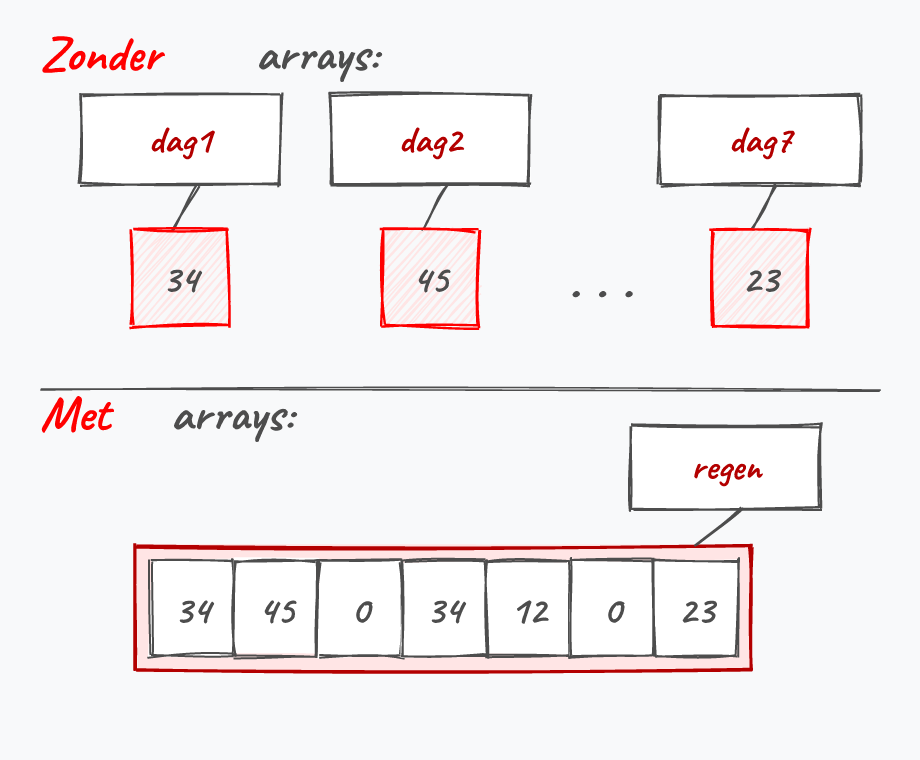
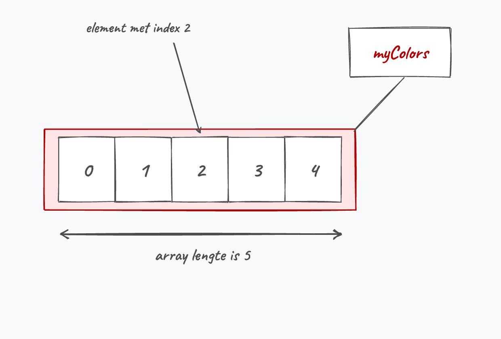
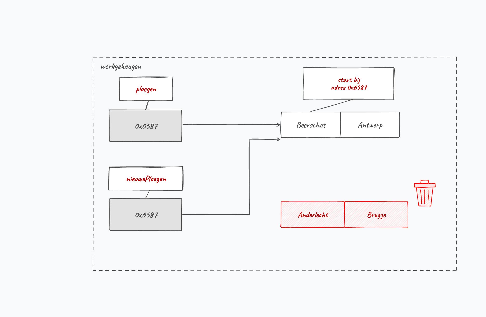
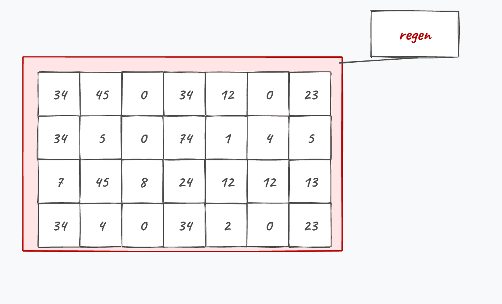
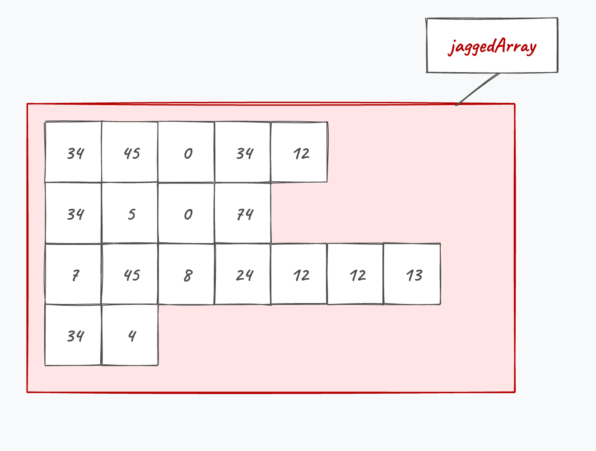
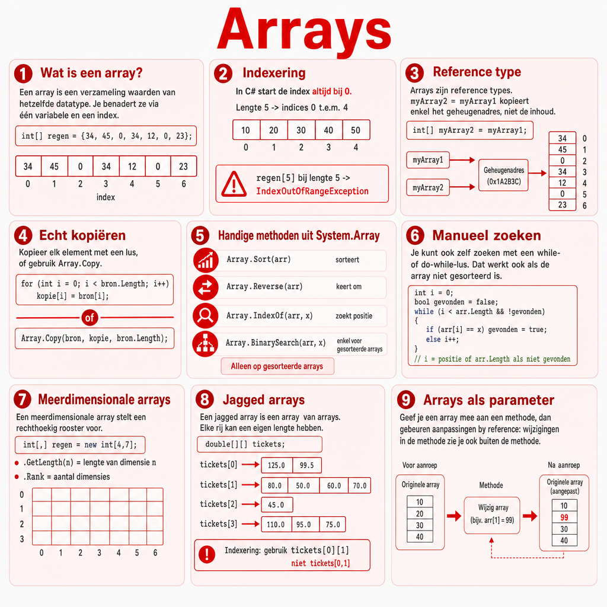

## Wat leer je in dit hoofdstuk?

Na dit hoofdstuk kan je:

* uitleggen waarom **arrays** veel data van hetzelfde type bundelen
* arrays **declareren**, **vullen** en met een loop **overlopen**
* begrijpen dat arrays **by reference** werken (en hoe je ze correct kopieert)
* de **`System.Array`**-methoden gebruiken (`Sort`, `Reverse`, `IndexOf`, ...)
* arrays als **parameter** en **returntype** in methoden gebruiken
* **meerdimensionale** en **jagged** arrays herkennen

---

## Het nut van arrays

Zeven losse variabelen voor zeven dagen regen?

```csharp
int dag1 = 34; int dag2 = 45; int dag3 = 0; // ... dag7
```

. . .

Eén **array** bundelt dezelfde soort data in één variabele:

```csharp
int[] regen = { 34, 45, 0, 34, 12, 0, 23 };
```

{width=60%}

---

## De kracht: een index in een loop

De index tussen `[ ]` mag een **variabele** zijn, dus genereer je ze in een loop:

```csharp
int[] regen = { 34, 45, 0, 34, 12, 0, 23, 7, 20, 34, 7, 42 };
double som = 0;
for (int i = 0; i < regen.Length; i++)
{
    som += regen[i];
}
double gemiddelde = som / regen.Length;
```

::: {.callout-tip .fragment}
Vanaf 3 of meer variabelen van dezelfde soort is een array bijna altijd het antwoord.
:::

---

## Even achteromkijken

:::: {.columns}

::: {.column width="22%"}

:::

::: {.column width="78%"}
Sorry dat we weer in het diepe duiken. Maar kijk eens achterom: schrik je hé? Je hebt al een aardige weg afgelegd sinds ik je voor het eerst in het zwembad gooide.

Alles wordt kinderspel als je er maar lang genoeg mee bezig bent.
:::

::::

---

## Een array declareren: 3 manieren

```csharp
// 1) enkel declareren (nog geen array in het geheugen)
int[] verkoopCijfers;

// 2) meteen initialiseren met waarden
string[] kleuren = { "red", "green", "blue" };

// 3) een lege array van een vaste lengte
string[] namen = new string[5];
```

::: {.callout-important .fragment}
Eens de lengte vastligt, kan een array **niet meer groeien of krimpen**. (Lists in hoofdstuk 12 lossen dat op.)
:::

---

## Index en accessor

:::: {.columns}

::: {.column width="60%"}
* Benader een element met `array[index]`
* De index **start bij 0**
* Een array met **lengte 5** heeft indices **0 tot en met 4**
:::

::: {.column width="40%"}

:::

::::

```csharp
Console.WriteLine(myColors[1]); // tweede element
myColors[0] = "indigo";         // eerste element overschrijven
```

---

## Overlopen met Length

`array.Length` geeft het aantal elementen. Ideaal als grens van een loop:

```csharp
for (int i = 0; i < myColors.Length; i++)
{
    Console.WriteLine(myColors[i]);
}
```

::: {.callout-warning .fragment}
`Console.WriteLine(myColors)` toont **niet** de inhoud. Overloop de array element per element.
:::

---

## Out of range

:::: {.columns}

::: {.column width="22%"}

:::

::: {.column width="78%"}
```csharp
int[] getallen = { 1, 2, 3 };
Console.WriteLine(getallen[5]); // crash bij uitvoer
```

Een **`IndexOutOfRangeException`**. We bouwen aan een gebouw met 3 verdiepingen; vraag ik mijn metser om op de zesde te metsen, dan valt hij eraf.
:::

::::

::: {.callout-important .fragment}
De compiler vangt dit **niet**: je ontdekt het pas bij de uitvoer.
:::

---

## Geheugen: value vs reference

* **Value types** (`int`, `double`, ...) bevatten de **waarde** zelf
* **Reference types** bewaren een **adres** naar de data elders in het geheugen

::: {.callout-important .fragment}
**Arrays werken by reference.** Een array-variabele bevat dus niet de array zelf, maar een **verwijzing** ernaar.
:::

---

## De kopieer-val

:::: {.columns}

::: {.column width="55%"}
```csharp
string[] ploegen = { "Beerschot", "Antwerp" };
string[] nieuwe = { "Anderlecht", "Brugge" };
nieuwe = ploegen; // geen kopie!
```

Beide variabelen wijzen nu naar **dezelfde** array. `nieuwe[1] = "..."` past dus ook `ploegen` aan.
:::

::: {.column width="45%"}

:::

::::

---

## Een array echt kopiëren

`=` maakt een alias, geen kopie. Kopieer dus **element per element**:

```csharp
for (int i = 0; i < ploegen.Length; i++)
{
    nieuwe[i] = ploegen[i];
}
```

::: {.callout-tip .fragment}
Of gebruik `Array.Copy(bron, doel, aantal)` uit de `System.Array`-bibliotheek.
:::

---

## System.Array

Handige ingebouwde methoden:

```csharp
Array.Sort(myColors);     // alfabetisch / van klein naar groot
Array.Reverse(myColors);  // volgorde omkeren
Array.Clear(myColors, 0, myColors.Length); // alles op default
```

---

## Zoeken in een array

```csharp
int i = Array.IndexOf(myColors, "green"); // index, of -1
```

* **`IndexOf`** werkt op een **ongesorteerde** array: voor beginners bijna altijd de juiste keuze
* **`BinarySearch`** is sneller, maar **enkel op een gesorteerde** array

::: {.callout-important .fragment}
`BinarySearch` op een ongesorteerde array geeft onzin. Sorteer eerst, of gebruik `IndexOf`.
:::

---

## Zelf zoeken met een loop

Staat rugnummer 12 in de top 5?

```csharp
int teZoeken = 12;
int[] top5 = { 5, 10, 12, 25, 16 };
bool gevonden = false;
int index = 0;
do
{
    if (top5[index] == teZoeken) gevonden = true;
    index++;
} while (!gevonden && index < top5.Length);
```

::: {.callout-tip .fragment}
Twee **synchrone** arrays (producten + prijzen op dezelfde index) doorzoek je op dezelfde manier.
:::

---

## Een string is een char-array

```csharp
string zin = "Ik ben Tom";
char[] karakters = zin.ToCharArray();
karakters[8] = 'i';                 // "Ik ben Tim"
string terug = new string(karakters);
```

Een `string` is in feite een `char[]`, vandaar deze omzettingen.

---

## Nuttige string-methoden

```csharp
"Tim".Length;                 // 3
"Ik ben Reinhardt".IndexOf("ben"); // 3
"  tekst  ".Trim();           // "tekst"
"Tim".ToUpper();              // "TIM"
"Ik ben Mercy".Replace("Mercy", "Reinhardt");
"Ik ben Mercy".Remove(3, 4);  // "Ik Mercy"
```

::: {.callout-note .fragment}
Deze methoden geven een **nieuwe** string terug; de originele blijft ongewijzigd. Bewaar het resultaat.
:::

---

## Split en Join

```csharp
string data = "12,13,20";
string[] delen = data.Split(',');        // {"12","13","20"}

string samen = String.Join(";", delen);  // "12;13;20"
```

`Split` levert een **array** op, `Join` voegt een array terug samen tot één string.

---

## Arrays en methoden

:::: {.columns}

::: {.column width="22%"}

:::

::: {.column width="78%"}
Arrays gaan **by reference** naar een methode. Pas je de array aan in de methode, dan verandert de **originele** array mee:

```csharp
static void PasAan(int[] arr) { arr[0] = 0; }

int[] nrs = { 1, 2, 3 };
PasAan(nrs);
Console.WriteLine(nrs[0]); // 0, niet 1
```
:::

::::

---

## Array-grootte en returntype

In de signatuur geef je **geen** grootte mee; gebruik `.Length` in de methode:

```csharp
static int[] MaakArray(int lengte, int beginwaarde)
{
    int[] result = new int[lengte];
    for (int i = 0; i < lengte; i++)
        result[i] = beginwaarde;
    return result;
}

int[] nieuw = MaakArray(4, 666);
```

::: {.callout-warning .fragment}
`static void LeesData(int[6] arr)` is **fout**: een grootte in de parameterlijst mag niet.
:::

---

## Opstartparameters: args

Nu snap je `string[] args` in `Main`: het zijn de **opstartparameters**.

```csharp
for (int i = 0; i < args.Length; i++)
    Console.WriteLine(args[i]);

if (args.Length >= 3 && args[2] == "cool")
    Console.WriteLine("Ik ga akkoord!");
```

::: {.callout-important .fragment}
Test **eerst** `args.Length >= 3`, dan pas `args[2]`. De `&&` stopt links bij `false` en zo vermijd je een crash.
:::

---

## Meerdimensionale arrays

:::: {.columns}

::: {.column width="55%"}
Met een komma in de haken maak je een **rechthoekige** array:

```csharp
int[,] matrix = new int[5, 10];

string[,] boeken =
{
    { "Macbeth", "Shakespeare" },
    { "Zie scherp", "Tim Dams" }
};
Console.WriteLine(boeken[1, 1]); // Tim Dams
```
:::

::: {.column width="45%"}

:::

::::

::: {.callout-tip .fragment}
`.Length` geeft het **totaal**; `GetLength(0)` en `GetLength(1)` de afzonderlijke dimensies, `.Rank` het aantal dimensies.
:::

---

## Jagged arrays

:::: {.columns}

::: {.column width="55%"}
Een **array van arrays** met **verschillende** lengtes. Let op de dubbele `[][]`:

```csharp
double[][] tickets =
{
    new double[] { 3.0, 40, 24 },
    new double[] { 123, 31.3 },
    new double[] { 2.1 }
};
Console.WriteLine(tickets[0][1]); // 40
```
:::

::: {.column width="45%"}

:::

::::

::: {.callout-note .fragment}
Vaak omslachtig en foutgevoelig. De collecties uit hoofdstuk 12 zijn meestal een gezonder alternatief.
:::

---

## Conclusie

* Een **array** bundelt veel waarden van hetzelfde type onder één naam; index start bij **0**
* Overloop arrays met een **loop** en `.Length`; let op de **`IndexOutOfRangeException`**
* Arrays werken **by reference**: `=` maakt een alias, kopieer dus element per element
* **`System.Array`** en string-methoden (`Split`, `Replace`, ...) besparen veel werk
* Arrays gaan **by reference** naar methoden; **meerdimensionale** en **jagged** arrays voor speciale gevallen

::: {.callout-tip}
Volgende halte: **object-georiënteerd programmeren**, met klassen en objecten.
:::

---

## Meer weten

**Kennisclips**

* [Arrays](https://ap.cloud.panopto.eu/Panopto/Pages/Viewer.aspx?id=d1801903-4bd3-4004-b1cb-ac4f00d3cfdf)
* [Arrays en geheugen](https://ap.cloud.panopto.eu/Panopto/Pages/Viewer.aspx?id=1a57ab27-bb21-4bd8-8b37-ac4f00d3cf97)
* [System.Array](https://ap.cloud.panopto.eu/Panopto/Pages/Viewer.aspx?id=3b587f2c-fc98-42d1-81ed-ac54007d7a4b)
* [Algoritmes en arrays](https://ap.cloud.panopto.eu/Panopto/Pages/Viewer.aspx?id=90e32a53-b9ac-4162-a3e9-ac5400879d81)
* [Strings en arrays](https://ap.cloud.panopto.eu/Panopto/Pages/Viewer.aspx?id=831314ae-c35f-4d6e-b7c0-ac54007d7abe)
* [Arrays en methoden](https://ap.cloud.panopto.eu/Panopto/Pages/Viewer.aspx?id=4f1a0fd6-697b-42d5-b44a-ac560097b2aa)
* [Meer-dimensionale arrays](https://ap.cloud.panopto.eu/Panopto/Pages/Viewer.aspx?id=9dea3f48-d5b9-4469-823c-ac590085d881)

[Oefeningen H8](https://apwt.gitbook.io/ziescherp-oefeningen/alles-samen-h1-tot-h8/readme2) · [Quizlet flashcards](https://quizlet.com/be/918628060/zie-scherp-scherper-hoofdstuk-08-flash-cards/)

---

## Zie verder: andere talen

Dezelfde concepten uit dit hoofdstuk, maar dan in andere talen. Handig om later code in Python of JavaScript te leren lezen.

---

## Zie verder: vaste vs dynamische lengte

In **Python** bestaat geen array met vaste grootte, wel een dynamische `list`:

```python
getallen = [1, 2, 3]
getallen.append(4)       # groeit gewoon mee
getallen.append("vier")  # mag zelfs een ander type zijn
```

Totaal anders dan een C#-array (vaste lengte, 1 type). Lijkt eerder op de `List` uit hoofdstuk 12.

---

## Zie verder: geen bounds-checking in C

C# gooit netjes een `IndexOutOfRangeException`. In **C** is er geen enkele grenscontrole:

```c
int getallen[3] = {1, 2, 3};
printf("%d", getallen[5]); // geen foutmelding!
```

Je leest dan zomaar willekeurige geheugeninhoud of je programma crasht. Net dat maakt buffer overflow attacks mogelijk.

---

## Zie verder: dezelfde val in JavaScript

Ook **JavaScript**-arrays werken by reference, dus `=` maakt een alias, geen kopie:

```javascript
let ploegen = ["Beerschot", "Antwerp"];
let nieuwe = ploegen;     // zelfde array!
nieuwe[1] = "Brugge";
console.log(ploegen[1]);  // "Brugge"
```

Heel gelijkaardig aan C#. Een echte kopie: `let kopie = [...ploegen];`.

---

## Samenvattende poster

Een handige samenvattende poster (Opgelet: gemaakt m.b.v. ChatGPT Image Gen 2).

{width=55%}
