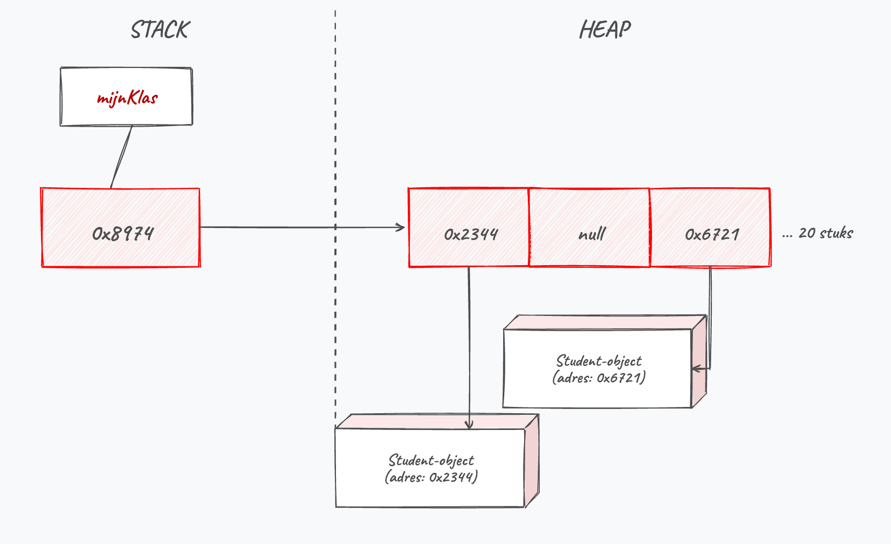
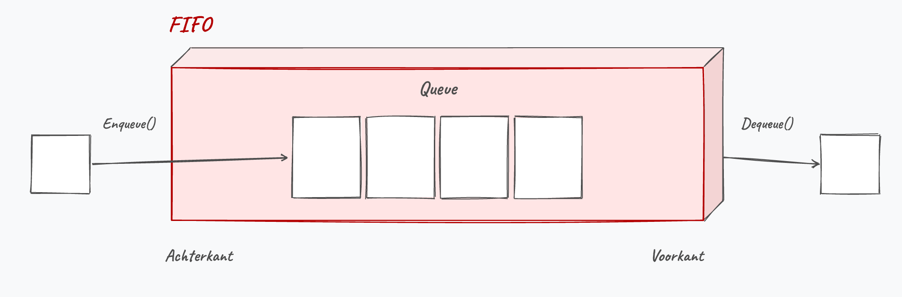
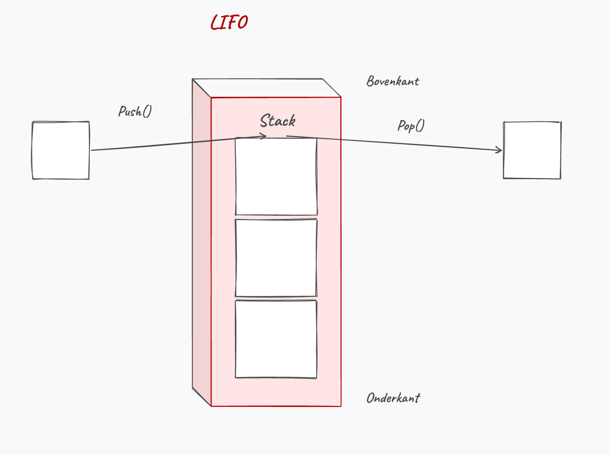
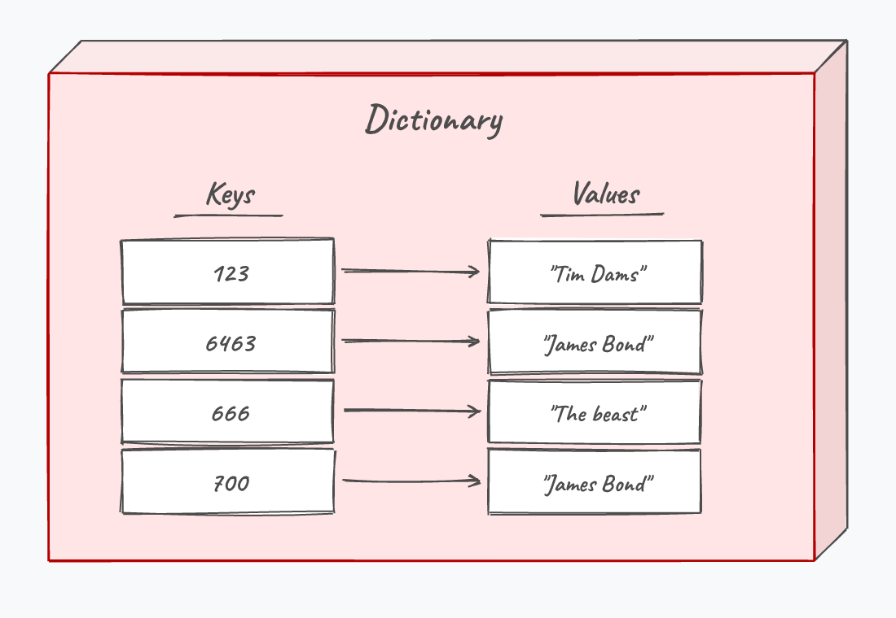
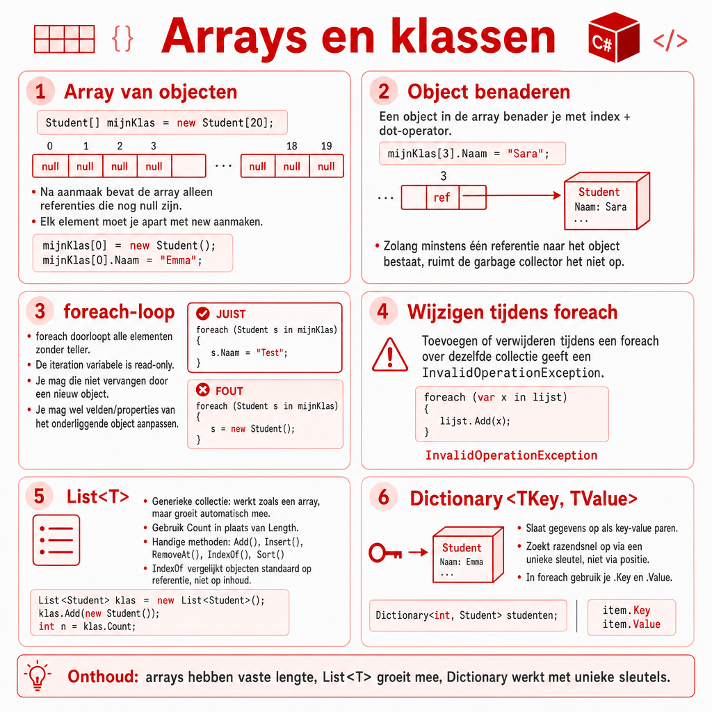

## Wat leer je in dit hoofdstuk?

Na dit hoofdstuk kan je:

* een **array van objecten** aanmaken en de `null`-valkuil vermijden
* werken met de **`List<>`**-collectie als "array on steroids"
* een **`foreach`**-loop gebruiken (en zijn beperkingen kennen)
* het **`var`**-keyword correct inzetten
* de collecties **`Queue`**, **`Stack`** en **`Dictionary`** kiezen waar ze passen

---

## Een array van objecten

```csharp
Student[] mijnKlas = new Student[20];
```

::: {.callout-important .fragment}
`new` maakt enkel de **array** aan. Er staan nog **geen** objecten in: alle elementen zijn **`null`**.
:::

{width=55%}

---

## Objecten in de array plaatsen

```csharp
for (int i = 0; i < mijnKlas.Length; i++)
{
    mijnKlas[i] = new Student();
}

mijnKlas[3].Naam = "Duke Peekaboo"; // via index + dot-operator
```

::: {.callout-warning .fragment}
Een nog niet aangemaakt element (`null`) benaderen geeft een **`NullReferenceException`**. Check eventueel met `mijnKlas[3]?.Naam`.
:::

---

## Array initializer syntax

Maak de objecten meteen aan; de compiler bepaalt de lengte:

```csharp
Student[] mijnKlas = new Student[]
{
    new Student(),
    new Student(),
    jos              // een bestaand object mag ook
};
```

::: {.callout-note .fragment}
`jos` is nu via twee wegen bereikbaar: via `jos` én via `mijnKlas[2]`. Zolang er één referentie is, ruimt de GC het object niet op.
:::

---

## List: een array on steroids

```csharp
List<int> getallen = new List<int>();
List<Pokemon> pokedex = new List<Pokemon>();
```

* Een **`List<>`** is een veiligere, krachtigere array
* Tussen `< >` staat het **type** dat de lijst bevat
* **Geen begingrootte** nodig: een list **groeit mee**

---

## Elementen toevoegen

```csharp
List<string> personages = new List<string>();
personages.Add("Reinhardt");
personages.Add("Mercy");

List<Pokemon> pokedex = new List<Pokemon>()
{
    new Pokemon() { Naam = "Pikachu", HP = 5 },
    new Pokemon() { Naam = "Bulbasaur", HP = 15 }
};
```

`Add()` voegt een element toe; object initializer syntax werkt ook hier.

---

## List indexeren en overlopen

```csharp
Console.WriteLine(personages[3]);
personages[2] = "Torbjorn";

for (int i = 0; i < personages.Count; i++)
{
    Console.WriteLine(personages[i]);
}
```

::: {.callout-important .fragment}
Een `List` werkt met **`Count`**, niet met `Length`.
:::

---

## Wat kan een List nog?

* `Clear()`, `Insert()`, `RemoveAt()`, `IndexOf()`, `Sort()`, ...

::: {.callout-important .fragment}
`IndexOf` en `Contains` vergelijken bij objecten de **referentie**. Twee aparte objecten met dezelfde inhoud gelden dus als **verschillend** (tot je `Equals` overridet, hoofdstuk 13).
:::

::: {.callout-tip .fragment}
**LINQ** (later) laat je in één leesbare regel filteren of sorteren ("alle Pokémon met meer dan 100 HP"). Voorlopig doen we dat nog met loops.
:::

---

## Pong met een List

```csharp
List<Balletje> veelBalletjes = new List<Balletje>();
for (int i = 0; i < 100; i++)
{
    veelBalletjes.Add(new Balletje());
}

while (true)
{
    foreach (var bal in veelBalletjes) bal.Update();
    foreach (var bal in veelBalletjes) bal.TekenOpScherm();
    Thread.Sleep(50); Console.Clear();
}
```

Leesbaarder dan met arrays, en de lijst groeit en krimpt vanzelf.

---

## foreach: de vierde loop

Wil je **alle** elementen overlopen zonder index?

```csharp
double[] metingen = { 1.2, 0.89, 3.15, 0.1 };
foreach (double meting in metingen)
{
    Console.WriteLine(meting);
}
```

De **iteration variable** (`meting`) krijgt elk element om de beurt. Geen teller nodig, en werkt ook op een `List`.

---

## foreach: drie aandachtspunten

1. De iteration variable is **read-only**: je kan de array zelf niet wijzigen
2. Enkel als je **alle** elementen wil (anders een andere loop)
3. **Geen teller** beschikbaar; maak die zelf als je hem nodig hebt

::: {.callout-important .fragment}
Read-only slaat op de **referentie**. Het object zelf mag je wél aanpassen: `student.Geboortejaar++;` mag, `student = new Student();` niet.
:::

---

## foreach: niet wijzigen tijdens iteratie

```csharp
foreach (var student in deKlas)
{
    if (student.Geboortejaar < 2000)
        deKlas.Remove(student); // FOUT
}
```

::: {.callout-warning .fragment}
*"Collection was modified; enumeration operation may not execute."* Wil je tijdens het doorlopen verwijderen, gebruik dan een gewone `for`-loop **van achter naar voor**.
:::

---

## Het var-keyword

`var` laat de compiler het type **afleiden** uit de rechterkant:

```csharp
var getal = 5;                 // int
var tekst = "Hi there";        // string
var ikke = new Leerkracht();   // Leerkracht
```

::: {.callout-tip .fragment}
In C# is dit puur **lazy syntax**: het type ligt nog steeds vast (statically typed). Anders dan in JavaScript, waar `var` een echt variabel type betekent.
:::

---

## Queue: first in, first out

:::: {.columns}

::: {.column width="55%"}
```csharp
Queue<string> rij = new Queue<string>();
rij.Enqueue("Ik eerst");
rij.Enqueue("Ik tweede");
Console.WriteLine(rij.Dequeue()); // Ik eerst
```

`Enqueue` zet achteraan bij, `Dequeue` haalt vooraan af. Net als de rij aan de kassa.
:::

::: {.column width="45%"}

:::

::::

---

## Stack: last in, first out

:::: {.columns}

::: {.column width="55%"}
```csharp
Stack<string> stapel = new Stack<string>();
stapel.Push("Ik eerst");
stapel.Push("Ik laatste");
Console.WriteLine(stapel.Pop()); // Ik laatste
```

`Push` legt bovenop, `Pop` neemt bovenaf. Net als een stapel papier.
:::

::: {.column width="45%"}

:::

::::

---

## Dictionary: sleutel en waarde

:::: {.columns}

::: {.column width="55%"}
Elk element heeft een **unieke key** en een **value**:

```csharp
Dictionary<int, string> klanten = new Dictionary<int, string>();
klanten.Add(123, "Tim Dams");
klanten.Add(666, "The beast");

Console.WriteLine(klanten[123]); // Tim Dams
```
:::

::: {.column width="45%"}

:::

::::

::: {.callout-tip .fragment}
Opzoeken via de key gaat **razendsnel**, ongeacht de grootte. Veel sneller dan zoeken in een `List`.
:::

---

## Dictionary doorlopen

```csharp
foreach (var item in klanten)
{
    Console.WriteLine($"{item.Key}\t: {item.Value}");
}
```

Elk item heeft een **`.Key`** en een **`.Value`** van de types die je bij de declaratie koos.

::: {.callout-important .fragment}
Gebruik voorlopig een eenvoudig type (`int`, `string`) als key. Een eigen klasse als key vereist `Equals` en `GetHashCode` (hoofdstuk 13).
:::

---

## Conclusie

* Een **array van objecten** start vol **`null`**: maak elk object eerst met `new`
* Een **`List<>`** groeit mee, werkt met **`Count`** en vol handige methoden
* **`foreach`** overloopt alle elementen leesbaar, maar de iteration variable is **read-only**
* **`var`** laat de compiler het type afleiden (C# blijft statically typed)
* **`Queue`** (FIFO), **`Stack`** (LIFO) en **`Dictionary`** (key-value) voor speciale gevallen

::: {.callout-tip}
Volgende halte: **overerving**, waar klassen eigenschappen en gedrag van elkaar erven.
:::

---

## Meer weten

**Kennisclips**

* [Arrays van objecten](https://ap.cloud.panopto.eu/Panopto/Pages/Viewer.aspx?id=328b271a-f26e-44ed-8e03-acb400ac9b72)
* [var keyword](https://ap.cloud.panopto.eu/Panopto/Pages/Viewer.aspx?id=9beea541-07b2-4854-b6c0-acb000c553f9)
* [De foreach loop](https://ap.cloud.panopto.eu/Panopto/Pages/Viewer.aspx?id=43be25ae-c1da-4b27-9563-aea90097378c)
* [List<> klasse](https://ap.cloud.panopto.eu/Panopto/Pages/Viewer.aspx?id=511f0a05-37a0-44b1-8096-ae9b00c6860b)
* [Werken met Dictionary<>](https://ap.cloud.panopto.eu/Panopto/Pages/Viewer.aspx?id=43e5eb65-6b40-4539-892e-ab9f0093b774)

[Oefeningen H12](https://apwt.gitbook.io/ziescherp-oefeningen/h12-arrays-en-klassen/a_practicamem) · [Quizlet flashcards](https://quizlet.com/be/918632520/zie-scherp-scherper-hoofdstuk-12-flash-cards/)

---

## Zie verder: andere talen

Dezelfde concepten uit dit hoofdstuk, maar dan in andere talen. Handig om later code in Python of JavaScript te leren lezen.

---

## Zie verder: List in andere talen

In **Python** is een ``list`` ingebouwd en typeloos:

```python
namen = ["Tim", "An"]
namen.append("Jan")
```

In **Java** lijkt het sterk op C#: ``ArrayList<String>`` met ``.add(...)``.

---

## Zie verder: foreach in andere talen

In **Python** schrijf je net hetzelfde idee, zonder type en accolades:

```python
for meting in metingen:
    print(meting)
```

In **JavaScript** heet dit ``for...of``:

```javascript
for (const meting of metingen) {
    console.log(meting);
}
```

---

## Zie verder: Dictionary in andere talen

In **Python** heet dit een ``dict``, ingebouwd met een handige ``{}``-syntax:

```python
klanten = {123: "Tim Dams", 6463: "James Bond"}
print(klanten[123])
```

In **JavaScript** gebruik je een ``Map`` met ``set`` en ``get``:

```javascript
const klanten = new Map();
klanten.set(123, "Tim Dams");
console.log(klanten.get(123));
```

---

## Samenvattende poster

Een handige samenvattende poster (Opgelet: gemaakt m.b.v. ChatGPT Image Gen 2).

{width=55%}
