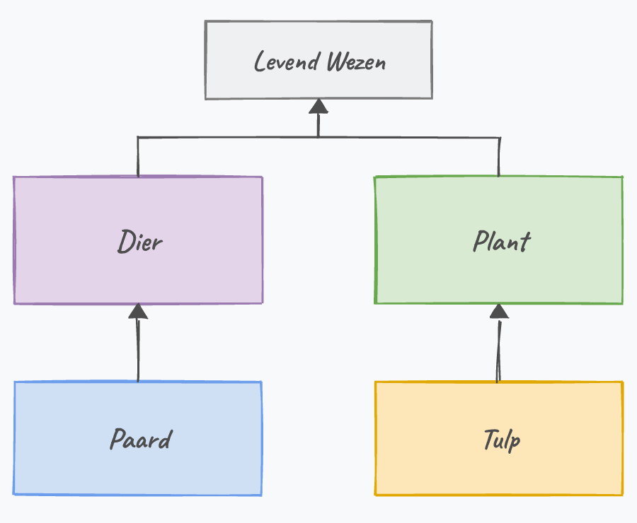
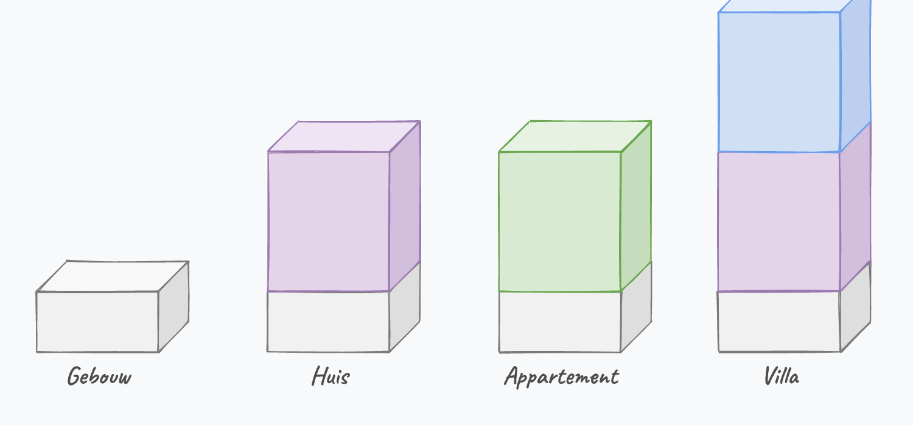
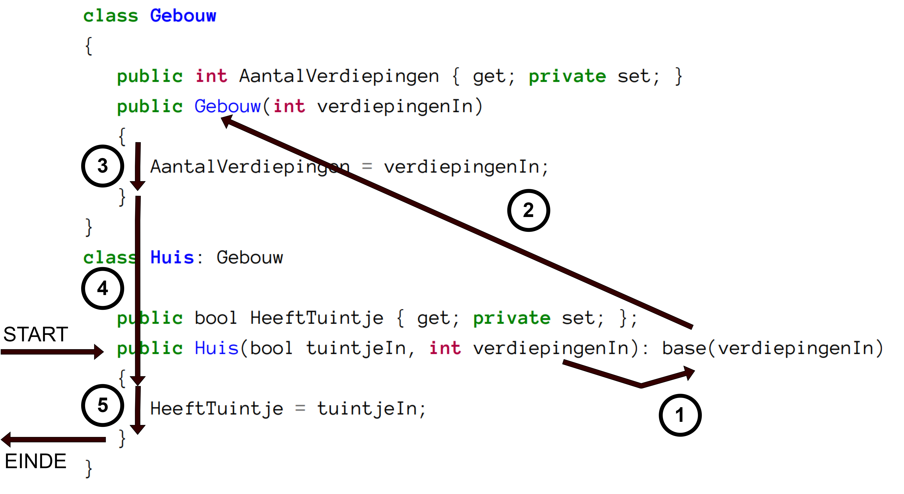
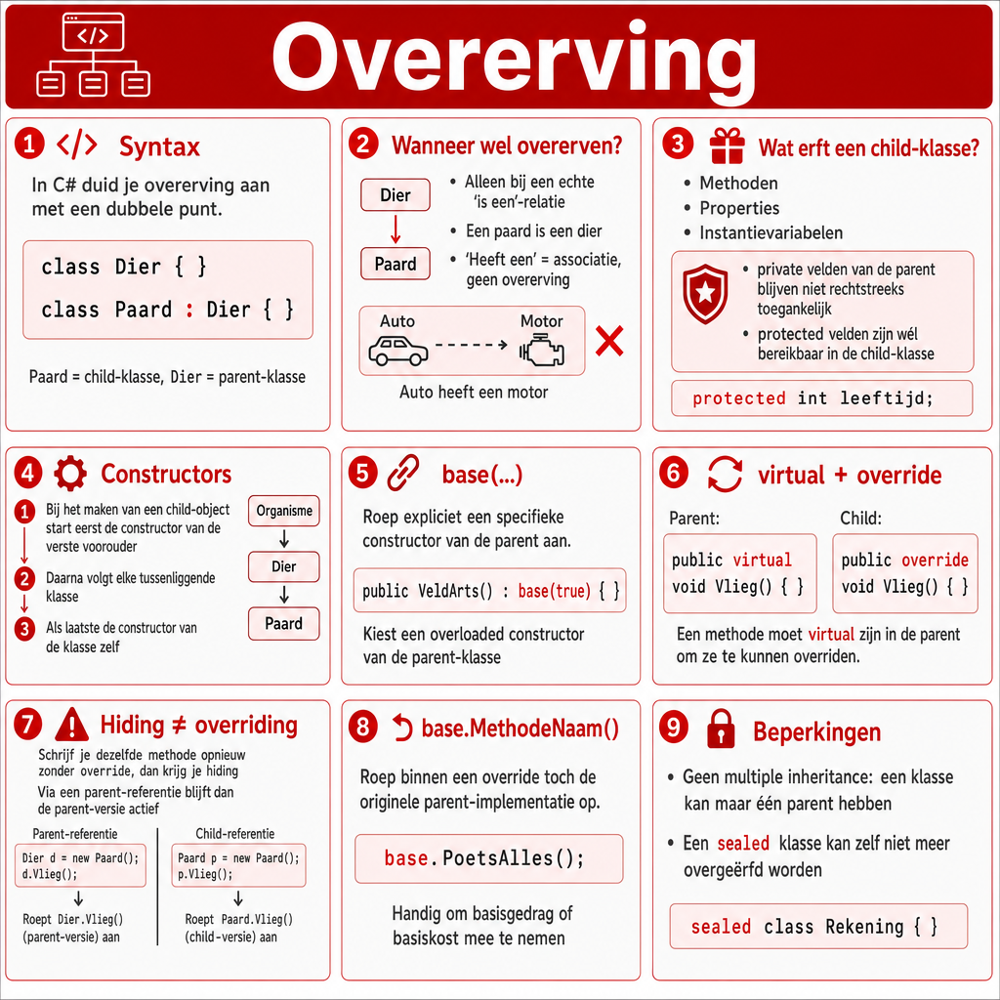

## Wat leer je in dit hoofdstuk?

Na dit hoofdstuk kan je:

* uitleggen wat **overerving** is en wanneer de **is-een**-relatie geldt
* een child-klasse maken met de **`:`**-notatie
* het **`protected`**-keyword en de regels rond **`private`** toepassen
* begrijpen hoe **constructors** bij overerving samenwerken (**`base()`**)
* methoden aanpassen met **`virtual`** en **`override`**
* de parent-implementatie hergebruiken met **`base`**

---

## Inheritance: de I van A PIE

We deden al **a**bstractie en **e**ncapsulatie. Nu: **i**nheritance.

* Programmeurs zijn lui: dubbele code = dubbel zoveel bugs
* Hebben `Monster` en `Held` veel gemeen? Dan delen ze wellicht een **voorouder** (`Karakter`)

> De gemeenschappelijke code verhuist naar de **parent**; de child houdt enkel zijn **specialisatie**.

---

## Rule of three

Een vuistregel tegen dubbele code:

> Eén keer copy-pasten mag. Doe je het een **derde** keer, dan is het tijd om te **refactoren**.

Overerving is daarbij vaak het gereedschap: gemeenschappelijke code verhuist naar een parent.

::: {.callout-tip .fragment}
Refactoren doe je in **babystapjes**: herstructureer beetje bij beetje, en test tussendoor.
:::

---

## De is-een relatie

:::: {.columns}

::: {.column width="55%"}
**"x is een y"** wijst op overerving:

* een paard **is een** dier
* een tulp **is een** plant

Kom je in een opgave *is*, *was*, *zijn* tegen, dan is overerving wellicht mogelijk.
:::

::: {.column width="45%"}

:::

::::

::: {.callout-important .fragment}
**"x heeft een y"** is géén overerving, maar associatie (volgend hoofdstuk).
:::

---

## Overerving in C\#

```csharp
internal class Dier
{
    public void Eet() { /* ... */ }
}

internal class Paard : Dier
{
    public bool KanHinnikken { get; set; }
}
```

Een `Paard` kan **alles** wat een `Dier` kan, plus zijn eigen specialisatie:

```csharp
Paard bpaard = new Paard();
bpaard.Eet();              // van Dier
bpaard.KanHinnikken = true; // van Paard
```

---

## Alles wordt overgeërfd

:::: {.columns}

::: {.column width="55%"}
De child erft **alles**: methoden, properties, instantievariabelen.

Een child-object is dus opgebouwd uit een **parent-deel** plus zijn eigen **specialisatie**.
:::

::: {.column width="45%"}

:::

::::

::: {.callout-important .fragment}
**`private`** blijft `private`: de child erft het wel, maar mag er niet rechtstreeks aan.
:::

---

## protected

Wil je dat children er wél bij kunnen, maar de buitenwereld niet? Gebruik **`protected`**:

```csharp
internal class Dier
{
    protected int geboortejaar;       // zichtbaar in child
}
internal class Paard : Dier
{
    public void MaakOuder() { geboortejaar++; } // werkt nu
}
```

::: {.callout-tip .fragment}
Nog netter: een property met **`protected set`**, zodat de instantievariabele beschermd blijft.
:::

---

## Geen multiple inheritance

In C# erft een klasse van **maximaal één** parent.

* Dat vermijdt het **diamond problem**: erf je van twee parents met dezelfde methode, welke geldt dan?
* Meerdere "rollen" combineren doe je later met **interfaces** (hoofdstuk 16)

::: {.callout-tip .fragment}
Denk aan een **vogelbekdier**: tegelijk vogel en zoogdier. Erfde het van allebei, met welke `LegEi()` of `GeefMelk()` moet de compiler dan werken? C# omzeilt die patstelling.
:::

::: {.callout-note .fragment}
Wil je net verhinderen dat iemand van je klasse erft? Zet er **`sealed`** voor.
:::

---

## Constructors bij overerving

Maak je een child-object, dan lopen de constructors in volgorde:

1. eerst de **verste voorouder** (bovenaan de keten)
2. dan elke tussenliggende parent
3. ten slotte de **klasse zelf**

::: {.callout-tip .fragment}
Logisch: de child heeft de **fundering** van zijn parent nodig voor hij zelf iets kan doen.
:::

---

## base()

Achter elke child-constructor staat impliciet **`: base()`** (de default constructor van de parent). Heeft de parent enkel een overloaded constructor, dan moet je die expliciet aanroepen:

```csharp
internal class Soldaat
{
    public Soldaat(bool kanSchieten) { /* ... */ }
}
internal class VeldArts : Soldaat
{
    public VeldArts() : base(true) { }
}
```

---

## Parameters doorgeven via base

```csharp
internal class Gebouw
{
    public int AantalVerdiepingen { get; private set; }
    public Gebouw(int verdiepingenIn) { AantalVerdiepingen = verdiepingenIn; }
}
internal class Huis : Gebouw
{
    public bool HeeftTuintje { get; private set; }
    public Huis(bool heeftTuin, int aantalVer) : base(aantalVer)
    {
        HeeftTuintje = heeftTuin;
    }
}
```

`new Huis(true, 1)`: de child houdt `heeftTuin` zelf, en sluist `aantalVer` door naar de parent.

---

## De volgorde in beeld

:::: {.columns}

::: {.column width="50%"}
`new Huis(true, 5)`:

1. constructor `Huis` start
2. roept eerst `base(5)` aan
3. `Gebouw` zet `AantalVerdiepingen`
4. terug in `Huis`: `HeeftTuintje = true`
:::

::: {.column width="50%"}

:::

::::

---

## virtual en override

Standaard mag een child de werking van de parent **niet** zomaar wijzigen. De parent moet dat **toelaten** met **`virtual`**; de child gebruikt **`override`**:

```csharp
internal class Vliegtuig
{
    public virtual void Vlieg()
    {
        Console.WriteLine("Het vliegtuig vliegt door de wolken.");
    }
}
internal class Raket : Vliegtuig
{
    public override void Vlieg()
    {
        Console.WriteLine("De raket verdwijnt in de ruimte.");
    }
}
```

---

## virtual en override: regels

* `virtual` mag op alles behalve `private` (en niet op `static`)
* `virtual` is een **mogelijkheid**, geen verplichting om te overriden
* De signatuur van de `override` moet **identiek** zijn aan die van de parent

::: {.callout-warning .fragment}
Vergeet je `override` (en schrijf je gewoon `public void Vlieg()`), dan krijg je een **`new`**-waarschuwing: C# denkt dat je de methode wil **verbergen** (*hiding*), niet **overschrijven**.
:::

---

## Override in actie: De Mol

In een spel is `Mol` een **specialisatie** van `Deelnemer`:

```csharp
internal class Deelnemer
{
    public virtual int Slaagkans() { return 80; }
}
internal class Mol : Deelnemer
{
    public override int Slaagkans() { return 30; } // de mol saboteert
}
```

::: {.callout-tip .fragment}
`Mol` is een `Deelnemer` (niet omgekeerd). Hij erft alles, maar past enkel zijn slaagkans aan.
:::

---

## base in een methode

Wil je de parent-versie **hergebruiken** en uitbreiden? Roep ze aan met **`base`**:

```csharp
internal class Frituur : Restaurant
{
    public override void PoetsAlles()
    {
        base.PoetsAlles();  // basiskost van Restaurant
        kosten += 500;      // extra voor de frituur
    }
}
```

Zo blijft de basislogica op **één** plek staan: verandert de basisprijs, dan klopt alles nog.

---

## Nog een base-voorbeeld

:::: {.columns}

::: {.column width="22%"}

:::

::: {.column width="78%"}
```csharp
internal class ModerneMens : Oermens
{
    public bool IsJager { get; set; }

    public override int VoorzieVoedsel()
    {
        if (IsJager)
            return base.VoorzieVoedsel() + 20;
        return 100;
    }
}
```
:::

::::

Een jager bouwt voort op de techniek van de `Oermens` (`base`) en doet er 20 kg bovenop.

---

## Pong met overerving

Maak `Update` in `Balletje` **`virtual`** en bouw een nieuw soort balletje:

```csharp
internal class CentreerBalletje : Balletje
{
    public override void Update()
    {
        if (X + VX >= Console.WindowWidth || X + VX < 0)
        {
            X = Console.WindowWidth / 2;
            Y = Console.WindowHeight / 2;
        }
        base.Update();
    }
}
```

`Balletje` blijft onaangeroerd; de nieuwe functionaliteit zit in de child.

---

## Showcase: RoomWalker

Bouw voort op de Crazy House: elke kamer is nu een **specialisatie** van `Room`.

:::: {.columns}

::: {.column width="50%"}
* `MonsterRoom`: toont een monster in de beschrijving
* `TreasureRoom`: houdt bij hoeveel goud er ligt
* `TrapRoom`: doet schade
:::

::: {.column width="50%"}
* `BossRoom`: monsterkamer met veel meer levens
* `VampireRoom`: enkel 's nachts actief
:::

::::

::: {.callout-tip .fragment}
Elke kamer **overridet** `Describe()`. Omdat `MonsterRoom` een `Room` is, past hij overal waar een `Room` past (polymorfisme, hoofdstuk 16). Startproject: [RoomWalkerDemo2025](https://github.com/timdams/RoomWalkerDemo2025).
:::

---

## Conclusie

* **Overerving** geldt bij een echte **is-een**-relatie; de child specialiseert de parent
* De child erft **alles**, maar **`private`** blijft afgeschermd; **`protected`** opent het voor children
* Constructors lopen van **parent naar child**; met **`base()`** kies je de juiste parent-constructor
* **`virtual`** + **`override`** laten een child de werking aanpassen
* Met **`base`** hergebruik je de parent-implementatie binnen een override

::: {.callout-tip}
Volgende halte: **gevorderde overerving**: `System.Object`, `abstract` en eigen exceptions.
:::

---

## Meer weten

**Kennisclips**

* [Overerving overzicht](https://ap.cloud.panopto.eu/Panopto/Pages/Viewer.aspx?id=32d7827b-53b1-482a-b52f-acb000cf868d)
* [Constructors bij overerving](https://ap.cloud.panopto.eu/Panopto/Pages/Viewer.aspx?id=9d5df664-3e85-4bee-95ef-acb000d34540)
* [virtual en override](https://ap.cloud.panopto.eu/Panopto/Pages/Viewer.aspx?id=8e3fdfd1-7cb1-4bb9-afc2-aea900945593)
* [base keyword](https://ap.cloud.panopto.eu/Panopto/Pages/Viewer.aspx?id=e2d99cbf-1c11-42fa-96c2-acb000d96cac)

[Oefeningen H13](https://apwt.gitbook.io/ziescherp-oefeningen/h13-overerving/a_practicasimpel) · [Quizlet flashcards](https://quizlet.com/be/934406099/zie-scherp-scherper-hoofdstuk-13-flash-cards/)

---

## Zie verder: andere talen

Dezelfde concepten uit dit hoofdstuk, maar dan in andere talen. Handig om later code in Python of JavaScript te leren lezen.

---

## Zie verder: overervings-syntax

Hetzelfde idee, andere notatie. In **Python** zet je de parent tussen haakjes:

```python
class Paard(Dier):
    pass
```

**Java** gebruikt ``extends`` (``class Paard extends Dier``), **C++** schrijft ``class Paard : public Dier``.

---

## Zie verder: virtual en override

C# vereist expliciet ``virtual`` op de parent én ``override`` op de child. In **Python** is élke methode automatisch overschrijfbaar, zonder keywords:

```python
class Raket(Vliegtuig):
    def vlieg(self):
        print("De raket verdwijnt in de ruimte.")
```

Ook **Java** maakt elke (niet-``final``) methode standaard overschrijfbaar. C# kiest bewust het omgekeerde.

---

## Zie verder: base versus super

Wat C# ``base`` noemt, heet in **Python** en **Java** net ``super``:

```python
class Frituur(Restaurant):
    def poets_alles(self):
        super().poets_alles()   # in C#: base.PoetsAlles()
        self.kosten += 500
```

---

## Samenvattende poster

Een handige samenvattende poster (Opgelet: gemaakt m.b.v. ChatGPT Image Gen 2).

{width=55%}
