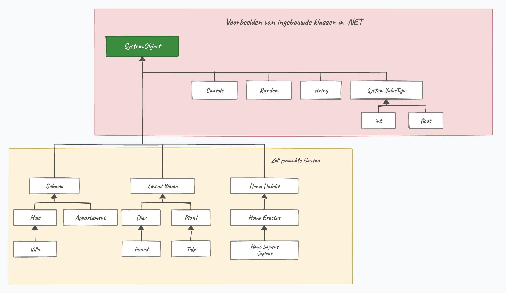
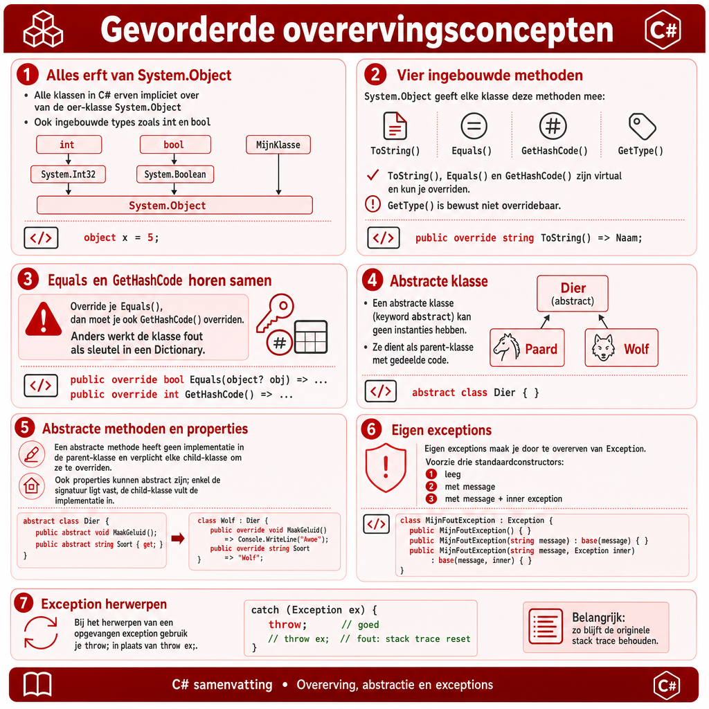

## Wat leer je in dit hoofdstuk?

Na dit hoofdstuk kan je:

* uitleggen dat alles erft van **`System.Object`**
* de ingebouwde methoden **`ToString`**, **`Equals`** en **`GetHashCode`** overriden
* een **abstracte klasse** en **abstracte methoden** maken
* het verschil tussen **`abstract`** en **`virtual`**/**`sealed`** uitleggen
* een **eigen exception** ontwerpen en opwerpen

---

## De oer-klasse: System.Object

:::: {.columns}

::: {.column width="55%"}
**Alles** in C# erft van **`System.Object`**: je eigen klassen, `Random`, `Console`, zelfs `int` en `bool`.

```csharp
internal class Student : System.Object
{ }
```

Schrijf je geen parent, dan is `System.Object` automatisch de parent.
:::

::: {.column width="45%"}

:::

::::

---

## Vier ingebouwde methoden

Elke klasse heeft er meteen vier, van `System.Object`:

| Methode | Doel |
|---|---|
| `ToString()` | een `string` die het object voorstelt |
| `Equals()` | zijn twee objecten gelijk? |
| `GetHashCode()` | unieke hash van het object |
| `GetType()` | het datatype van het object |

::: {.callout-note .fragment}
Drie ervan zijn **`virtual`** (`ToString`, `Equals`, `GetHashCode`): die kan je overriden. `GetType()` niet: dat moet altijd het echte type teruggeven.
:::

---

## GetType()

```csharp
Student stud1 = new Student();
Console.WriteLine(stud1.GetType());      // StudentManager.Student
Console.WriteLine(stud1.GetType().Name); // Student
```

`GetType()` geeft een `Type`-object terug, met o.a. een `Name`-property.

---

## ToString(): het werkpaardje

`Console.WriteLine(stud1)` roept stiekem `stud1.ToString()` aan. Standaard geeft dat de klassenaam. Override het voor iets nuttigs:

```csharp
internal class Student
{
    public string Voornaam { get; set; }
    public int Geboortejaar { get; set; }

    public override string ToString()
    {
        return $"{Voornaam} ({Geboortejaar})";
    }
}
```

Nu toont `Console.WriteLine(stud1)` netjes `Tim Dams (1981)`.

---

## Equals() overriden

Jij bepaalt wanneer twee objecten "gelijk" zijn:

```csharp
public override bool Equals(object o)
{
    if (o is not Student temp) // null of geen Student? Niet gelijk.
        return false;
    return Geboortejaar == temp.Geboortejaar && Voornaam == temp.Voornaam;
}
```

::: {.callout-note .fragment}
`o is not Student temp` checkt het type én steekt `o` meteen als `Student` in `temp`. Dat `is`-patroon zie je voluit in hoofdstuk 18.
:::

---

## GetHashCode() overriden

Override je `Equals`, override dan **ook** `GetHashCode` (gelijke objecten moeten dezelfde hash geven, belangrijk voor `Dictionary` en `HashSet`):

```csharp
public override int GetHashCode()
{
    return HashCode.Combine(Voornaam, Geboortejaar);
}
```

::: {.callout-tip .fragment}
Geef dezelfde properties mee die je in `Equals` vergelijkt. `HashCode.Combine` doet het rekenwerk voor je.
:::

---

## Even moed verzamelen

:::: {.columns}

::: {.column width="22%"}

:::

::: {.column width="78%"}
*"Ok, wow? Vier methoden en wat beloofde compatibiliteit? Call me unimpressed."*

Begrijpelijk. We leggen puzzelstukjes klaar die straks samenkomen. **Polymorfisme** wordt onze doelpuntenmaker, en `System.Object` geeft telkens de perfecte voorzet.
:::

::::

---

## Abstracte klassen

Geef mij de blauwdruk van een "meubel". Een tafel? Een kast? Een bed? Sommige concepten zijn te **abstract** om er een object van te maken.

```csharp
internal abstract class Dier
{
    public string Naam { get; set; }
}
```

* Je kan **niet** `new Dier()` doen
* Je kan er **wel** van overerven: `Paard : Dier`, `Wolf : Dier`

::: {.callout-tip .fragment}
**`abstract`** en **`sealed`** zijn tegenpolen: bij `abstract` *moet* je overerven, bij `sealed` *mag* het net niet.
:::

---

## Abstracte methoden

:::: {.columns}

::: {.column width="55%"}
Welk geluid maakt "een dier"? Onbekend. Geef enkel de signatuur:

```csharp
internal abstract class Dier
{
    public abstract string MaakGeluid();
}
```

Child-klassen **moeten** dit overriden:

```csharp
public override string MaakGeluid()
{
    return "Hinnikhinnik";
}
```
:::

::: {.column width="45%"}

:::

::::

::: {.callout-important .fragment}
`virtual` = override **mag**, `abstract` = override **moet**. Een abstracte methode kan enkel in een abstracte klasse.
:::

---

## Abstracte properties

Ook properties kunnen `abstract`; de child vult de implementatie in:

```csharp
internal abstract class Dier
{
    public abstract int MaxLeeftijd { get; }
}
internal class Olifant : Dier
{
    public override int MaxLeeftijd
    {
        get { return 100; }
    }
}
```

Een abstracte `{ get; }` is dus **geen** auto-property: er staat bewust geen implementatie.

---

## Pong met abstract

Een gemeenschappelijke `SpelObject` voor alles op het scherm, zonder te weten **hoe** het getekend wordt:

```csharp
internal abstract class SpelObject
{
    public int X { get; set; }
    public int Y { get; set; }
    public abstract void TekenOpScherm();
}
```

`Balletje` en een nieuw `ScoreBoard` erven hiervan en implementeren elk hun eigen `TekenOpScherm()`.

---

## Zelf een exception opwerpen

Exceptions zijn ook maar klassen die erven van `Exception`. Werp er zelf een op met **`throw`**:

```csharp
static int Bereken(int getal)
{
    if (getal != 0)
        return 100 / getal;
    else
        throw new DivideByZeroException("BOEM. ZWART GAT!");
}
```

Elders vang je die op met `catch (DivideByZeroException e)`.

---

## Een eigen exception ontwerpen

Erf van `Exception` en voorzie de drie standaard-constructors:

```csharp
internal class Timception : Exception
{
    public Timception() { }
    public Timception(string message) : base(message) { }
    public Timception(string message, Exception inner)
        : base(message, inner) { }
}
```

```csharp
throw new Timception("Een wilde exception verschijnt!");
```

---

## throw versus throw ex

::: {.callout-warning}
Gooi je een opgevangen exception opnieuw door, gebruik dan **`throw;`** (zonder variabele):

```csharp
catch (Exception e)
{
    // ...loggen...
    throw;      // GOED: behoudt de stack trace
    // throw e; // SLECHT: wist de stack trace
}
```

`throw e;` wist de **stack trace**, waardoor de echte oorzaak veel moeilijker te vinden is.
:::

---

## Conclusie

* Alles erft van **`System.Object`**, met o.a. `ToString`, `Equals`, `GetHashCode` (allemaal `virtual`)
* Override **`ToString`** voor leesbare objecten; override **`Equals`** + **`GetHashCode`** samen
* Een **`abstract`** klasse kan je niet instantiëren, maar dient als basis voor children
* Een **abstracte methode** zonder body **moet** de child overriden
* Eigen **exceptions** erven van `Exception`; gebruik `throw;` om de stack trace te bewaren

::: {.callout-tip}
Volgende halte: **compositie en aggregatie**: de "heeft-een"-relatie.
:::

---

## Meer weten

**Kennisclips**

* [Abstracte klassen](https://ap.cloud.panopto.eu/Panopto/Pages/Viewer.aspx?id=b1b22106-87a6-4f6f-9437-acb100add8d5)
* [System.Object en ToString](https://ap.cloud.panopto.eu/Panopto/Pages/Viewer.aspx?id=00cad992-7714-4051-a992-ab7d0093864b)
* [Zelf uitzonderingen maken](https://ap.cloud.panopto.eu/Panopto/Pages/Viewer.aspx?id=b68d611d-2022-4f0b-aa88-acb100b9ef5a)
* [Abstract en System.Object met Zoo-dieren](https://ap.cloud.panopto.eu/Panopto/Pages/Viewer.aspx?id=e0c0f796-de77-4930-bcb6-ab8d00ce0c24)
* [Class diagram en de class designer in Visual Studio](https://ap.cloud.panopto.eu/Panopto/Pages/Viewer.aspx?id=4d0a4b76-eed7-45e3-ba3f-ae8500fd94e9)

[Oefeningen H14](https://apwt.gitbook.io/ziescherp-oefeningen/h14-gevorderde-overervingsconcepten/a_practica) · [Quizlet flashcards](https://quizlet.com/be/918808297/zie-scherp-scherper-hoofdstuk-14-flash-cards/)

---

## Zie verder: andere talen

Dezelfde concepten uit dit hoofdstuk, maar dan in andere talen. Handig om later code in Python of JavaScript te leren lezen.

---

## Zie verder: één oer-klasse

Ook **Java** kent dezelfde oer-klasse, daar gewoon `Object` genoemd. Elke klasse erft er impliciet van, met methoden als `toString()`, `equals()` en `hashCode()`:

```java
class Student {
    // erft automatisch van java.lang.Object
}

Student stud = new Student();
System.out.println(stud.getClass().getName()); // Student
```

Heel gelijkaardig dus. Ook **Python** doet dit met `object`.

---

## Zie verder: abstract zonder keyword

**C++** kent het keyword `abstract` niet, maar wel exact hetzelfde idee: een "pure virtual" methode. Je zet `= 0` achter de signatuur, en zo'n klasse kan je niet instantiëren:

```cpp
class Dier {
public:
    virtual std::string MaakGeluid() = 0; // pure virtual
};

class Paard : public Dier {
public:
    std::string MaakGeluid() override { return "Hinnikhinnik"; }
};
```

**Python** doet dit met de `ABC`-module en `@abstractmethod`.

---

## Zie verder: eigen exceptions in Python

In **Python** werkt dit verrassend gelijkaardig: erf over van `Exception` en gooi op met `raise` (het equivalent van `throw`):

```python
class Timception(Exception):
    pass

def tims_methode():
    raise Timception("Een wilde exception verschijnt!")

try:
    tims_methode()
except Timception as e:
    print(e)
```

---

## Samenvattende poster

Een handige samenvattende poster (Opgelet: gemaakt m.b.v. ChatGPT Image Gen 2).

{width=55%}
