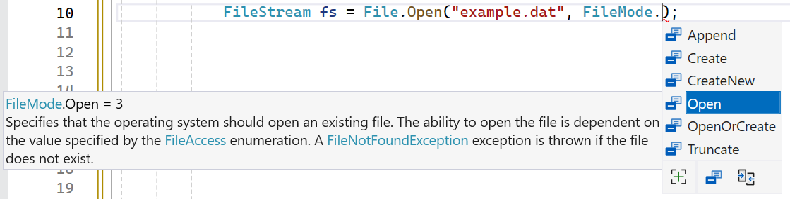
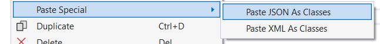

## Wat leer je in dit hoofdstuk?

Na dit hoofdstuk kan je:

* werken met **`System.IO`**: paden, bestanden en folders
* tekst lezen en schrijven met **`StreamReader`**, **`StreamWriter`** en de **`File`**-klasse
* het **`using`**-blok inzetten om bestanden netjes vrij te geven
* binaire bestanden verwerken met **`BinaryWriter`** en **`BinaryReader`**
* info opvragen met **`FileInfo`** en **`DirectoryInfo`**
* objecten **serialiseren** naar en **deserialiseren** uit **JSON**

---

## System.IO

```csharp
using System.IO;
```

Hiermee lees, schrijf, maak en verwijder je bestanden en folders. Maar: je raakt nu **echt** de harde schijf.

::: {.callout-important .fragment}
Tijd voor een **back-up**, en voor **exception handling**: bestanden luisteren minder goed dan jij. Eén foutje wist zomaar gegevens (ja, ook mij is dat al overkomen).
:::

---

## Paden

Elk bestand heeft een uniek **path**, in C# steeds een `string`:

```text
c:\temp\mijnData.txt
```

* Een path is **niet** hoofdlettergevoelig
* Windows gebruikt `\`, macOS gebruikt `/`

```csharp
File.WriteAllText("doem.txt", "Het einde is nabij");        // bij het programma
File.WriteAllText(@"c:\temp\doem.txt", "Het einde is nabij"); // vast pad
```

---

## Veilig met paden: Path.Combine

Bouw paden platformonafhankelijk met de **`Path`**-klasse:

```csharp
string fullPath = Path.Combine("data", "dagboek.txt");
// Windows: data\dagboek.txt   macOS: data/dagboek.txt
```

::: {.callout-tip .fragment}
`Path` heeft ook `GetTempPath`, `GetFileNameWithoutExtension`, ... En via `Environment.GetFolderPath(Environment.SpecialFolder.Desktop)` vind je het bureaublad van de gebruiker.
:::

---

## Eerst controleren

Controleer of iets bestaat vóór je het gebruikt, en overschrijf nooit zomaar:

```csharp
if (File.Exists(path)) { /* werk met bestand */ }
if (Directory.Exists(path)) { /* werk met folder */ }

if (!Directory.Exists(path))
    Directory.CreateDirectory(path);
```

---

## StreamWriter: schrijven

```csharp
StreamWriter writer = new StreamWriter("dagboek.txt", true);
writer.WriteLine("Game over!");
```

* Net als bij `Console` gebruik je **`WriteLine`**
* De tweede parameter **`true`** = **toevoegen** (append); `false` overschrijft

::: {.callout-warning .fragment}
Zo "bloot" gebruik je het beter niet: bij een fout blijft het bestand open en gelockt. Verderop lossen we dat op met `using`.
:::

---

## StreamReader: lezen

```csharp
StreamReader reader = new StreamReader("dagboek.txt");
string regel;
while ((regel = reader.ReadLine()) != null)
{
    Console.WriteLine(regel);
}
```

`ReadLine` geeft `null` zodra het einde van het bestand bereikt is: zo weet de loop wanneer te stoppen.

---

## Het using-blok

Een **`using`**-blok geeft een bestand gegarandeerd weer vrij, ook bij een fout:

```csharp
using (StreamWriter writer = new StreamWriter("doem.txt"))
{
    writer.WriteLine("Het einde is nabij!");
    writer.WriteLine("Hou vol!");
}
```

Bij de sluitende accolade roept C# automatisch `Dispose()` aan: het bestand gaat netjes dicht.

::: {.callout-tip .fragment}
Vanaf nu zetten we **altijd** een `using` rond een `StreamWriter` of `StreamReader`.
:::

---

## File.ReadAllText of StreamReader?

De `File`-klasse kan een bestand in één keer inlezen, zonder lus:

```csharp
string alles = File.ReadAllText("dagboek.txt");
string[] regels = File.ReadAllLines("dagboek.txt");
```

* **Klein bestand, in één keer**: `File.ReadAllText` / `ReadAllLines` (kort en leesbaar)
* **Groot bestand of regel per regel**: `StreamReader` met de `while`-lus

---

## Uitgewerkt: een dagboek

```csharp
string path = "dagboek.txt";

Console.WriteLine("Dagboek:");
using (StreamReader reader = new StreamReader(path))
{
    string regel;
    while ((regel = reader.ReadLine()) != null)
        Console.WriteLine(regel);
}

Console.WriteLine("Geef je volgende schrijfsel:");
string entry = Console.ReadLine();

using (StreamWriter writer = new StreamWriter(path, true))
{
    writer.WriteLine($"\n{DateTime.Now}");
    writer.WriteLine(entry);
}
```

---

## Binaire bestanden

:::: {.columns}

::: {.column width="55%"}
Met een **`BinaryWriter`** schrijf je **elk** datatype weg:

```csharp
var fs = File.Open("bond.dat", FileMode.Create);
using (BinaryWriter writer = new BinaryWriter(fs))
{
    writer.Write("Bond");
    writer.Write(7);
    writer.Write(true);
}
```
:::

::: {.column width="45%"}

:::

::::

`FileMode` (`Create`, `Append`, `Open`, ...) bepaalt hoe het bestand geopend wordt.

---

## BinaryReader

```csharp
var fs = File.Open("bond.dat", FileMode.Open);
using (BinaryReader reader = new BinaryReader(fs))
{
    string naam = reader.ReadString();
    int code = reader.ReadInt32();
    bool leeftNog = reader.ReadBoolean();
}
```

::: {.callout-important .fragment}
De **volgorde** is cruciaal: lees in exact dezelfde volgorde als je schreef. Wissel je `ReadInt32` en `ReadBoolean` om, dan crasht je programma met een `EndOfStreamException`.
:::

---

## FileInfo

Een **`FileInfo`**-object geeft info over een bestand én bewerkingsmethoden:

```csharp
FileInfo info = new FileInfo("bond.dat");
if (info.Exists)
{
    Console.WriteLine($"{info.Name}: {info.Length / 1024} kB");
    Console.WriteLine(info.CreationTime);
}
```

`CopyTo`, `MoveTo` en `Delete` doen wat je verwacht.

::: {.callout-tip .fragment}
**`File` vs `FileInfo`?** `File` is een **static** klasse (snel, kort iets doen). `FileInfo` instantieer je met `new` (handig voor meerdere bewerkingen na elkaar).
:::

---

## DirectoryInfo

```csharp
DirectoryInfo dir = new DirectoryInfo(@"C:\temp");
foreach (var bestand in dir.GetFiles("*.txt"))
{
    Console.WriteLine(bestand.Name);
}
```

* `GetFiles` en `GetDirectories` geven de inhoud terug
* Een **searchPattern** (`*.txt`, `Tim?.*`) filtert; `SearchOption.AllDirectories` zoekt ook in subfolders

---

## Serialiseren: het idee

Objecten met de hand wegschrijven (string-conversies, byte-volgorde) is lastig. **Serialiseren** doet het voor je: een object "in serie" naar een bestand en terug.

> Zo maak je letterlijk een **savepoint** van je programma.

**JSON** combineert het beste van beide werelden: compact én leesbaar.

```json
{ "naam": "Barry", "leeftijd": 25, "uitgeschreven": true }
```

---

## JSON serialiseren

Gebruik `System.Text.Json`. Serialiseren werkt op de **publieke** kant van je object:

```csharp
public class Student
{
    public string Naam { get; set; }
    public int Leeftijd { get; set; }
}

var student = new Student { Naam = "Barry", Leeftijd = 25 };
string json = JsonSerializer.Serialize(student);
File.WriteAllText("student.json", json);
```

::: {.callout-tip .fragment}
Met `new JsonSerializerOptions { WriteIndented = true }` krijg je nette inspringing. Een hele `List<Student>` serialiseert net zo makkelijk.
:::

---

## JSON deserialiseren

De omgekeerde weg is **generic**: je geeft het verwachte type mee.

```csharp
string json = File.ReadAllText("student.json");
Student ingeladen = JsonSerializer.Deserialize<Student>(json);
```

::: {.callout-note .fragment}
Met attributen stuur je het gedrag bij: `[JsonIgnore]` slaat een property over, `[JsonPropertyName("...")]` hernoemt ze, `[JsonInclude]` neemt iets privaat toch mee.
:::

---

## Bonus: Paste JSON as Classes

:::: {.columns}

::: {.column width="55%"}
Onbekende JSON van bv. een web-API? Laat VS de klassen voor je schrijven:

1. kopieer de JSON
2. nieuw, leeg klasse-bestand
3. **Edit - Paste Special - Paste JSON as Classes**

BOEM!
:::

::: {.column width="45%"}

:::

::::

---

## Conclusie

* **`System.IO`** geeft toegang tot de harde schijf: werk voorzichtig en met **exception handling**
* **`StreamReader`**/**`StreamWriter`** (in een **`using`**-blok) en de **`File`**-klasse lezen en schrijven tekst
* **`BinaryWriter`**/**`BinaryReader`** verwerken elk datatype, maar de **volgorde** telt
* **`FileInfo`** en **`DirectoryInfo`** geven info en bewerkingen
* **JSON-serialisatie** maakt een leesbaar savepoint van je objecten

::: {.callout-tip}
En dat was het laatste hoofdstuk. Je bent van "Hello World!" tot serialisatie geraakt: dik verdiend. Blijf vooral **oefenen** en **bouwen**.
:::

---

## Zie verder: andere talen

Dezelfde concepten uit dit hoofdstuk, maar dan in andere talen. Handig om later code in Python of JavaScript te leren lezen.

---

## Zie verder: een bestand lezen

In **Python** doet `with open` exact wat ons `using`-blok doet: het bestand gaat automatisch dicht aan het einde van het blok, ook bij een fout.

```python
with open("dagboek.txt") as f:
    inhoud = f.read()
# f is hier al netjes gesloten
```

Waar C# een `StreamReader` plus `using` nodig heeft, vangt Python beide in één korte regel.

---

## Zie verder: JSON in JavaScript

JSON staat voor *JavaScript Object Notation* en komt dus letterlijk uit **JavaScript**. Geen aparte `JsonSerializer` nodig: serialiseren zit ingebouwd.

```javascript
const student = { naam: "Barry", leeftijd: 25 };
const jsonString = JSON.stringify(student);
// {"naam":"Barry","leeftijd":25}
```

Nóg directer dan C#: omdat JSON uit JavaScript stamt, is een object en zijn JSON-voorstelling bijna hetzelfde ding.

---

## Zie verder: JSON in Python

**Python** gebruikt zijn ingebouwde `json`-module: `json.dumps` serialiseert, `json.loads` deserialiseert.

```python
import json

student = {"naam": "Barry", "leeftijd": 25}
json_string = json.dumps(student)   # object -> JSON-tekst
terug = json.loads(json_string)     # JSON-tekst -> dict
```

Verschil met C#: je hoeft geen type mee te geven. Python geeft een `dict` terug, waar C# via `Deserialize<Student>` weet bij welke klasse de data hoort.

---

## Meer weten

**Kennisclips**

* [Bestandsverwerking intro](https://ap.cloud.panopto.eu/Panopto/Pages/Viewer.aspx?id=4abb4fd1-d8e8-4bf9-9069-b45300951d91)
* [Lezen en schrijven](https://ap.cloud.panopto.eu/Panopto/Pages/Viewer.aspx?id=245ee4d1-8a4f-4d7a-8b23-b4530103b293)
* [FileInfo](https://ap.cloud.panopto.eu/Panopto/Pages/Viewer.aspx?id=fa02d630-a851-4f70-9b8a-b45300afe62d)

[Oefeningen H18](https://apwt.gitbook.io/ziescherp-oefeningen/h18-bestandsverwerking/a_practica) · [Quizlet flashcards](https://quizlet.com/be/934448214/zie-scherp-scherper-hoofdstuk-18-flash-cards/)
