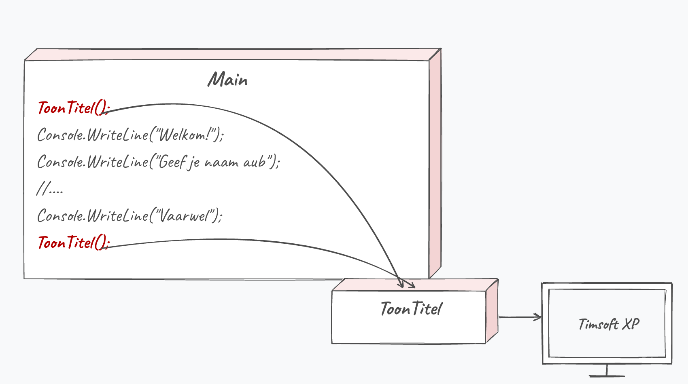
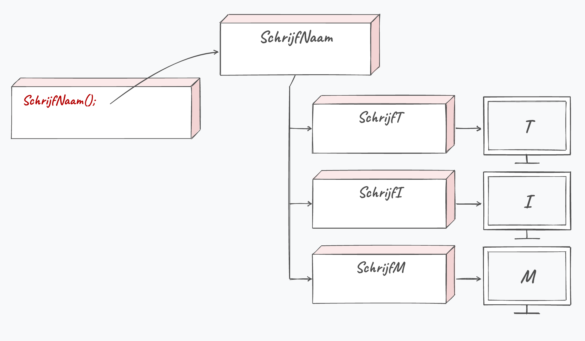
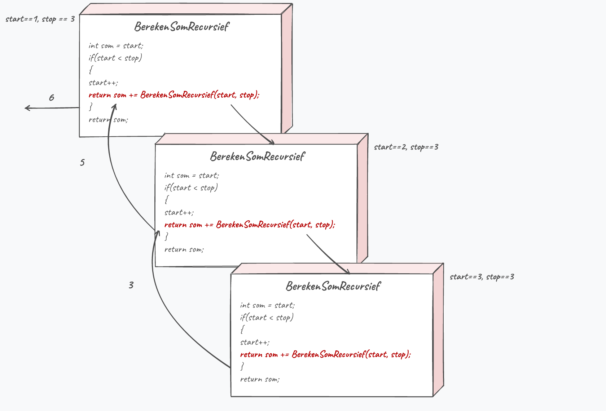
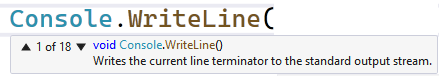

## Wat leer je in dit hoofdstuk?

Na dit hoofdstuk kan je:

* uitleggen waarom **methoden** code herbruikbaar en leesbaar maken
* zelf een methode schrijven met een **returntype** en **`return`**
* **parameters** doorgeven en het verschil met *by value* begrijpen
* methoden **nesten** en oneindige methode-lussen herkennen
* **named** en **optionele** parameters en **overloading** gebruiken
* met **`///`**-commentaar en **IntelliSense** efficiënter werken

---

## Luiheid als deugd

> *"I will always choose a lazy person to do a difficult job, because he will find an easy way to do it."* - Bill Gates

We jagen op **zo weinig mogelijk code met zoveel mogelijk rendement**. Loops waren een eerste stap, methoden de volgende.

::: {.callout-tip .fragment}
Bestond `Console.WriteLine` niet, dan moest je telkens tientallen lijnen interne code overtypen. Wees blij dat methoden bestaan.
:::

---

## Wat is een methode?

* Een **blok code** dat een specifieke taak uitvoert
* Herkenbaar aan de **ronde haakjes** achteraan, al dan niet met parameters
* Je gebruikt ze al sinds les 1: elke `Console.WriteLine()` is een methode-aanroep

> Nieuw: we gaan nu **zelf** methoden definiëren, niet enkel bestaande gebruiken.

---

## Methode-syntax

```csharp
static returntype MethodeNaam(optioneel_parameters)
{
    //code van de methode
}
```

De eerste lijn is de **methode-signatuur**: returntype, naam en parameters.

::: {.callout-tip .fragment}
Vergeet `static` voorlopig: beschouw het als een verplicht **toverwoord**. Waarom het er staat, zie je in hoofdstuk 11.
:::

---

## Een eenvoudige methode

:::: {.columns}

::: {.column width="55%"}
```csharp
static void ToonTitel()
{
    Console.WriteLine("Timsoft XP");
}
```

Aanroepen, eender waar:

```csharp
ToonTitel();
```

Verandert de titel ooit? Eén plek aanpassen volstaat.
:::

::: {.column width="45%"}

:::

::::

::: {.callout-note .fragment}
Ook **`Main`** is gewoon een methode: het startpunt van je programma.
:::

---

## Returntype en return

`void` betekent dat een methode **niets** teruggeeft. Vaak wil je wel iets terug:

```csharp
static string VerkrijgAuteurNaam()
{
    return "Tim Dams";
}
```

* **`return`** geeft het resultaat terug en verlaat de methode meteen
* Vang het resultaat op in een variabele van **hetzelfde type**:

```csharp
string myName = VerkrijgAuteurNaam();
Console.WriteLine($"Auteur: {VerkrijgAuteurNaam()}");
```

---

## Een uitgewerkte methode

```csharp
static int FaculteitVan5()
{
    int resultaat = 1;
    for (int i = 1; i <= 5; i++)
    {
        resultaat *= i;
    }
    return resultaat;
}
```

```csharp
Console.WriteLine($"Faculteit van 5 is {FaculteitVan5()}");  // 120
```

---

## void: niets opvangen

```csharp
static void ToonVersie()
{
    Console.WriteLine("Dit is versie 8.31");
}
```

Een `void`-methode geeft niets terug. Deze twee **mogen dus niet**:

```csharp
string result = ToonVersie();      // FOUT
Console.WriteLine(ToonVersie());   // FOUT
```

---

## Not all code paths return a value

:::: {.columns}

::: {.column width="22%"}

:::

::: {.column width="78%"}
`return` mag overal, en sluit de methode meteen af. Maar elke weg door je methode moet wél iets teruggeven:

```csharp
switch (r.Next(0, 4))
{
    case 0: return "noord";
    // ...
}
return "onbekend"; // nooit bereikt, tóch vereist
```
:::

::::

::: {.callout-warning .fragment}
*"Not all code paths return a value"*: ergens kan je het einde bereiken zonder `return`.
:::

---

## Parameters doorgeven

Veralgemeen `FaculteitVan5` met een **parameter**:

```csharp
static int BerekenFaculteit(int grens)
{
    int resultaat = 1;
    for (int i = 1; i <= grens; i++)
        resultaat *= i;
    return resultaat;
}
```

```csharp
int resultaat = BerekenFaculteit(5);  // 120
```

::: {.callout-tip .fragment}
De parameternaam (`grens`) hoeft niet gelijk te zijn aan de meegegeven variabele. Enkel de **waarde** telt.
:::

---

## By value

Parameters gaan standaard **by value**: de methode krijgt een **kopie**.

```csharp
static void JaartjeOuder(int leeftijd)
{
    leeftijd++;
    Console.WriteLine($"Je bent {leeftijd} jaar geworden.");
}
```

```text
Je bent 40 jaar.
Je bent 41 jaar geworden.
Je bent 40 jaar.   <- origineel ongewijzigd
```

::: {.callout-note .fragment}
*By reference* (de echte variabele aanpassen) komt aan bod vanaf het hoofdstuk over arrays.
:::

---

## Volgorde van parameters

De eerste meegegeven waarde gaat naar de eerste parameter, enz.

```csharp
static void ToonInfo(string name, int age)
{
    Console.WriteLine($"{name} is {age} jaar");
}
```

```csharp
ToonInfo("Tim", 37);   // ok
ToonInfo(37, "Tim");   // FOUT: compileert niet
```

---

## Methoden nesten

:::: {.columns}

::: {.column width="55%"}
Een methode mag andere methoden aanroepen:

```csharp
static void SchrijfNaam()
{
    SchrijfT();
    SchrijfI();
    SchrijfM();
}
```

Resultaat: "Tim".
:::

::: {.column width="45%"}

:::

::::

::: {.callout-warning .fragment}
Een methode die **zichzelf** ongecontroleerd aanroept, loopt oneindig en crasht als het geheugen op is.
:::

---

## Recursie (kort)

:::: {.columns}

::: {.column width="55%"}
**Recursie** = een methode die zichzelf aanroept, maar **wel stopt**:

```csharp
static int BerekenSom(int start, int stop)
{
    int som = start;
    if (start < stop)
        return som += BerekenSom(start + 1, stop);
    return som;
}
```
:::

::: {.column width="45%"}

:::

::::

Een geavanceerd concept; we komen het pas in hoofdstuk 18 kort terug tegen.

---

## Lokale functies: niet doen

Sinds [C#]{.cs} 7 mag een methode in een andere methode staan, maar als beginner doe je dat **niet**:

```csharp
static void Main(string[] args)
{
    TimVindtDitNietLeuk();

    static void TimVindtDitNietLeuk() // NIET DOEN
    {
        Console.WriteLine("Doe dit niet!");
    }
}
```

Je kan zo'n lokale functie nergens anders aanroepen. Zet je methoden gewoon **naast** `Main`.

---

## Documentatie met ///

```csharp
/// <summary>
/// Berekent de macht van een getal.
/// </summary>
/// <param name="grondtal">Het getal dat je verheft</param>
/// <param name="exponent">De exponent</param>
static int Macht(int grondtal, int exponent) { /* ... */ }
```

Typ `///` boven een methode en VS maakt het skelet. Bij elke aanroep krijg je dan **tooltips** met uitleg.

---

## Bestaande methoden en IntelliSense

:::: {.columns}

::: {.column width="55%"}
* Typ een methode en stop na het **eerste haakje**: IntelliSense toont alle manieren (de *overloads*)
* Cursor op een methode + **`F1`** opent de online documentatie
* Typ `Console.` en zie alles wat die bibliotheek kan
:::

::: {.column width="45%"}

:::

::::

---

## Herbruikbare input

Komt deze constructie vaak voor?

```csharp
Console.WriteLine("Geef leeftijd");
int leeftijd = int.Parse(Console.ReadLine());
```

Verhuis ze naar een methode:

```csharp
static int VraagInt(string zin)
{
    Console.WriteLine(zin);
    return int.Parse(Console.ReadLine());
}

int leeftijd = VraagInt("Geef leeftijd");
```

Je `Main` blijft net en leesbaar.

---

## Named parameters

Twee parameters van hetzelfde type verwisselen? Dat compileert gewoon:

```csharp
static void ToonPunten(string vak, int score, string student) { }

ToonPunten("Steven", 14, "Programmeren");  // stille bug
```

Geef daarom expliciet aan welke waarde bij welke parameter hoort:

```csharp
ToonPunten(student: "Steven", score: 14, vak: "Programmeren");
```

* Geef je **alle** parameters een naam, dan maakt de volgorde niet uit
* Meng je named en gewone parameters, dan **moet** elke named parameter op zijn eigen plaats blijven

---

## Optionele parameters

Geef een **default waarde** mee; die parameters staan **achteraan**:

```csharp
static void ToonFactuur(string klant, int korting = 0, int btw = 21)
```

```csharp
ToonFactuur("Tim", 10, 6);
ToonFactuur("Tim", 10);   // btw = 21
ToonFactuur("Tim");       // korting = 0, btw = 21
```

::: {.callout-tip .fragment}
Wil je enkel `btw` zetten en `korting` overslaan? `ToonFactuur("Tim", 6)` compileert, maar die 6 belandt in `korting`. Gebruik een named parameter: `ToonFactuur("Tim", btw: 6)`.
:::

---

## Method overloading

Dezelfde naam, maar een **andere parameterlijst**. De compiler kiest de juiste:

```csharp
static int Verdubbel(int getal)
{
    return getal * 2;
}
static string Verdubbel(string tekst)
{
    return tekst + tekst;
}
```

```csharp
Verdubbel(21);    // 42
Verdubbel("ha");  // haha
```

::: {.callout-important .fragment}
Het returntype mág verschillen, maar telt niet mee. Twee versies die enkel in returntype verschillen compileren niet.
:::

::: {.callout-note .fragment}
Passen twee versies even goed, dan kiest de compiler niet: *the call is ambiguous*. Hoe hij bij twijfel tussen types wél kiest (de **betterness rule**) is verdiepingsstof.
:::

---

## Methoden debuggen: step in

Herinner je de debugknoppen uit hoofdstuk 4? Eén lieten we toen liggen: **step in**.

* **Step over** springt over een methode-aanroep heen
* **Step in** gaat **in** je eigen methode en laat je daar lijn per lijn stappen

Simpel, maar oefen het toch een paar keer.

---

## Methoden in actie: verdeel en heers

Een groot probleem splits je op in **kleine methoden**, elk met een duidelijke taak: een **IN** (parameters), een **ACTIE** en een **UIT** (returntype).

> Teken eerst een flowchart. **Elk blokje wordt een methode.** Daarna rijg je ze aan elkaar in een hoofdmethode.

::: {.callout-tip .fragment}
Zo blijft je `Main` kort en lees je je programma als een inhoudstafel.
:::

---

## Showcase: Avenger Mission Planner

Nick Fury managet de Avengers. Elke fase van een missie is een methode:

| Methode | IN | UIT |
|---|---|---|
| `Alarm` | niets | moeilijkheidsgraad (`int`, 0 = geen alarm) |
| `MissieVoorbereiden` | graad | naam held (`string`) |
| `MissieUitvoeren` | graad + held | missiepercentage (`int`) |
| `Evaluatie` | percentage + held | niets (`void`) |

---

## Avenger Mission Planner: de manager

Een `MissieManager` rijgt de losse methoden aan elkaar:

```csharp
static void MissieManager(int moeilijkheidsgraad)
{
    string held = MissieVoorbereiden(moeilijkheidsgraad);
    int percentage = MissieUitvoeren(moeilijkheidsgraad, held);
    Evaluatie(percentage, held);
}
```

::: {.callout-tip .fragment}
**Uitbreiding**: bij een alarm waarschuw je ook DC via `DCWaarschuwer(moeilijkheidsgraad)`. Eén extra methode-aanroep, klaar.
:::

---

## Showcase: verhaal-generator

Bouw van **onder naar boven**, elke laag hergebruikt de vorige:

* `GenereerKlinker()` / `GenereerMedeklinker()`: losse letters
* `GenereerNaam(int lengte)`: een uitspreekbare naam (klinker na medeklinker)
* `GenereerKorteZin()`: onderwerp + werkwoord + voorwerp
* `GenereerVerhaal()`: meerdere zinnen aan elkaar

::: {.callout-tip .fragment}
`GenereerMedeklinker` **hergebruikt** `IsKlinker`: blijf letters trekken tot er een geen klinker is. Methoden die methoden gebruiken.
:::

---

## Verhaal-generator: zinnen samenstellen

```csharp
static string GenereerKorteZin()
{
    string onderwerp = GenereerNaam(6);
    string werkwoord = GenereerWerkwoord();   // "gooit", "trapt", ...
    string voorwerp  = GenereerVoorwerp();    // "de bal", "de lepel", ...
    return $"{onderwerp} {werkwoord} {voorwerp}";
}
```

::: {.callout-tip .fragment}
**Uitdaging**: schrijf zelf `GenereerVerhaal()` dat meerdere zinnen met voegwoorden (" en ", ", maar ", ", dus ") aan elkaar plakt. Ben jij de volgende Shakespeare?
:::

---

## Showcase: Sinterklaas cadeau-generator

De Sint verdeelt het werk over **drie hulp-elfen**, elk een methode:

* `IsBraaf(...)`: braaf of stout? (`bool`)
* `BerekenAantalCadeaus(...)`: hoeveel cadeaus (`int`)
* `GenereerCadeau()`: een willekeurig cadeau (`string`)

Een `TestenMaar()`-methode maakt met `Random` willekeurige kinderen en draait alles in een loop.

::: {.callout-tip .fragment}
Zelfde idee als de Avengers: splits het probleem op, laat elke methode één ding goed doen.
:::

---

## Conclusie

* Een **methode** is een herbruikbaar codeblok: minder fouten, betere leesbaarheid
* **`void`** geeft niets terug; anders gebruik je **`return`** met het juiste type
* Parameters gaan **by value** (een kopie); de **volgorde** telt
* **Named** en **optionele** parameters en **overloading** maken je methoden flexibel
* Met **`///`** en **IntelliSense** werk je sneller en met betere documentatie

::: {.callout-tip}
Volgende halte: **arrays**, om vele waarden samen in één variabele bij te houden.
:::

---

## Meer weten

**Kennisclips**

* [Methoden](https://ap.cloud.panopto.eu/Panopto/Pages/Viewer.aspx?id=61df170d-4f30-486f-a411-ac4f00b06415)
* [Goede methoden schrijven](https://ap.cloud.panopto.eu/Panopto/Pages/Viewer.aspx?id=453d817f-0567-4d1a-bd46-ac8c00a27bfa)
* [Bestaande bibliotheken](https://ap.cloud.panopto.eu/Panopto/Pages/Viewer.aspx?id=b16047e4-d2b4-4274-b9d9-af0f00843a6a)
* [Geavanceerde methodetechnieken](https://ap.cloud.panopto.eu/Panopto/Pages/Viewer.aspx?id=75c9a72b-f485-4660-b71e-ac4f00bb0c38)
* [Fun with methods](https://ap.cloud.panopto.eu/Panopto/Pages/Viewer.aspx?id=ab62fdcd-94f3-4028-bee1-ac3600ca414b)

[Oefeningen H7](https://apwt.gitbook.io/ziescherp-oefeningen/h7-methoden/b_practicasamen) · [Quizlet flashcards](https://quizlet.com/be/918627932/zie-scherp-scherper-hoofdstuk-07-flash-cards/)

---

## Zie verder: andere talen

Dezelfde concepten uit dit hoofdstuk, maar dan in andere talen. Handig om later code in Python of JavaScript te leren lezen.

---

## Zie verder: methode-signatuur

**Python** doet dit zo:

```python
def tel_op(a, b):
    return a + b
```

Geen returntype, geen types voor parameters. Dat scheelt typewerk, maar Python merkt een verkeerd type pas tijdens het uitvoeren.

---

## Zie verder: bibliotheken importeren

In C# haal je bibliotheken binnen met `using`. **Python** doet dit met `import`:

```python
import math

print(math.sqrt(16))
```

Hetzelfde idee als bij C#: je geeft aan welke bibliotheek je wilt en spreekt de methoden aan via de naam (`math.sqrt`, zoals `Math.Sqrt`).

---

## Zie verder: overloading

**Python** kent geen overloading: een tweede functie met dezelfde naam overschrijft de eerste. Meestal is dat niet nodig, want `*` werkt er op getallen én op strings:

```python
def verdubbel(waarde):
    return waarde * 2

print(verdubbel(21))    # 42
print(verdubbel("ha"))  # haha
```

Wil je per type toch iets anders doen, dan schrijf je die keuze zelf met een `if isinstance(...)`.
