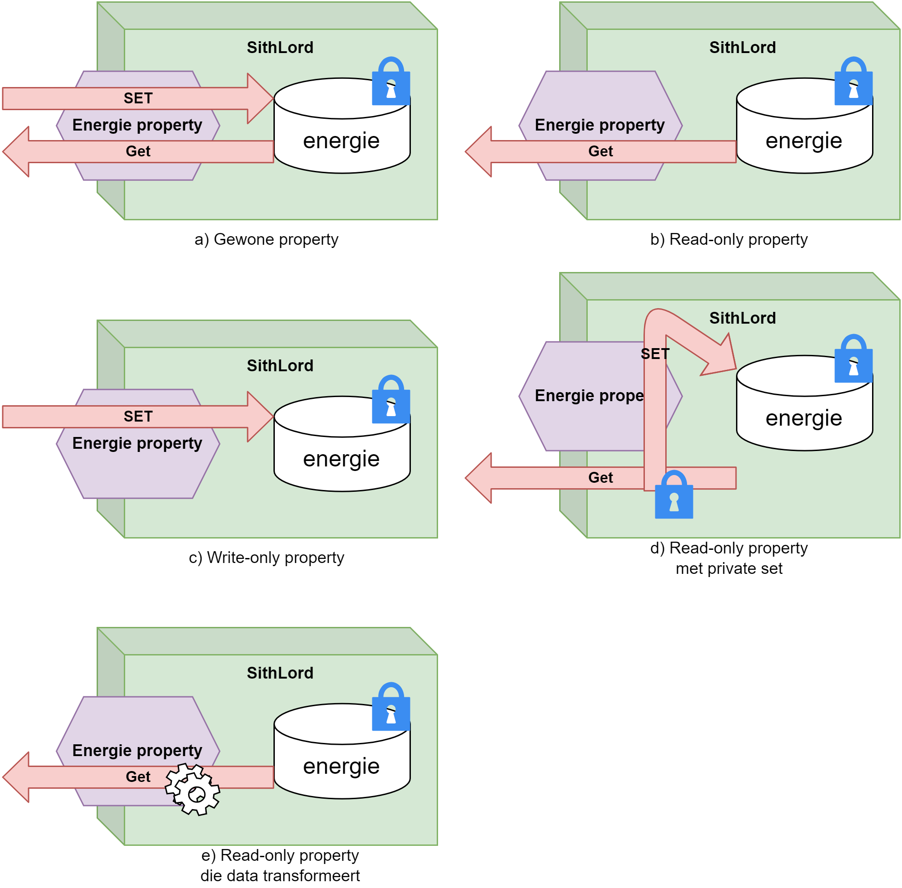
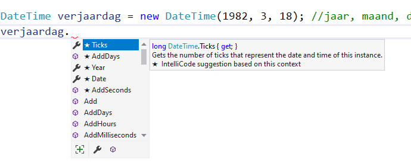

## Wat leer je in dit hoofdstuk?

Na dit hoofdstuk kan je:

* uitleggen waarom **OOP** code modulair en onderhoudsvriendelijk maakt
* het verschil tussen een **klasse** en een **object** beschrijven
* **abstractie** en **encapsulatie** situeren (het black-box-principe)
* een klasse maken met **methoden** en **instantievariabelen**
* **access modifiers** (`public`/`private`) correct gebruiken
* objecten hun staat laten beschermen via **properties** (full en auto)
* werken met de ingebouwde **`DateTime`**-klasse

---

## Van gestructureerd naar OOP

Tot nu toe programmeerden we **gestructureerd** (procedureel): loops, methoden, beslissingen.

* Werkt prima, maar grote projecten verzanden in **spaghetti**
* **OOP** bouwt hierop voort, maar maakt code **modulair, leesbaar en onderhoudsvriendelijk**

> Alles draait voortaan rond **klassen en objecten**.

---

## Pong zonder OOP

```csharp
int balX = 20; int balY = 20;
int vX = 2;    int vY = 1;
while (true) { /* posities updaten, tekenen ... */ }
```

::: {.callout-warning .fragment}
Twee balletjes? Dan moet je **bijna elke lijn verdubbelen** (`bal2X`, `v2X`, ...). Bij honderd balletjes wordt het een ramp.
:::

---

## Pong met OOP: de klasse

```csharp
internal class Balletje
{
    public int X { get; set; }
    public int Y { get; set; }
    public int VX { get; set; }
    public int VY { get; set; }

    public void Update() { /* botst tegen de randen */ }
    public void TekenOpScherm()
    {
        Console.SetCursorPosition(X, Y);
        Console.Write("O");
    }
}
```

We stoppen de **data** en het **gedrag** van een balletje samen in één klasse.

---

## Pong met OOP: de Main

```csharp
Balletje bal1 = new Balletje();
bal1.X = 20; bal1.Y = 20; bal1.VX = 2; bal1.VY = 1;

Balletje bal2 = new Balletje();
bal2.X = 10; bal2.Y = 8; bal2.VX = 2; bal2.VY = -1;

while (true)
{
    bal1.Update();  bal2.Update();
    bal1.TekenOpScherm();  bal2.TekenOpScherm();
    Thread.Sleep(50); Console.Clear();
}
```

::: {.callout-tip .fragment}
Honderd balletjes? Een array van `Balletje` en twee loopjes. Zo simpel.
:::

---

## De kracht van OOP

> De **logica zit in de objecten zelf**. Elk object is verantwoordelijk voor zijn eigen gedrag, op basis van zijn eigen interne toestand.

In de `Main` zeg je gewoon: "update jezelf" en "teken jezelf".

---

## Even doorbijten

:::: {.columns}

::: {.column width="22%"}

:::

::: {.column width="78%"}
Duizend mammoeten en sabeltandtijgers! Ik doe een voorspelling: van alle hoofdstukken wordt **dit** het hoofdstuk waar je het meest je tanden op stukbijt.

Hou vol, geef niet te snel op, en kom hier geregeld terug.
:::

::::

---

## Klasse versus object

* Een **klasse** is een **blauwdruk** die het gedrag en de toestand van objecten beschrijft
* Een **object** is een **instantie** van die klasse, met een eigen toestand en identiteit

::: {.callout-tip .fragment}
Het **grondplan** van een huis is de klasse. De tien huizen die je ermee bouwt zijn de objecten: elk met eigen bakstenen en rolluiken.
:::

---

## Toestand, gedrag, identiteit

Een object heeft:

* **Gedrag**: beschreven door de **methoden** van de klasse
* **Toestand**: bepaald door zijn **instantievariabelen** en **properties**
* **Identiteit**: een unieke naam zodat andere objecten ermee kunnen werken

::: {.callout-tip .fragment}
Zoek in een opgave naar de **zelfstandige naamwoorden**: dat zijn vaak je klassen.
:::

---

## Abstractie en encapsulatie

Het **black-box**-principe, denk aan een auto:

* **Encapsulatie**: alle onderdelen die samenhoren bundel je tot één geheel
* **Abstractie**: naar buiten toe vereenvoudig je de complexiteit tot een **interface** (stuur, pedalen, dashboard)

> Hoe minder de buitenwereld moet weten om met een object te werken, hoe beter.

---

## Tijd voor taart: A PIE

De vier pijlers van OOP:

* **A**bstractie
* **P**olymorfisme (hoofdstuk 16)
* **I**nheritance / overerving (hoofdstuk 13)
* **E**ncapsulatie

::: {.callout-note .fragment}
Steve Jobs over objecten: *"They encapsulate complexity, and the interfaces to that complexity are high level."*
:::

---

## Een klasse maken

```csharp
internal class Auto
{

}
```

* Een klassenaam begint met een **hoofdletter**
* Zet elke klasse in een **apart `.cs`-bestand** (Project - Add class...)
* VS zet er de access modifier **`internal`** voor

---

## Objecten aanmaken met new

```csharp
Auto mijnEersteAuto = new Auto();
Auto mijnAndereAuto = new Auto();
```

* Objecten maak je met het **`new`** keyword (zoals eerder bij `Random`)
* `new` maakt het object in het geheugen en geeft het **adres** terug

::: {.callout-tip .fragment}
Klassen zijn dus gewoon een **nieuw, krachtiger datatype**: variabelen die meerdere waarden én methoden bundelen.
:::

---

## new en null

:::: {.columns}

::: {.column width="22%"}

:::

::: {.column width="78%"}
Zonder `new` bestaat je object niet: de variabele is dan **`null`** (een lege doos).

```csharp
Auto auto;            // null
Console.WriteLine(auto); // use of unassigned local variable
```
:::

::::

::: {.callout-warning .fragment}
Een `null`-object tóch gebruiken geeft een **`NullReferenceException`**: dé klassieker bij beginnende OOP'ers. Je vergat `new`.
:::

---

## Object-methoden

```csharp
internal class Mens
{
    public void Praat()
    {
        Console.WriteLine("Ik ben een mens!");
    }
}
```

```csharp
Mens joske = new Mens();
joske.Praat();   // via de dot-operator
```

* **Geen `static`** voor methoden in zo'n klasse
* **`public`** maakt de methode bruikbaar voor de buitenwereld

---

## Access modifiers

* **`private`**: enkel zichtbaar binnen de klasse zelf (de **standaard** als je niets schrijft)
* **`public`**: iedereen kan eraan
* **`internal`**: enkel binnen het huidige project; **`protected`**: voor overerving (later)

::: {.callout-important .fragment}
Zet **altijd expliciet** een access modifier. Niets schrijven betekent `private`, maar dat expliciet maken leest veel duidelijker.
:::

---

## Waarom private?

Interne hulpcode scherm je af zodat anderen ze niet per ongeluk aanroepen. Binnen de klasse mag je ze wél gebruiken:

```csharp
public void Praat()
{
    Console.WriteLine("Ik ben een mens!");
    VertelGeheim();        // mag: zelfde klasse
}
private void VertelGeheim()
{
    Console.WriteLine("Ik ben verliefd op Anneke");
}
```

---

## Instantievariabelen

Elke instantie houdt zijn **eigen** toestand bij in een **instantievariabele**:

```csharp
internal class Mens
{
    private int geboorteJaar = 1970;

    public void Praat()
    {
        Console.WriteLine($"Ik ben geboren in {geboorteJaar}.");
    }
}
```

Verjong je het ene object, dan blijft het andere ongemoeid: elk object heeft zijn **eigen** `geboorteJaar`.

---

## Houd instantievariabelen privé

:::: {.columns}

::: {.column width="30%"}

:::

::: {.column width="70%"}
Ik zag je denken: "zal ik die instantievariabele eens `public` maken?" **Niet doen. Simpel.**

Een `public` instantievariabele laat de buitenwereld om het even welke waarde toekennen (`adil.geboortejaar = -12000;`) en breekt zo je klasse.
:::

::::

::: {.callout-important .fragment}
Toegang regel je via **properties** en **methoden**, nooit via een publieke instantievariabele.
:::

---

## Gecontroleerde toegang

Een methode kan illegale waarden tegenhouden:

```csharp
public void VeranderGeboortejaar(int nieuw)
{
    if (nieuw >= 1900)
        geboorteJaar = nieuw;
}
```

Een object **beschermt zichzelf**: de buitenwereld kan zijn werking niet zomaar om zeep helpen.

---

## Get/Set: de oldschool manier

Vroeger (en nog steeds in **Java**) regelde je toegang via aparte methoden:

```csharp
private int energie;
public int GetEnergie() { return energie; }
public void SetEnergie(int waarde)
{
    if (waarde >= 0) energie = waarde;
}
```

Werkt, maar omslachtig: `vader.SetEnergie(20)` in plaats van gewoon `vader.Energie = 20`.

::: {.callout-tip .fragment}
[C#]{.cs} heeft hiervoor **properties**: ze werken als een variabele, maar met de controle van een methode. Best of both worlds.
:::

---

## Properties: het idee

Darth Vader is een `SithLord` met een geheime naam en een hoeveelheid energie (nooit onder 0):

```csharp
internal class SithLord
{
    private int energie;
    private string sithName;
}
```

::: {.callout-tip .fragment}
**Properties** zijn de moderne [C#]{.cs}-manier om de interne staat **gecontroleerd** in en uit te lezen, in plaats van losse methoden.
:::

---

## Full property

```csharp
private int energie;

public int Energie
{
    get { return energie; }
    set { energie = value; }
}
```

```csharp
Vader.Energie = 20;                  // set
Console.WriteLine(Vader.Energie);    // get
```

* Een property is altijd **`public`** en begint met een **hoofdletter**
* In de `set` zit de waarde in het keyword **`value`**

---

## Full property met controle

De property treedt op als **wachter**:

```csharp
public int Energie
{
    get { return energie; }
    set
    {
        if (value >= 0)
            energie = value;
    }
}
```

`palpatine.Energie = -1;` heeft nu **geen effect**: negatieve energie wordt geweigerd.

---

## Property-variaties

:::: {.columns}

::: {.column width="50%"}
* **Write-only**: geen `get` (bv. een pincode)
* **Read-only**: geen `set`
* **Read-only met `private set`**: enkel intern aanpasbaar
* **Transformerend**: berekent data in de `get`
:::

::: {.column width="50%"}

:::

::::

::: {.callout-tip .fragment}
Pas, ook **binnen** de klasse, je instantievariabele aan via de property, zodat je controles niet omzeilt.
:::

---

## Transformerende property

Een read-only property die data **berekent** (geen eigen instantievariabele):

```csharp
internal class Persoon
{
    public string Voornaam { get; set; }
    public string Achternaam { get; set; }

    public string VolledigeNaam
    {
        get { return $"{Voornaam} {Achternaam}"; }
    }
}
```

---

## Methode of property?

::: {.callout-tip}
* Gaat het om een **actie of gedrag** (iets doen, tonen, berekenen dat tijd kost)? Gebruik een **methode**.
* Gaat het om een **eigenschap** met data die snel verkregen wordt? Gebruik een **property**.
:::

---

## Auto-properties

Geen extra controle nodig? Dan volstaat een **auto-property**, zonder zichtbare instantievariabele:

```csharp
internal class Persoon
{
    public string Voornaam { get; set; }
    public int Geboortejaar { get; set; } = 2002;   // beginwaarde
    public string Naam { get; private set; }          // read-only naar buiten
}
```

::: {.callout-tip .fragment}
Begin vaak met auto-properties; vervang ze door full properties zodra je controle of transformatie nodig hebt. (`prop` + tab + tab in VS.)
:::

---

## DateTime: een ingebouwde klasse

```csharp
DateTime nu = DateTime.Now;                  // huidige datum en tijd
DateTime dag = new DateTime(2017, 4, 21);    // jaar, maand, dag
```

* `DateTime.Now` is een **static property**
* `new DateTime(...)` gebruikt een **constructor** (hoofdstuk 11) om het object meteen in te stellen

---

## DateTime: methoden en properties

```csharp
DateTime einde = trouwMoment.AddDays(35);
Console.WriteLine(einde.Month);      // 5
Console.WriteLine(einde.DayOfWeek);  // Friday
```

:::: {.columns}

::: {.column width="55%"}
* `AddDays`, `AddHours`, `AddYears`, ... geven telkens een **nieuw** `DateTime`-object terug
* Properties zoals `Month` en `DayOfWeek` zijn **read-only**
:::

::: {.column width="45%"}

:::

::::

---

## DateTime: TimeSpan

Twee `DateTime`-objecten aftrekken geeft een **`TimeSpan`**:

```csharp
DateTime vandaag = DateTime.Today;
DateTime geboorte = new DateTime(2009, 6, 17);
TimeSpan verschil = vandaag - geboorte;
Console.WriteLine($"{verschil.TotalDays} dagen oud.");
```

Optellen van twee datums kan niet, aftrekken wel.

---

## Uitdaging: Personal Trainer

Bouw een mini-fitness-app waarin een sporter zijn trainingen bijhoudt. Een klasse `Loper` met:

* `Naam`
* `AantalLopen`, `TotaleAfstand` en `TotaleTijd` (alleen leesbaar naar buiten)
* een methode `RegistreerTraining(afstand, tijd)`

::: {.callout-tip .fragment}
Gebruik **properties met begrenzing** (clamping): een negatieve afstand of tijd weiger je in de `set`. Zo beschermt het object zichzelf, precies de kern van dit hoofdstuk.
:::

---

## Terugblik op een stevig hoofdstuk

:::: {.columns}

::: {.column width="22%"}

:::

::: {.column width="78%"}
We doorliepen vier fasen:

1. **Pong** toonde waarom OOP helpt
2. de **theorie** (klasse vs object) verwarde even
3. de **praktijk**: methoden en properties als kern van een klasse
4. **`DateTime`** als voorproefje van een krachtige klasse
:::

::::

---

## Conclusie

* **OOP** bundelt data en gedrag in **klassen**; objecten zijn de concrete **instanties** (met `new`)
* Een object beheert zijn eigen **toestand**; **instantievariabelen** blijven **privé**
* **Properties** geven gecontroleerde toegang: full (met `get`/`set`/`value`) of auto
* Vergeet je `new`, dan is je object `null` en krijg je een **`NullReferenceException`**
* **`DateTime`** toont hoe krachtig een goed ontworpen klasse is

::: {.callout-tip}
Volgende halte: **geheugenmanagement** en **uitzonderingen** (exceptions).
:::

---

## Meer weten

**Kennisclips**

* [OOP, klassen en objecten: what's it all about?](https://ap.cloud.panopto.eu/Panopto/Pages/Viewer.aspx?id=628acdda-bcc3-4de5-8b0e-acc200a98688)
* [Klassen en objecten in C#](https://ap.cloud.panopto.eu/Panopto/Pages/Viewer.aspx?id=6d91d9e1-9c8e-4b7a-a9a0-accd00b0ff32)
* [Methoden en access modifiers](https://ap.cloud.panopto.eu/Panopto/Pages/Viewer.aspx?id=59d6fbe6-a779-45d8-bb95-ae2700b22623)
* [Properties: nut en full properties](https://ap.cloud.panopto.eu/Panopto/Pages/Viewer.aspx?id=20d5c36f-7a4b-447b-a5c9-b11d00b18e93)
* [Auto-properties](https://ap.cloud.panopto.eu/Panopto/Pages/Viewer.aspx?id=024fbb15-cb1b-446b-a12c-b11d00f38c52)
* [De DateTime klasse](https://ap.cloud.panopto.eu/Panopto/Pages/Viewer.aspx?id=bab1597f-4907-40ae-8723-acb00095e421)

[Oefeningen H9](https://apwt.gitbook.io/ziescherp-oefeningen/h9-object-oriented-programming/a_practica) · [Quizlet flashcards](https://quizlet.com/be/918631776/zie-scherp-scherper-hoofdstuk-09-flash-cards/)
