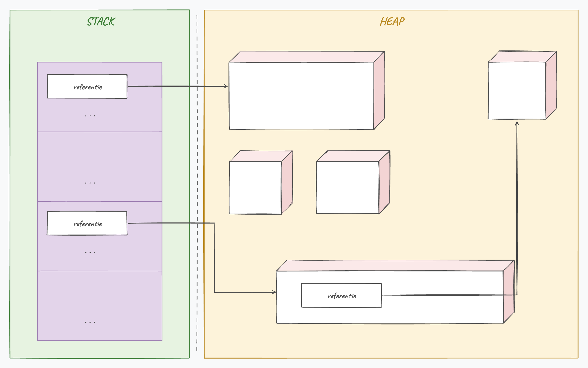
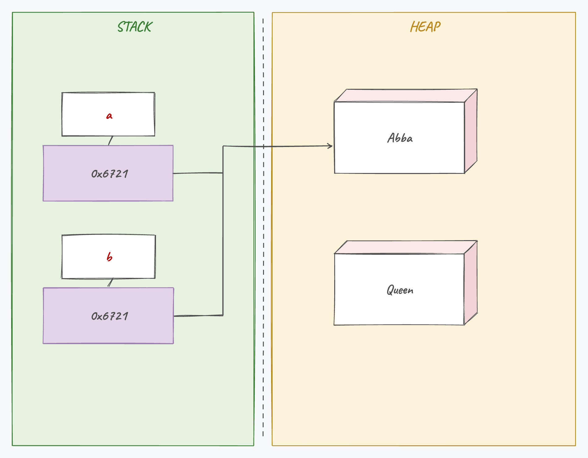
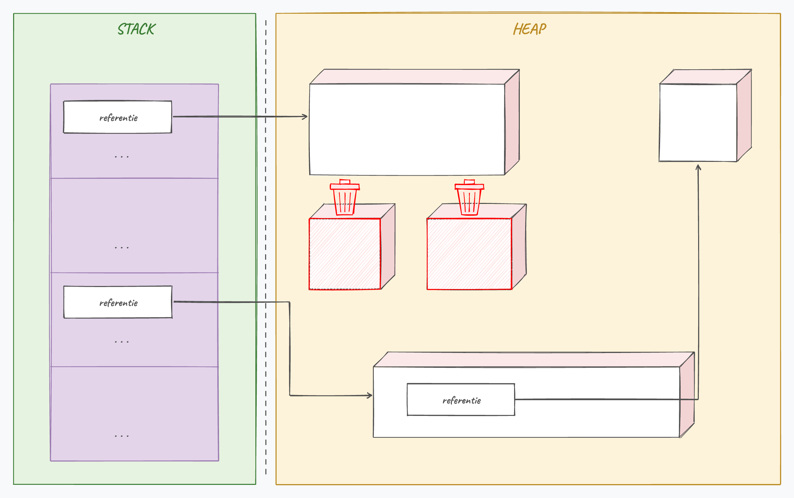

## Wat leer je in dit hoofdstuk?

Na dit hoofdstuk kan je:

* uitleggen hoe het geheugen verdeeld is in **stack** en **heap**
* het verschil tussen **value types** en **reference types** doorgronden
* de rol van de **Garbage Collector** beschrijven
* werken met **`null`** en de **`NullReferenceException`** vermijden
* **`namespace`** en **`using`** situeren
* robuuste code schrijven met **`try`**, **`catch`** en **`finally`**

---

## Twee soorten geheugen

Een [C#]{.cs}-programma krijgt twee geheugens:

* de kleine, snelle **stack**
* het grote, tragere **heap**

| | Value types | Reference types |
|---|---|---|
| Inhoud | de waarde zelf | een verwijzing naar de data |
| Locatie | **stack** | **heap** |
| Default | `0`, `false`, ... | `null` |
| `=` kopieert | de waarde | het **adres** |

---

## Waarom twee geheugens?

:::: {.columns}

::: {.column width="58%"}
* De **stack** is bij het compileren al **exact berekenbaar** (snel, vaste grootte)
* De **heap** is voor data waarvan de grootte pas **tijdens de uitvoer** bekend is (arrays, objecten)
:::

::: {.column width="42%"}

:::

::::

> De heap is de grote speelplaats; de stack het kleine, snelle bankje ernaast.

---

## Als de stack vol loopt

De stack is **klein en snel**. Roept een methode zichzelf eindeloos aan (oneindige recursie), dan stapelen de aanroepen op tot de stack vol zit:

```csharp
void Tel() { Tel(); } // roept zichzelf eindeloos aan
```

::: {.callout-warning .fragment}
Resultaat: een **`StackOverflowException`** en je programma crasht. Zorg dus altijd voor een stopconditie bij recursie.
:::

---

## Value types: in de stack

`=` kopieert de **waarde**. Een methode krijgt een **kopie**:

```csharp
void VerhoogParameter(int a)
{
    a++;
    Console.WriteLine($"In methode {a}");
}

int getal = 5;
VerhoogParameter(getal);
Console.WriteLine($"Na methode {getal}");
```

```text
In methode 6
Na methode 5
```

---

## Reference types: in de heap

```csharp
Student stud = new Student();
```

1. `new Student()` maakt het object in de **heap** en geeft het adres terug
2. de variabele `stud` staat in de **stack**
3. dat adres wordt in `stud` bewaard

::: {.callout-note .fragment}
Zonder `new` is `stud` nog **`null`**: een lege doos, zonder verwijzing.
:::

---

## De alias-val

:::: {.columns}

::: {.column width="55%"}
```csharp
Student a = new Student("Abba");
Student b = new Student("Queen");
b = a;
Console.WriteLine(a.Naam); // Abba
```

`b = a` kopieert het **adres**, niet het object. Beide wijzen nu naar hetzelfde object; "Queen" is onbereikbaar.
:::

::: {.column width="45%"}

:::

::::

---

## Waarom referenties? De menhir

Een object kan **groot** zijn, een echte "menhir" in het geheugen. Een referentie is maar een klein **adres** dat ernaar wijst.

* Wil je objecten herschikken (bv. **sorteren**)? Dan verleg je enkel de **referenties**; de zware objecten blijven gewoon staan
* Veel goedkoper dan telkens het hele object kopieren

::: {.callout-tip .fragment}
Obelix sleurt niet met elke menhir mee: hij verlegt gewoon het bordje dat ernaar wijst. Net zo werkt je computer met objecten.
:::

---

## De Garbage Collector

:::: {.columns}

::: {.column width="55%"}
Objecten in de heap waar **geen referentie** meer naar wijst, worden door de **GC** opgeruimd:

```csharp
Held superman = new Held();
Held batman = new Held();
batman = superman; // 'batman'-object is nu wees
```
:::

::: {.column width="45%"}

:::

::::

::: {.callout-warning .fragment}
Roep **nooit** zelf `GC.Collect()` op. De GC kiest zelf het beste moment; jij maakt het meestal net trager.
:::

---

## string: een buitenbeentje

`string` is een **reference type**, maar gedraagt zich vaak als een value type omdat het **immutable** is:

```csharp
string naam = "tim";
naam = naam.ToUpper();   // nieuwe tekst "TIM"
```

::: {.callout-tip .fragment}
Methoden op een string geven steeds een **nieuwe** string terug. Vergeet je de toewijzing (`naam.ToUpper();`), dan verandert er niets.
:::

---

## Objecten in methoden

Objecten gaan **by reference** naar een methode. Aanpassingen werken op het **origineel**:

```csharp
public void VoegMetingToeEnVerwijder(Meting inMeting)
{
    Temperatuur += inMeting.Temperatuur;
    inMeting.Temperatuur = 0;   // past het meegegeven object aan!
}
```

::: {.callout-note .fragment}
Een methode mag ook een object **teruggeven** (`return new Meting();`), bijvoorbeeld `PlantVoort()` die een nieuw `Mens`-object oplevert.
:::

---

## Bevallen in [C#]{.cs}

Een methode kan een **nieuw object** teruggeven, met je eigen regels:

```csharp
public Mens KrijgKind(Mens partner)
{
    Mens baby = new Mens();
    baby.Lengte = Math.Max(Lengte, partner.Lengte); // nooit groter dan de grootste ouder
    return baby;
}
```

::: {.callout-tip .fragment}
Jij bepaalt de regels van je objecten: een baby wordt nooit langer dan de grootste ouder, en enkel een `Mens` met de juiste eigenschappen kan `KrijgKind` aanroepen.
:::

---

## null en de NullReferenceException

```csharp
Student stud1 = null;
Console.WriteLine(stud1.Naam); // crash
```

::: {.callout-warning .fragment}
*"Object reference not set to an instance of an object"*: de beruchte **`NullReferenceException`**. Je gebruikt een object dat nog niet met `new` is gemaakt.
:::

---

## null netjes afhandelen

```csharp
if (stud1 != null)
{
    Console.WriteLine(stud1.Naam);
}

Console.WriteLine(stud1?.Naam); // korter: enkel als niet null
```

* Het **`?.`** (null-conditional) voert de code enkel uit als het object niet `null` is
* Een methode mag bewust **`null` teruggeven** (bv. "niet gevonden")

::: {.callout-note .fragment}
Groene kronkellijntjes rond `null`? Dat is de *nullable reference types*-functie. Die behandelen we bewust nog niet; je mag ze voorlopig negeren.
:::

---

## Namespaces

Een **`namespace`** voorkomt naamconflicten tussen klassen:

```csharp
namespace MyEpicGame
{
    internal class Monster { }
}
```

De volledige naam is `MyEpicGame.Monster`, dus een `Monster` uit een ander project (`NietZoEpicGame.Monster`) botst er niet mee.

---

## De namespace-politie

:::: {.columns}

::: {.column width="30%"}

:::

::: {.column width="70%"}
De politie, uw vriend! Vraag je "waar is de Kerkstraat?", dan vragen wij eerst: **in welke gemeente?**

Een namespace is net die gemeentenaam: ze laat toe een klasse (de straat) zonder verwarring te identificeren.
:::

::::

---

## using

```csharp
using System.Diagnostics;
```

* Zo zeg je: "zoek je een klasse en vind je ze niet, kijk dan ook in deze bibliotheek"
* Het VS-**lampje** vindt een ontbrekende `using` voor je
* Via **NuGet** voeg je extra bibliotheken toe (zoek eens `Colorful.Console`)

---

## Exception handling: waarom?

Uitzonderingen liggen vaak **buiten** je controle:

* data die er niet is (verplaatst bestand, wegvallende wifi)
* foute invoer van de gebruiker
* programmeerfouten (deling door nul, een `null`-object)

::: {.callout-tip .fragment}
Een onafgehandelde exception toont een **joekel van een foutmelding** en sluit je programma af. Exception handling laat je netjes reageren, zonder een woud aan `if`-checks.
:::

---

## Zonder exceptions: een wirwar

Vroeger checkte je elke stap met `if`'s, diep genest:

```csharp
bool foutA = MethodeA();
if (foutA)
{
    // handel probleem A af
}
else
{
    bool foutB = MethodeB();
    if (foutB)
    {
        // handel probleem B af, enzovoort ...
    }
}
```

::: {.callout-warning .fragment}
Onleesbaar en foutgevoelig. `try`/`catch` scheidt de **gewone flow** netjes van de **foutafhandeling**.
:::

---

## try en catch

```csharp
try
{
    string input = Console.ReadLine();
    int getal = Convert.ToInt32(input);
}
catch
{
    Console.WriteLine("Verkeerde invoer!");
}
```

* In het **`try`**-blok staat code die kan mislukken
* Het **`catch`**-blok vangt de uitzondering op en laat je programma netjes verder werken

---

## throw

Je kan zelf een uitzondering **opwerpen**:

```csharp
throw new Exception("Wow, dit loopt fout");
```

::: {.callout-note .fragment}
Bij een `throw` klimt de uitvoering omhoog door de methode-aanroepen (*stack unwinding*) tot er een passend `catch`-blok klaarstaat. Daarom telt de **plaats** van je `try`/`catch`.
:::

---

## Meerdere catch-blokken

```csharp
try { /* ... */ }
catch (FormatException e)
{
    Console.WriteLine("Verkeerd invoerformaat");
}
catch (Exception e)
{
    Console.WriteLine("Exception opgetreden");
}
```

Exceptions vormen een **hiërarchie**: `FormatException` is óók een `Exception`.

::: {.callout-warning .fragment}
**Specifiek eerst, algemeen laatst.** Zet je `catch (Exception)` bovenaan, dan compileert je code niet: het zou alles al opvangen.
:::

---

## De exception-parameter

```csharp
catch (Exception e)
{
    Console.WriteLine(e.Message);
    Console.WriteLine(e.StackTrace);
}
```

`Message`, `StackTrace`, `TargetSite`, ... geven info over de fout.

::: {.callout-important .fragment}
Stuur deze info **niet zomaar naar de gebruiker**: ze kan gevoelige details bevatten die kwaadwillige gebruikers misbruiken.
:::

::: {.callout-tip .fragment}
Een **leeg** `catch`-blok is een anti-pattern: je verbergt bugs in plaats van ze op te lossen.
:::

---

## finally

```csharp
try { /* ...kan mislukken */ }
catch (Exception ex) { Console.WriteLine(ex.Message); }
finally
{
    // loopt ALTIJD, bv. een bestand netjes sluiten
}
```

Het **`finally`**-blok draait altijd: of er nu een exception was of niet. Samen vormen `try`, `catch` en `finally` de drie-eenheid van exception handling.

---

## Waar plaats je try/catch?

* **Rond de hele methode-aanroep**: bij de eerste fout stopt alles
* **Rond één stap in een loop**: een foute url wordt overgeslagen, de rest gaat door

```csharp
for (int i = 0; i < urls.Length; i++)
{
    try { /* download urls[i] */ }
    catch (Exception ex) { Console.WriteLine(ex.Message); }
}
```

De plaats van je `try`/`catch` bepaalt dus hoe je programma op fouten reageert.

---

## Conclusie

* Het geheugen splitst in een snelle **stack** (value types) en een flexibele **heap** (reference types)
* **`=`** kopieert bij objecten het **adres**, niet het object: pas op voor de alias-val
* De **Garbage Collector** ruimt onbereikbare objecten op; vergeet `new` niet (`null`!)
* **`namespace`** en **`using`** ordenen je klassen en voorkomen naamconflicten
* **`try`/`catch`/`finally`** vangt uitzonderingen op: specifiek eerst, algemeen laatst

::: {.callout-tip}
Volgende halte: **gevorderde klasseconcepten**, met constructors en `static`.
:::

---

## Meer weten

**Kennisclips**

* [Stack vs heap](https://ap.cloud.panopto.eu/Panopto/Pages/Viewer.aspx?id=4774ee4d-a695-4b3c-8adf-aeae008a1229)
* [Referenties en null](https://ap.cloud.panopto.eu/Panopto/Pages/Viewer.aspx?id=d9117b52-7306-4e92-bf24-acb100b10697)
* [Objecten in methoden als parameter of returnwaarde](https://ap.cloud.panopto.eu/Panopto/Pages/Viewer.aspx?id=39c455a9-d24e-4783-8507-ae2a0094a93f)
* [Namespaces en using](https://ap.cloud.panopto.eu/Panopto/Pages/Viewer.aspx?id=2acbe0e2-4850-442c-a002-acb000a923b1)
* [Werken met exception](https://ap.cloud.panopto.eu/Panopto/Pages/Viewer.aspx?id=f0d75032-e9bc-46e8-9a36-acb400b24318)
* [Stack Overflow Exception](https://ap.cloud.panopto.eu/Panopto/Pages/Viewer.aspx?id=640a52f0-9ea0-42fc-b1f6-ab7a0093eda6)

[Oefeningen H10](https://apwt.gitbook.io/ziescherp-oefeningen/h10-geheugenmanagement-uitzonderingen-en-namespaces/a_poke1) · [Quizlet flashcards](https://quizlet.com/be/918632155/zie-scherp-scherper-hoofdstuk-10-flash-cards/)

---

## Zie verder: andere talen

Dezelfde concepten uit dit hoofdstuk, maar dan in andere talen. Handig om later code in Python of JavaScript te leren lezen.

---

## Zie verder: geheugen zelf beheren

C# heeft een GC. In **C++** beheer je geheugen zelf met `new` en `delete`:

```cpp
int* p = new int(5);   // reserveren
delete p;              // zelf weer vrijgeven
```

Vergeet je `delete`, dan lek je geheugen (*memory leak*). De C#-GC neemt dat risico van je over.

---

## Zie verder: "geen waarde"

**Python** noemt `null` gewoon `None`:

```python
student = None
if student is None:
    print("Nog geen student.")
```

**JavaScript** heeft er zelfs twee: `null` (bewust leeg) én `undefined` (nooit toegekend):

```javascript
let student = null;   // bewust leeg
let leeftijd;         // undefined
```

---

## Zie verder: fouten in andere talen

**Python** kent ook exceptions, maar `catch` heet er `except`:

```python
try:
    getal = int(input())
except ValueError:
    print("Verkeerde invoer!")
```

De taal **C** heeft *geen* exceptions: je checkt zelf na elke aanroep een foutcode:

```c
int getal;
if (scanf("%d", &getal) != 1) {   // 1 = gelukt
    printf("Verkeerde invoer!\n");
}
```
