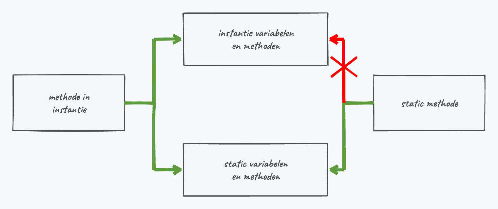

## Wat leer je in dit hoofdstuk?

Na dit hoofdstuk kan je:

* een **constructor** schrijven om de beginstaat van een object in te stellen
* het verschil tussen een **default** en een **overloaded** constructor uitleggen
* constructors hergebruiken met **`this()`**
* objecten opzetten met **object initializer syntax** en **`required`**
* het keyword **`static`** gebruiken voor fields, methoden, properties en klassen
* uitleggen waarom een `static` deel niet bij de niet-static delen kan

---

## Waar staan we?

Een klasse bestond tot nu uit:

* **instantievariabelen** (de toestand)
* **methoden** (het gedrag)
* **properties** (gecontroleerde toegang)

. . .

Daar komen nu bij:

* **constructors**, **`static`** en **object initializer syntax**

---

## De new operator

```csharp
Student frank = new Student();
```

`new` doet **drie** dingen:

1. een object aanmaken in de **heap**
2. de **constructor** aanroepen voor extra initialisatie
3. een **referentie** naar dat object teruggeven

> Vandaar de ronde haakjes bij `new Student()`: dat is de constructor-aanroep.

---

## Soorten constructors

* **Geen** zelf geschreven constructor: je krijgt gratis een onzichtbare **default** constructor
* Enkel een **default** constructor (zonder parameters), maar zelf ingevuld
* Een of meer **overloaded** constructors met parameters, bv. `new Student("Jos")`

::: {.callout-warning .fragment}
Net als met aannemers: soms ruimen ze zelf op, soms niet. Schrijf je **zelf** een constructor, dan ben je de **gratis** default constructor kwijt.
:::

---

## Een default constructor

```csharp
internal class Student
{
    public Student()
    {
        UurVanInschrijven = DateTime.Now.Hour;
    }
    public int UurVanInschrijven { get; private set; }
}
```

* Altijd **`public`**, **geen** returntype, naam = **klassenaam**, geen parameters

::: {.callout-tip .fragment}
Enkel een auto-property een startwaarde geven? Dan volstaat `public int X { get; set; } = 2;` zonder constructor.
:::

::: {.callout-warning .fragment}
Zet **geen** `Console.WriteLine` in een constructor: die hoort het object op te zetten, niet iets te tonen.
:::

---

## Overloaded constructors

```csharp
public Student(string bijnaamIn)
{
    BijNaam = bijnaamIn;
}
```

Zo kan je `new Student("Lord Oakenwood")` schrijven.

::: {.callout-warning .fragment}
Vanaf nu werkt `new Student()` **niet** meer: *"Student does not contain a constructor that takes 0 arguments"*. Wil je de default constructor terug? Schrijf hem dan zelf.
:::

---

## Dubbele code in constructors

Stel: drie constructors die elk `Naam`, `Adres` en `Saldo` instellen. Splits je later `Adres` op in `Straat` + `Stad`, dan moet je **elke** constructor apart aanpassen.

::: {.callout-warning .fragment}
Code die je op meerdere plekken herhaalt, is vragen om problemen. Eén bron van waarheid is beter.
:::

---

## this(): constructors hergebruiken

Vermijd dubbele code door één constructor de andere te laten aanroepen:

```csharp
public Microfoon(string merkIn, bool isUitverkochtIn)
{
    Merk = merkIn;
    IsUitverkocht = isUitverkochtIn;
}

public Microfoon(string merkIn) : this(merkIn, false) { }

public Microfoon() : this("Onbekend", true) { }
```

De compiler kiest via **overload resolution** de juiste constructor.

---

## Welke constructors voorzien?

Minstens genoeg om een object in een **geldige** staat te brengen:

```csharp
public Breuk(int tellerIn, int noemerIn)
{
    Teller = tellerIn;
    Noemer = noemerIn;   // set weigert noemer 0
}
```

::: {.callout-tip .fragment}
Door enkel deze constructor te voorzien, dwing je af dat niemand een `Breuk()` zonder noemer maakt (en zo een `DivideByZeroException` riskeert).
:::

---

## Object initializer syntax

Geef bij de creatie properties een beginwaarde, **zonder** een aparte constructor:

```csharp
Meting m = new Meting { Temperatuur = 3.4, IsGeconfirmeerd = true };
```

* Werkt via de **default** constructor en daarna de **properties**
* Enkel voor properties met een van buitenaf bereikbare `set`

::: {.callout-note .fragment}
Intern: eerst de default constructor, dan `m.Temperatuur = 3.4;` enzovoort.
:::

---

## required properties

Wil je toch verplichten dat een property wordt ingesteld bij object initializer syntax? Gebruik **`required`**:

```csharp
internal class Meting
{
    public double Temperatuur { get; set; }
    public required bool IsGeconfirmeerd { get; set; }
}
```

```csharp
Meting m = new Meting { Temperatuur = 0.7 }; // FOUT: IsGeconfirmeerd ontbreekt
```

::: {.callout-important .fragment}
`required` bestaat sinds [C#]{.cs} 11 (.NET 7+).
:::

---

## static: het idee

> **`static`** geeft aan dat een element bij de **klasse zelf** hoort, niet bij een individueel object.

Gevolg: je kan het aanroepen **zonder** een object aan te maken, en de data wordt **gedeeld** over alle objecten.

`static` kan op fields, methoden, properties en zelfs de hele klasse.

---

## static fields

```csharp
internal class Mens
{
    private static int teller = 0;
    public Mens() { teller++; }
}
```

Eén exemplaar, **gedeeld** door alle objecten: maak je drie `Mens`-objecten, dan staat `teller` op 3.

::: {.callout-warning .fragment}
Gebruik `static` met mate: het druist vaak in tegen OOP. Het past bij zaken die bij de **klasse** horen (een teller), niet bij een individueel object (een geboortejaar).
:::

---

## static methoden en klassen

Daarom kan je `Math.Pow(3, 2)` zonder een `Math`-object te maken:

```csharp
internal static class EpicLibrary
{
    public static void ToonInfo() { Console.WriteLine("Ik ben ik"); }
    public static int TelOp(int a, int b) { return a + b; }
}

EpicLibrary.ToonInfo();
int som = EpicLibrary.TelOp(3, 5);
```

::: {.callout-important .fragment}
Een **`static class`** mag **enkel** static members bevatten. De compiler dwingt dat af: je kan er toch nooit een object van maken.
:::

---

## static versus non-static

:::: {.columns}

::: {.column width="55%"}
Een `static` methode kan **enkel** andere `static` leden aanspreken: ze hoort bij geen enkel object.

```csharp
private int gewicht = 50;
private static void Verminder()
{
    gewicht--; // FOUT
}
```
:::

::: {.column width="45%"}

:::

::::

::: {.callout-tip .fragment}
Daarom moet in `Program.cs` alles `static` zijn: `Main` is zelf `static`.
:::

---

## static properties

Alle balletjes delen dezelfde speelveldgrenzen:

```csharp
static public int Breedte { get; set; }
static public int Hoogte { get; set; }
```

```csharp
Balletje.Hoogte = Console.WindowHeight;
Balletje.Breedte = Console.WindowWidth;
```

Elk balletje gebruikt in `Update()` gewoon `Balletje.Breedte`, zonder de grenzen zelf te kennen.

---

## static en Random

:::: {.columns}

::: {.column width="22%"}

:::

::: {.column width="78%"}
Een `Random` per object is een **slecht idee**: objecten die snel na elkaar ontstaan, krijgen dezelfde seed en dus dezelfde getallen.

```csharp
internal class Dobbelsteen
{
    static Random gen = new Random(); // gedeeld
    public int Werp() { return gen.Next(1, 7); }
}
```
:::

::::

::: {.callout-tip .fragment}
Eén gedeelde, `static` generator lost dat netjes op.
:::

---

## Uitdaging: Crazy House

Een tekst-avontuur waarin de speler van kamer naar kamer wandelt:

:::: {.columns}

::: {.column width="50%"}
**`Room`**

* deuren naar noord/oost/zuid/west, elk een **referentie** naar een andere `Room`
* een `Describe()` die de kamer en de uitgangen toont
:::

::: {.column width="50%"}
**`Player`**

* houdt zijn `HuidigeKamer` bij
* een `MoveTo(richting)` om (te proberen) verplaatsen
:::

::::

::: {.callout-tip .fragment}
Een object dat een ander object **als instantievariabele** bevat: de kern van grotere OOP-programma's. Uitbreiding: geef sommige kamers een **NPC** met een `Speak()`-tip.
:::

---

## Conclusie

* De **constructor** zet een object meteen in een geldige beginstaat (via `new`)
* Schrijf je zelf een constructor, dan ben je de **gratis** default constructor kwijt
* **`this()`** hergebruikt constructors; **object initializer syntax** en **`required`** vullen properties in
* **`static`** hoort bij de **klasse**, niet bij een object: gedeelde data en hulpmethoden
* Een `static` deel kan enkel andere `static` delen aanspreken

::: {.callout-tip}
Volgende halte: **arrays en collecties van objecten** (`List`, `foreach`, `Dictionary`).
:::

---

## Meer weten

**Kennisclips**

* [Constructors](https://ap.cloud.panopto.eu/Panopto/Pages/Viewer.aspx?id=c61c93d6-1f53-4772-bb85-ae2a00ae074d)
* [Overloaded constructors en this](https://ap.cloud.panopto.eu/Panopto/Pages/Viewer.aspx?id=e4e76739-f3fb-4568-86c2-ae2a00b3e227)
* [Object initialize Syntax](https://ap.cloud.panopto.eu/Panopto/Pages/Viewer.aspx?id=3dabbb6a-850c-4796-babf-acb000b6a1db)
* [static keyword](https://ap.cloud.panopto.eu/Panopto/Pages/Viewer.aspx?id=5c9d6af4-3b7e-416c-b171-acb4009a874d)
* [Nugets en libraries](https://ap.cloud.panopto.eu/Panopto/Pages/Viewer.aspx?id=2950c6d7-0837-461f-a9ec-ae2f00c66853)
* [Eigen class library maken](https://ap.cloud.panopto.eu/Panopto/Pages/Viewer.aspx?id=01ff79ae-bf94-4a9e-93f4-ae2f00c6684c)

[Oefeningen H11](https://apwt.gitbook.io/ziescherp-oefeningen/h11-gevorderde-klasseconcepten/a_practica3) · [Quizlet flashcards](https://quizlet.com/be/918632354/zie-scherp-scherper-hoofdstuk-11-flash-cards/)
