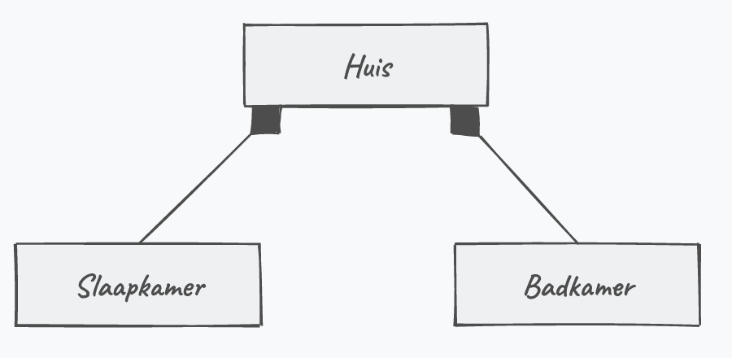
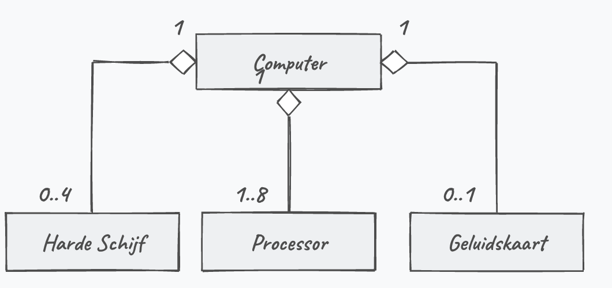
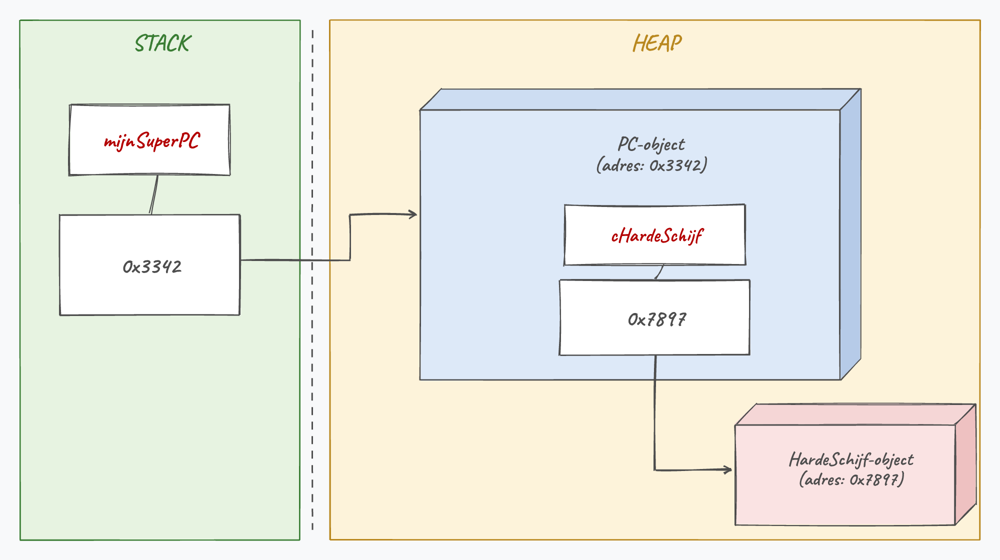
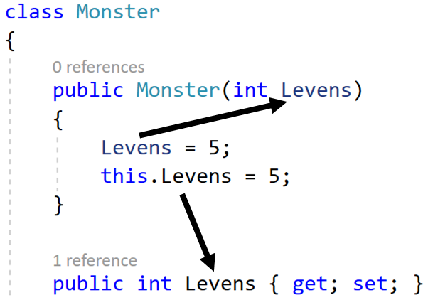

## Wat leer je in dit hoofdstuk?

Na dit hoofdstuk kan je:

* het verschil tussen **compositie** en **aggregatie** uitleggen
* de **heeft-een**-relatie herkennen (tegenover de is-een-relatie)
* een object als **instantievariabele** of via een **property** in een klasse plaatsen
* een **heeft-meerdere**-relatie modelleren met een array of `List`
* afwegen wanneer je **associatie** boven **overerving** kiest
* het **`this`**-keyword gebruiken

::: {.callout-tip .fragment}
Eigenlijk niets nieuws: je deed dit waarschijnlijk al, zonder de naam te kennen.
:::

---

## Associaties: twee smaken

Een object **in** een ander object gebruiken heet een **associatie**. Het verschil zit in de **levensduur** van het interne object:

* **Compositie**: het interne object kan **niet** zonder het omliggende (een kamer zonder huis bestaat niet)
* **Aggregatie**: beide kunnen **op zichzelf** bestaan (een motor kan je uit een gesloopte auto redden)

---

## De heeft-een relatie

* Overerving = **is een** ("een paard is een dier")
* Associatie = **heeft een** ("een mango heeft een pit", "een vliegtuig heeft een cockpit")

::: {.callout-important .fragment}
Een boek **is** geen pagina. Een boek **heeft** pagina's. Dat is dus associatie, geen overerving. ("Heeft meerdere" wijst op een array of `List`.)
:::

---

## Is-een en heeft-een samen

De twee relaties sluiten elkaar niet uit:

* een `Auto` **heeft een** `Motor` (compositie)
* een `Sportwagen` **is een** `Auto` (overerving)
* dus een `Sportwagen` **heeft** via overerving **ook** een `Motor`

::: {.callout-tip .fragment}
Overerving en compositie werken samen: de child erft de associaties van zijn parent.
:::

---

## Compositie en aggregatie in UML

:::: {.columns}

::: {.column width="50%"}
**Compositie**: volle ruit aan de kant van het omliggende object.


:::

::: {.column width="50%"}
**Aggregatie**: lege ruit. Een getal duidt de verhouding aan.


:::

::::

---

## In code: een object als instantievariabele

Een *PC heeft een HardeSchijf*, dus zit er in `PC` een instantievariabele van het type `HardeSchijf`:

```csharp
internal class PC
{
    private HardeSchijf hardeSchijf;
}
```

Vergeet niet die `HardeSchijf` ook te **instantiëren**, anders blijft hij de hele levensduur `null`.

---

## Manier 1 en 2: compositie

Meteen bij de instantievariabele, of via de constructor:

```csharp
internal class PC
{
    private HardeSchijf hardeSchijf = new HardeSchijf();   // manier 1

    public PC(bool preinstall)                              // manier 2
    {
        if (preinstall)
            hardeSchijf = new HardeSchijf();
        else
            hardeSchijf = null;
    }
}
```

Sterft de PC, dan sterft de interne schijf mee: dat is **compositie**.

---

## Manier 3: aggregatie via property

Maak het object **buiten** de PC aan en plug het in via een property:

```csharp
internal class PC
{
    public HardeSchijf HardeSchijf { get; set; }
}
```

```csharp
HardeSchijf schijf = new HardeSchijf();
PC mijnPC = new PC();
mijnPC.HardeSchijf = schijf;
```

Er blijft een externe referentie (`schijf`), dus de GC ruimt hem niet op met de PC: dat is **aggregatie**.

---

## In het geheugen

:::: {.columns}

::: {.column width="55%"}
Het interne object staat **apart** in de heap; de PC bewaart enkel een **referentie** ernaar.

Compositie geeft dus **geen** groot monolithisch object: alles blijft netjes verbonden via referenties.
:::

::: {.column width="45%"}

:::

::::

::: {.callout-warning .fragment}
Een intern object aanspreken dat nooit werd aangemaakt, geeft een **`NullReferenceException`**. Controleer dus op `null`.
:::

---

## Heeft-meerdere relatie

Een boek heeft veel pagina's, dus een array of `List`. Hou de collectie **privé** en bied een eigen methode aan:

```csharp
internal class Boek
{
    public List<Pagina> AllePaginas { get; private set; } = new List<Pagina>();

    public void InsertPagina(Pagina paginaIn, int positie)
    {
        AllePaginas.Insert(positie, paginaIn);
    }
}
```

::: {.callout-important .fragment}
Een interne `List` rechtstreeks via een publieke `set` aanbieden is riskant: iemand kan dan zomaar `Clear()` aanroepen. Hou het een **blackbox**.
:::

---

## Associatie of overerving?

> ***Favor composition over inheritance.***

In de praktijk gebruik je veel vaker een **heeft-een** dan een **is-een**-relatie.

::: {.callout-important .fragment}
`patient.Hart = donor.Hart;` kopieert **niet**: beide verwijzen nu naar **hetzelfde** `Hart`-object. Een object delen is geen object kopiëren. Wees dus geen Dokter Frankenstein van [C#]{.cs}: te veel compositie maakt een klasse minder herbruikbaar.
:::

---

## Het this-keyword

**`this`** is de referentie naar het **huidige object**. Drie toepassingen:

* een object kan **zichzelf** meegeven als parameter
* een instantievariabele of property aanroepen die een **gelijke naam** heeft als een lokale variabele
* een andere constructor aanroepen (`: this(...)`, hoofdstuk 11)

::: {.callout-important .fragment}
`this` werkt enkel in een **instance-context** (gewone methoden, properties, constructors). In een `static` methode bestaat er geen "huidig object".
:::

---

## this: naamconflict oplossen

:::: {.columns}

::: {.column width="55%"}
```csharp
public Speler(int Levens)
{
    Levens = 5;       // past de parameter aan
    this.Levens = 5;  // past de property aan
}
```

`this.Levens` haalt de property, ook al heet de parameter net zo.
:::

::: {.column width="45%"}

:::

::::

::: {.callout-tip .fragment}
Beter nog: geef je parameter gewoon een andere naam, dan heb je `this` hier niet eens nodig.
:::

---

## this: zichzelf meegeven

```csharp
internal class Werknemer
{
    public int Rang { get; set; }
    public bool IsPromoveerbaar()
    {
        return Management.MagPromoveren(this);
    }
}
```

Het object geeft **zichzelf** (`this`) door aan een externe methode, zodat een werknemer zelf kan checken of die promoveerbaar is.

---

## Heroes & Weapons

In een spel heeft een `Held` **twee handen**, elk met 0 of 1 `Wapen` dat schade doet:

```csharp
internal class Held
{
    public Wapen LinkerHand { get; set; }
    public Wapen RechterHand { get; set; }
}
internal class Wapen
{
    public int Schade { get; set; }
}
```

::: {.callout-tip .fragment}
Een lege hand is gewoon `null`. Reik je het wapen door aan een andere held, dan is het **aggregatie**: het wapen leeft los van de held.
:::

---

## Conclusie

* Een **associatie** is een object-in-een-object; **compositie** (sterft mee) of **aggregatie** (los leefbaar)
* De **heeft-een**-relatie wijst op associatie, de **is-een**-relatie op overerving
* Plaats het interne object via een **instantievariabele**, **constructor** of **property**
* "Heeft meerdere" doe je met een array of `List`, liefst achter een nette **blackbox**
* **`this`** verwijst naar het huidige object; *favor composition over inheritance*

::: {.callout-tip}
Volgende halte: **polymorfisme**, waar één naam vele vormen aanneemt.
:::

---

## Meer weten

**Kennisclips**

* [Compositie](https://ap.cloud.panopto.eu/Panopto/Pages/Viewer.aspx?id=35c61e32-7e2a-41de-9488-acb000dce2a8)
* [Compositie in praktijk: basics](https://ap.cloud.panopto.eu/Panopto/Pages/Viewer.aspx?id=c27b6387-8b84-41e6-821e-acb000e3141b)
* [Compositie in praktijk: demo met helden](https://ap.cloud.panopto.eu/Panopto/Pages/Viewer.aspx?id=86c5c33e-eac6-4467-9522-acb100bdc094)
* [this keyword](https://ap.cloud.panopto.eu/Panopto/Pages/Viewer.aspx?id=ea597dce-a279-44bb-881d-acb100b55d85)

[Oefeningen H15](https://apwt.gitbook.io/ziescherp-oefeningen/h15-compositie-en-aggregatie/a_practicacomp) · [Quizlet flashcards](https://quizlet.com/be/918808522/zie-scherp-scherper-hoofdstuk-15-flash-cards/)

---

## Zie verder: andere talen

Dezelfde concepten uit dit hoofdstuk, maar dan in andere talen. Handig om later code in Python of JavaScript te leren lezen.

---

## Zie verder: compositie in Python

In **Python** werkt de "heeft een"-relatie quasi identiek: gewoon een object als instantievariabele.

```python
class HardeSchijf:
    pass

class PC:
    def __init__(self):
        self.harde_schijf = HardeSchijf()   # PC heeft een HardeSchijf
```

"Een object in een ander object" is geen C#-eigenaardigheid, maar geldt in elke OO-taal. Net als *favor composition over inheritance*.

---

## Zie verder: this in Python en JavaScript

In **Python** bestaat er geen impliciet `this`: je geeft het huidige object expliciet mee als eerste parameter, traditioneel `self`.

```python
class Auto:
    def start(self):
        print(self.merk)
```

C# regelt `this` verborgen via de compiler; Python toont datzelfde object gewoon als eerste parameter. **JavaScript** heeft wél `this`, maar met beruchte binding-regels: waarnaar het verwijst hangt af van *hoe* je een functie aanroept.
