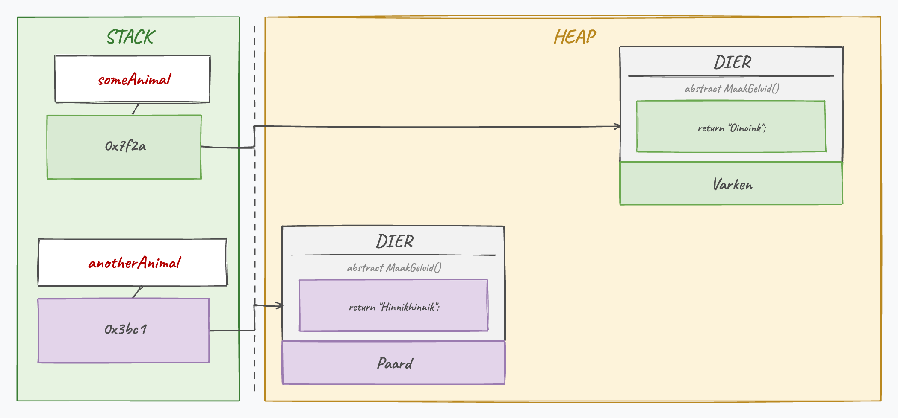

## Wat leer je in dit hoofdstuk?

Na dit hoofdstuk kan je:

* uitleggen wat **polymorfisme** is en hoe **late binding** werkt
* child-objecten in een variabele van het **parent-type** bewaren (**upcasting**)
* lijsten van een basistype vullen met allerlei child-objecten
* polymorfisme inzetten om code **eenvoudiger** te maken
* de **`is`**- en **`as`**-keywords en **pattern matching** gebruiken
* **`Equals`** netjes overriden

---

## De P van A PIE

Polymorfisme = *poly* (meerdere) + *morfisme* (vormen): **meerdere vormen**.

> Het laat toe om child-objecten te behandelen als objecten van hun **parent**-klasse, en zorgt dat `virtual`/`override` echt werkt.

---

## Polymorfisme in mensentaal

Ik ben **Tim**. Maar ook: een `Docent` is een `Werknemer`, en een `Werknemer` is een `Mens`.

* Bij de bakker ben ik gewoon een **mens**
* Bij AP een **werknemer**
* In de les een **docent**

Steeds dezelfde Tim, maar in welke **rol** je me ziet, hangt af van de context. Dat is polymorfisme.

---

## Is-een in actie

```csharp
internal abstract class Dier
{
    public abstract string MaakGeluid();
}
internal class Paard : Dier
{
    public override string MaakGeluid() { return "Hinnikhinnik"; }
}
internal class Varken : Dier
{
    public override string MaakGeluid() { return "Oinkoink"; }
}
```

---

## Child in een parent-variabele

:::: {.columns}

::: {.column width="55%"}
```csharp
Dier a = new Varken();
Dier b = new Paard();
Console.WriteLine(a.MaakGeluid()); // Oinkoink
Console.WriteLine(b.MaakGeluid()); // Hinnikhinnik
```

De variabele is van het type `Dier`, maar elk roept zijn **eigen** `MaakGeluid` op.
:::

::: {.column width="45%"}

:::

::::

---

## Late binding

Waarom voert `a.MaakGeluid()` toch de **Varken**-versie uit?

* [C#]{.cs} kiest pas **tijdens de uitvoer** welke `override` draait, op basis van het **echte object** in de heap
* Dat heet **late binding** (*dynamic dispatch*)
* Het werkt enkel omdat de methode **`virtual`** of **`abstract`** is

---

## Upcasting

Een child toewijzen aan een parent-variabele (**upcasting**) gaat automatisch, tot zelfs:

```csharp
System.Object mijnObject = new Varken();
```

::: {.callout-important .fragment}
De compiler kijkt naar het **type van de variabele**, niet naar het echte object. Via `mijnObject` kan je dus enkel wat `System.Object` kent. Terug naar `Varken` (**downcasting**) doe je veilig met `is` en `as`.
:::

---

## Upcasting over meerdere niveaus

Een hierarchie kan diep gaan:

```text
Dennenboom -> Naaldboom -> Boom -> Plant -> LevendWezen
```

```csharp
LevendWezen wezen = new Dennenboom(); // mag: een Dennenboom is een LevendWezen
Boom boom = new Dennenboom();         // mag ook
```

Een `Dennenboom` kan je dus zien als een `Naaldboom`, een `Boom`, een `Plant` of een `LevendWezen`: upcasting werkt naar **elke** voorouder.

---

## Arrays en polymorfisme

Een lijst van het **basistype**, gevuld met child-objecten:

```csharp
List<Dier> zoo = new List<Dier>();
zoo.Add(new Varken());
zoo.Add(new Paard());

foreach (var dier in zoo)
{
    Console.WriteLine(dier.MaakGeluid());
}
```

Objecten als één geheel behandelen, zonder dat ze exact hetzelfde type hoeven te zijn.

---

## Met grote kracht...

:::: {.columns}

::: {.column width="22%"}

:::

::: {.column width="78%"}
Polymorfisme werkt enkel mooi als een child zich **echt** kan gedragen als zijn parent (het *Liskov substitution principle*).

Het klassieke tegenvoorbeeld: een `Vierkant` die overerft van `Rechthoek` klopt taalkundig, maar geeft brokkelige code. Kan elk child overal de plaats van zijn parent innemen?
:::

::::

---

## In de praktijk: de drukke premier

```csharp
internal class EersteMinister
{
    public MinisterVanMilieu Jansens { get; set; } = new MinisterVanMilieu();
    public MinisterBZ Ganzeweel { get; set; } = new MinisterBZ();

    public void Regeer()
    {
        Jansens.VerhoogBosSubsidies();
        Jansens.OpenOnderzoek();
        Ganzeweel.VervangAmbassadeur();
        // ... de premier moet ELK departement van binnen kennen
    }
}
```

De `EersteMinister` weet veel te veel: dat vloekt tegen **abstractie**.

---

## De oplossing: een abstracte Minister

```csharp
internal abstract class Minister
{
    public abstract void Adviseer();
}
internal class MinisterVanMilieu : Minister
{
    public override void Adviseer()
    {
        VerhoogBosSubsidies();
        OpenOnderzoek();
    }
}
```

Elke minister **moet** `Adviseer` overriden.

---

## Regeren wordt eenvoudig

```csharp
internal class EersteMinister
{
    public List<Minister> AlleMinisters { get; set; } = new List<Minister>();

    public void Regeer()
    {
        foreach (Minister minister in AlleMinisters)
        {
            minister.Adviseer();
        }
    }
}
```

De premier hoeft geen enkel departement nog van binnen te kennen. Wie zei dat regeren moeilijk was?

---

## Het is-keyword

`is` test of een object van een bepaald type is, en geeft een **`bool`**:

```csharp
List<Voertuig> alleMiddelen = new List<Voertuig>();
alleMiddelen.Add(new Auto());

foreach (var middel in alleMiddelen)
{
    if (middel is Auto)
    {
        // doe enkel iets met de auto's
    }
}
```

---

## Het as-keyword

`as` **probeert** te converteren; lukt het niet, dan krijg je **`null`** in plaats van een crash:

```csharp
Mens jos = fritz as Mens;
if (jos != null)
{
    // doe Mens-zaken
}
```

::: {.callout-important .fragment}
`as` werkt enkel op **reference types** (objecten en interfaces), niet op value types als `int`.
:::

::: {.callout-tip .fragment}
**Vuistregel:** wil je het object daarna *gebruiken*, kies `as`; wil je enkel *weten* of iets van een type is, kies `is`.
:::

---

## Pattern matching

Sinds [C#]{.cs} 7 doe je de check én de omzetting in **één** stap:

```csharp
if (mijnAuto is Voertuig v)
{
    // v is hier meteen beschikbaar als Voertuig
}
```

::: {.callout-tip .fragment}
In dezelfde geest: `if (jos is not null)` is de modernere variant van `!= null`. Je ziet deze vorm overal in moderne [C#]{.cs}.
:::

---

## Equals netjes overriden

Met `is` schrijf je een veilige `Equals` (geen crash bij een verkeerd type):

```csharp
public override bool Equals(object o)
{
    if (o is Student temp)
        return Geboortejaar == temp.Geboortejaar && Voornaam == temp.Voornaam;
    return false;
}
```

::: {.callout-important .fragment}
Wie `Equals` overridet, override **ook** `GetHashCode` (met `HashCode.Combine`), anders haperen `Dictionary` en `HashSet`.
:::

---

## == of .Equals()?

* **`==`** vergelijkt bij objecten standaard de **referenties**: twee aparte objecten met dezelfde inhoud zijn dus niet gelijk
* Door **`Equals`** te overriden bepaal jij gelijkheid op basis van de **inhoud**

::: {.callout-tip .fragment}
Sinds [C#]{.cs} 9 regelen **`record`**-types dit automatisch: `public record Student(string Voornaam, int Geboortejaar);` genereert zelf `Equals`, `GetHashCode` én `ToString`. We doen het hier met de hand om te begrijpen wat eronder zit.
:::

---

## Heroes & Weapons, part 2

De wapens uit H15 worden nu **polymorf**: elk type onderhoudt zich anders.

```csharp
internal abstract class Wapen
{
    public abstract void Maintain();
}
internal class Zwaard : Wapen
{
    public override void Maintain() { Sharpen(); } // scherper = meer schade
}
internal class Boog : Wapen
{
    public override void Maintain() { aantalPijlen += 10; }
}
```

::: {.callout-tip .fragment}
De `Held` roept gewoon `wapen.Maintain()` aan voor elk wapen in zijn handen. Late binding kiest de juiste versie (Zwaard, Boog of Staf die mana verdubbelt).
:::

---

## Conclusie

* **Polymorfisme** behandelt child-objecten als hun parent; **late binding** kiest de juiste `override`
* **Upcasting** gaat vanzelf; voor **downcasting** gebruik je `is` en `as`
* Een **`List<Basistype>`** met child-objecten maakt code flexibel en kort (de premier!)
* **`is`** toetst een type, **`as`** zet veilig om (`null` bij mislukking), **pattern matching** doet beide
* Override **`Equals`** voor vergelijking op inhoud, en vergeet **`GetHashCode`** niet

::: {.callout-tip}
Volgende halte: **interfaces**, contracten die klassen beloven na te komen.
:::

---

## Meer weten

**Kennisclips**

* [Polymorfisme](https://ap.cloud.panopto.eu/Panopto/Pages/Viewer.aspx?id=9f159648-9bc0-4169-91b0-acb000c86dea)
* [Polymorfisme in de praktijk met presidenten](https://ap.cloud.panopto.eu/Panopto/Pages/Viewer.aspx?id=9ed3a377-6ae3-4b51-bf44-aeae0091e6e5)
* [Is en as keywords](https://ap.cloud.panopto.eu/Panopto/Pages/Viewer.aspx?id=8b1974ff-7c0a-4da8-9bd5-acb000cb742c)
* [Objecten vergelijken met Equals: polymorfisme in actie](https://ap.cloud.panopto.eu/Panopto/Pages/Viewer.aspx?id=b705422d-db2d-420a-bcda-aba700fd9336)

[Oefeningen H16](https://apwt.gitbook.io/ziescherp-oefeningen/h16-polymorfisme/a_practica) · [Quizlet flashcards](https://quizlet.com/be/918808929/zie-scherp-scherper-hoofdstuk-16-flash-cards/)

---

## Zie verder: andere talen

Dezelfde concepten uit dit hoofdstuk, maar dan in andere talen. Handig om later code in Python of JavaScript te leren lezen.

---

## Zie verder: polymorfisme in Python

C# heeft een gemeenschappelijke parent plus `virtual`/`override` nodig. **Python** doet het via *duck typing*: heeft het object de methode, dan werkt het gewoon, zonder gedeelde basisklasse.

```python
def laat_spreken(dier):
    print(dier.maak_geluid())   # elk object met die methode werkt

laat_spreken(Paard())   # Hinnikhinnik
laat_spreken(Varken())  # Oinkoink
```

Bij Python merk je pas tijdens het uitvoeren of een object de methode echt heeft; C# controleert dat al bij het compileren.

---

## Zie verder: type-check in andere talen

Dezelfde vraag, andere notatie. In **Python** is het een functie:

```python
if isinstance(mijn_auto, Voertuig):
    print("mijn_auto is een Voertuig")
```

In **JavaScript** een operator:

```javascript
if (mijnAuto instanceof Voertuig) {
    console.log("mijnAuto is een Voertuig");
}
```

---

## Zie verder: gelijkheid in andere talen

Zelf bepalen wanneer objecten gelijk zijn, doe je via een vaste methode. **Python** override `__eq__` (zit achter `==`):

```python
def __eq__(self, other):
    return self.voornaam == other.voornaam
```

**Java** lijkt op C#: override `equals` (en `hashCode`):

```java
@Override
public boolean equals(Object o) { ... }
```

In **JavaScript** kan `===` niet overschreven worden: daar schrijf je zelf een functie `zijnGelijk(a, b)`.
