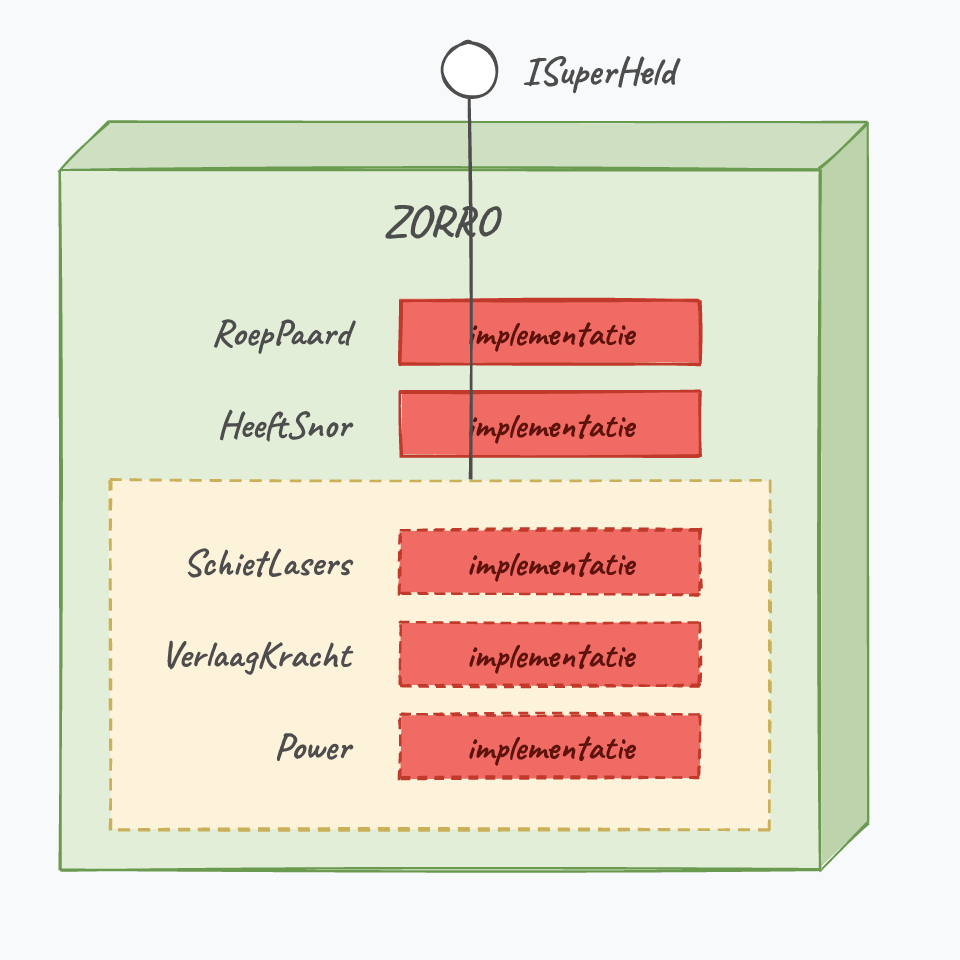
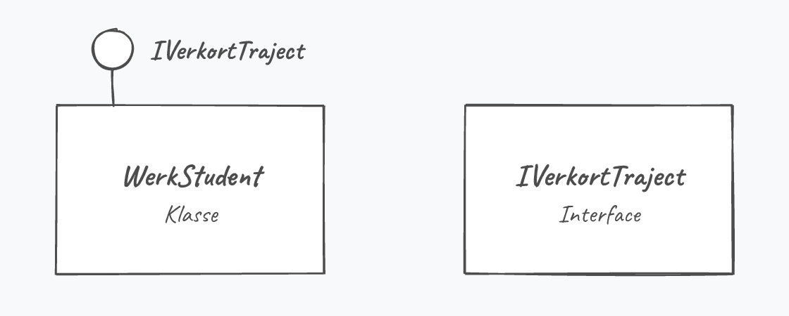
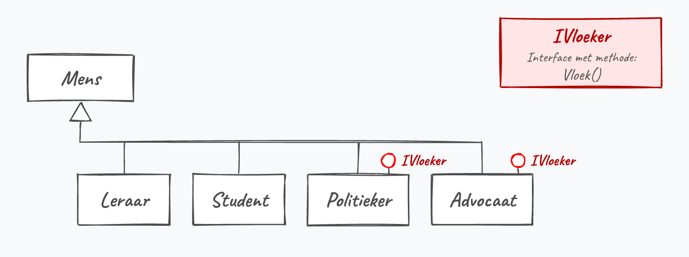

## Wat leer je in dit hoofdstuk?

Na dit hoofdstuk kan je:

* uitleggen wat een **interface** is en hoe ze verschilt van een klasse
* een interface **definiëren** en in een klasse **implementeren**
* kiezen tussen een **interface** en een **abstracte klasse**
* **meerdere** interfaces combineren (waar overerving tekortschiet)
* met **`is`** en **`as`** objecten op een interface bevragen
* interfaces inzetten voor losser gekoppelde, **SOLID**-code

---

## Interfaces in de echte wereld

"Interface" = tussen vlakken: de afgesproken **verbinding** tussen twee systemen.

* Een auto: stuur en pedalen, ongeacht benzine of elektrisch
* Een pc: USB, HDMI, audio, ... wereldwijd afgesproken aansluitingen

> Ken je de interface, dan kan je ze gebruiken zonder de interne werking te kennen.

::: {.callout-important .fragment}
Dit gaat **niet** over grafische User Interfaces. U weze gewaarschuwd.
:::

---

## Interfaces in OOP

> Een **interface** is een belofte: een lijst van publieke methoden en properties die een klasse zegt te hebben, **zonder** de implementatie.

Het is als een sticker "USB 3.0 compatibel": je weet wat het apparaat kan, niet hoe het binnenin werkt.

::: {.callout-note .fragment}
Let wel: een interface is een **belofte**, geen garantie op gedrag. Ze legt enkel de **signaturen** vast. Een klasse kan `SchietLasers()` implementeren en er iets totaal anders in stoppen.
:::

---

## Een interface in [C#]{.cs}

```csharp
interface ISuperHeld
{
    void SchietLasers();
    int VerlaagKracht(bool isZwak);
    int Power { get; set; }
}
```

* `interface` in plaats van `class`, naam start met een **`I`**
* **Geen** `public` (alles is publiek), **geen** code: elke signatuur eindigt op `;`

---

## De regels

* Geen **instantievariabelen** en geen **constructors**
* Geen **access modifiers**: alles is `public`
* Een interface erft niet van een klasse, wel van andere **interfaces**
* In de regel **geen code**, enkel signaturen

::: {.callout-tip .fragment}
Sinds [C#]{.cs} 8 bestaan *default interface methods* (met code), maar we houden het bewust bij zuivere signaturen.
:::

---

## Een interface visualiseren

:::: {.columns}

::: {.column width="50%"}
Een interface is als een blad met **gaten**: leg je het op een klasse die de belofte nakomt, dan vallen de gaten precies over de juiste methoden en properties.
:::

::: {.column width="50%"}

:::

::::

---

## Een klasse implementeert een interface

```csharp
internal class Zorro : ISuperHeld
{
    public void RoepPaard() { }
    public bool HeeftSnor { get; set; }

    public void SchietLasers() { Console.WriteLine("pewpew"); }
    public int VerlaagKracht(bool isZwak)
    {
        if (isZwak) return 5;
        return 10;
    }
    public int Power { get; set; }
}
```

Zolang `Zorro` niet **alles** uit `ISuperHeld` implementeert, compileert de klasse niet.

::: {.callout-tip .fragment}
In VS: klik op het lampje bij de klasse-signatuur en kies "Implement interface".
:::

---

## Interface of abstracte klasse?

| | Abstracte klasse | Interface |
|---|---|---|
| Gedeelde **code** | ja | nee |
| **Instantievariabelen** | ja | nee |
| **Constructors** | ja | nee |
| Hoeveel **combineren**? | 1 | meerdere |
| Relatie | "**is een**" | "**kan iets**" |

::: {.callout-tip .fragment}
Gedeelde code en een echte is-een-relatie? Abstracte klasse. Enkel afdwingen dat ongerelateerde klassen "iets kunnen" (`IVliegt` voor `Vogel` én `Vliegtuig`)? Interface.
:::

---

## UML en meerdere interfaces

:::: {.columns}

::: {.column width="50%"}
Een klasse erft van **maar één** parent, maar mag **meerdere** interfaces dragen:

```csharp
internal class Zorro : Man, ISuperHeld { }
internal class Batman : Man, ISuperHeld, ICoureur { }
```

Eerst de parent-klasse, dan de interface(s).
:::

::: {.column width="50%"}

:::

::::

::: {.callout-note .fragment}
Interfaces mogen ook van elkaar erven: `interface IGod : ISuperHeld`.
:::

---

## is met interfaces

```csharp
if (gameOfThrones is IVerwijderbaar)
{
    Console.WriteLine("Ik kan dit verwijderen");
}
```

Net als bij polymorfisme schitteren interfaces in een **lijst** vol verschillende objecten:

```csharp
foreach (var persoon in werknemers)
{
    if (persoon is IManager manager)
    {
        // enkel de managers
    }
}
```

---

## Interfaces in de praktijk

Een `Minister` zijn als "bij-job", niet als hoofd-klasse. Definieer een interface:

```csharp
interface IMinister
{
    void Adviseer();
}
```

Nu kan **eender wie** minister worden zonder z'n bestaande klasse op te geven:

```csharp
internal class Ceo : IMinister
{
    public void Adviseer() { Console.WriteLine("Vrijhandel is essentieel!"); }
    public void MaakJaarlijkseOmzet() { Console.WriteLine("Geld!!!"); }
}
```

---

## De premier werkt met IMinister

```csharp
List<IMinister> alleMinisters = new List<IMinister>();
alleMinisters.Add(new Ceo());
alleMinisters.Add(new MinisterVanMilieu());

foreach (IMinister minister in alleMinisters)
{
    minister.Adviseer();
}
```

Een CEO én een echte minister staan samen in één lijst. OOP benadert de realiteit.

---

## .NET-interface: IComparable

Wil je `Array.Sort` of `List.Sort` op je eigen objecten? Dan moet je `IComparable` implementeren, anders krijg je *"At least one object must implement IComparable"*.

```csharp
internal class Land : IComparable
{
    public int Oppervlakte { get; set; }

    public int CompareTo(object other)
    {
        Land ander = (Land)other;
        return Oppervlakte.CompareTo(ander.Oppervlakte); // sorteer op oppervlakte
    }
}
```

::: {.callout-tip .fragment}
Het **framework** roept jouw `CompareTo` aan. Zo zie je waarvoor interfaces echt dienen: een belofte die anderen (zelfs .NET zelf) kunnen gebruiken.
:::

---

## Alles samen: vloekende mensen

:::: {.columns}

::: {.column width="52%"}
Mensen spreken; enkel **vloekers** vloeken:

```csharp
interface IVloeker { void Vloek(); }

internal class Leraar : Mens { }
internal class Politieker : Mens, IVloeker
{
    public void Vloek() { Console.WriteLine("Godvermiljaardedju!"); }
}
```
:::

::: {.column width="48%"}

:::

::::

Hoe laat je in een `Mens[]` enkel de vloekers vloeken?

---

## Drie oplossingen

```csharp
// 1) is + harde cast
if (mens is IVloeker)
    ((IVloeker)mens).Vloek();

// 2) as + null-check
IVloeker v = mens as IVloeker;
if (v != null) v.Vloek();

// 3) pattern matching (de moderne manier)
if (mens is IVloeker vloeker)
    vloeker.Vloek();
else
    mens.Spreek();
```

---

## SOLID en de black-box

:::: {.columns}

::: {.column width="22%"}

:::

::: {.column width="78%"}
Werk **tegen de interface**, niet tegen de implementatie. Het boeit je niet meer wat er in een klasse zit; aan haar interfaces zie je wat ze kan.

Dat is de kern van de **SOLID**-principes: abstractie en *separation of concerns*. De ultieme black-box-revelatie. *See what I did there?*
:::

::::

---

## Interfaces overal in .NET

Het .NET-framework zit er vol mee. Een paar die je nog vaak zal tegenkomen:

* **`IEnumerable`**: laat `foreach` en LINQ over je collectie lopen
* **`IDisposable`**: netjes opruimen, samen met `using`
* **`IComparable`**: maakt je objecten sorteerbaar
* **`ICloneable`**: laat een object zichzelf klonen

::: {.callout-tip .fragment}
Implementeer je zo'n interface, dan werkt je eigen klasse meteen samen met bestaande .NET-functionaliteit.
:::

---

## Conclusie

* Een **interface** is een belofte van publieke methoden en properties, **zonder** code
* Een klasse die een interface draagt, **moet** alles ervan implementeren
* Kies een **interface** voor "kan iets" en om er **meerdere** te combineren; een **abstracte klasse** voor gedeelde code en "is een"
* Met **`is`** en **`as`** (en pattern matching) bevraag je objecten op een interface
* Interfaces zorgen voor losser gekoppelde, **SOLID**-code

::: {.callout-tip}
Volgende halte: **bestandsverwerking**: lezen van en schrijven naar bestanden.
:::

---

## Meer weten

**Kennisclips**

* [Interfaces introductie](https://ap.cloud.panopto.eu/Panopto/Pages/Viewer.aspx?id=45c9a641-7333-432b-8f67-acb00082080f)
* [Interfaces & polymorfisme](https://ap.cloud.panopto.eu/Panopto/Pages/Viewer.aspx?id=4d5b3a53-531e-4e11-a777-ae2f00cec23e)
* [Interfaces in de praktijk: meme-detective](https://ap.cloud.panopto.eu/Panopto/Pages/Viewer.aspx?id=2ace92d8-27c8-4b3a-9a3d-abac014a15a9)
* [Interfaces en polymorfisme: vloekende mensen](https://ap.cloud.panopto.eu/Panopto/Pages/Viewer.aspx?id=01040bf2-b14d-407f-b186-abad00b66540)
* [Interfaces en polymorfisme: fuifsimulator](https://ap.cloud.panopto.eu/Panopto/Pages/Viewer.aspx?id=f40f6bd4-83cf-4ad1-8cb8-adf000d4cd5f)

[Oefeningen H17](https://apwt.gitbook.io/ziescherp-oefeningen/h17-interfaces-1/a_practica) · [Quizlet flashcards](https://quizlet.com/be/918809130/zie-scherp-scherper-hoofdstuk-17-flash-cards/)
